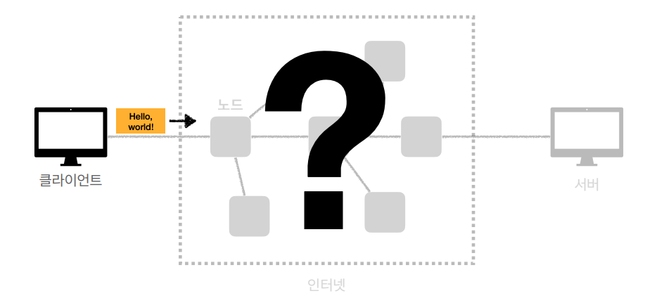
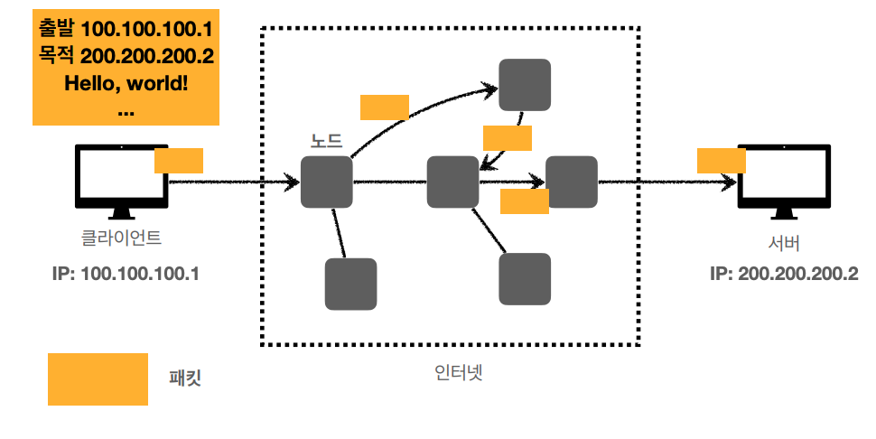
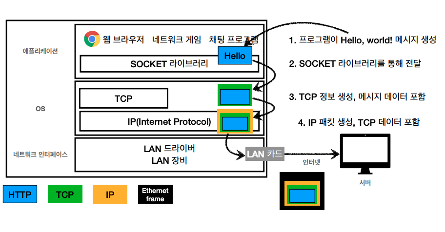
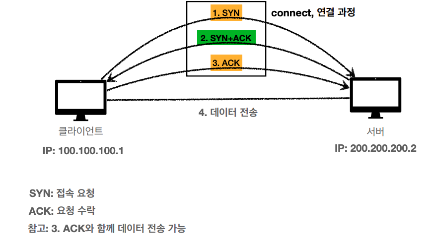
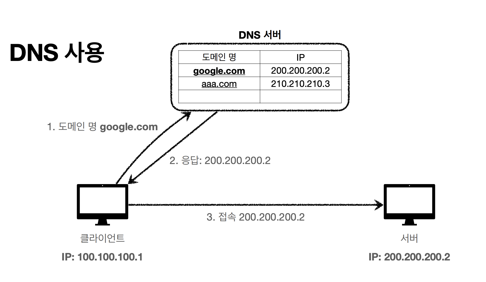
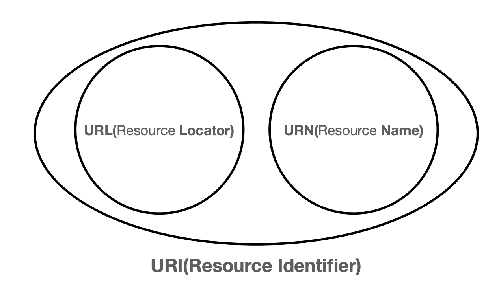
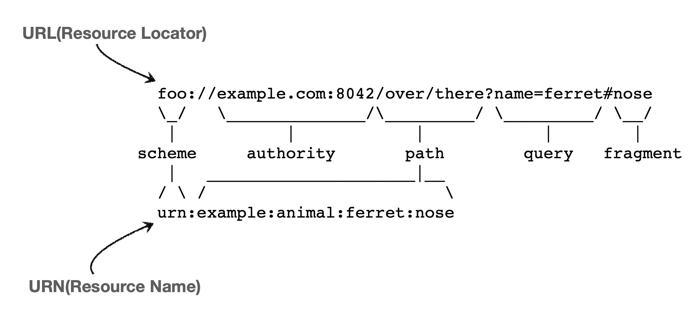
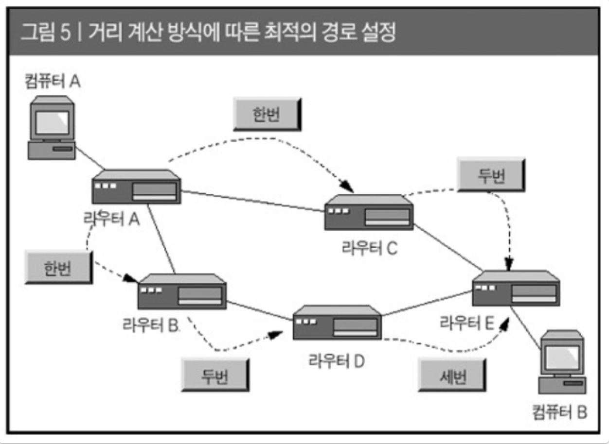

# 브라우저 동작 원리와 브라우저 렌더링 과정 

> www.google.com을 주소창에 입력했을 때, 어떠한 일이 발생할까?

 

## 인터넷 네트워크

> 인터넷에서 컴퓨터 둘은 어떻게 통신할까

**복잡한 인터넷 망 → 어떻게 복잡한 것을 해쳐나가 서버와 클라이언트가 통신할 수 있는 걸까?**

 

### IP (인터넷 프로토콜)

> 100.100.100.1 

 

**인터넷 프로토콜의 역할**

- 지정한 IP 주소에 데이터 전달
- 패킷이라는 통신 단위로 데이터 전달

 

IP 패킷 정보에는 출발지 IP, 목적지 IP, 기타 등등 + 전송 데이터가 있고, 이  IP 프로토콜에 따라 노드들이 패킷을 전달해 적절하게 목적지로 갈 수 있게 도움

→ 서버도 마찬가지로 진행하는데, 인터넷 망은 복잡하기 때문에 요청할 때랑 응답할 때랑 서로 다른 곳으로 전달될 수도 있음

 

**IP 프로토콜 한계**

- **비연결성** : 패킷을 받을 대상이 없거나 서비스 불능 상태여도 패킷 전송 (대상 서버가 패킷을 받을 수 있는 상태인지 모름)
- **비신뢰성** : 중간에 패킷이 사라지거나, 패킷이 순서대로 안오면? (패킷 소실, 패킷 전달 순서 문제 발생)
- **프로그램 구분** : 같은 IP 서버에서 통신하는 애플리케이션이 둘 이상이면? (게임하고 노래 들을 때 등) 

 💡 이 문제를 해결해주는 것이 바로 **TCP, UDP 프로토콜**

 

### TCP, UDP

**인터넷 프로토콜 스택의 4계층 (OSI)** : 인터넷에서 컴퓨터들이 서로 정보를 주고받을 때 쓰이는 프로토콜 모음 → **용도**에 따라 4개 계층으로 이루어져 있음

- 애플리케이션 계층 - HTTP, FTP, TLS/SSL

- 전송 계층 - TCP, UDP

- 인터넷 계층 - IP

- 네트워크 인터페이스 계층

쉽게 말해서, IP의 한계를 TCP를 살짝 얹어 보완해주는 역할을 한다고 보면 됨

 

3. 메세지 데이터에 TCP 정보를 씌움
4. TCP 정보에 IP 정보를 씌움
5. 네트워크 인터페이스를 통해 LAN 카드를 나갈 때 ETHERNET FRAME 포함해서 나감 (MAC 주소 같은 물리적 내용까지 포함)

6. 이후, 인터넷을 통해 서버로 전송

 

**IP 패킷 정보**

- 출발지 IP, 목적지 IP, 기타.. 

- 전송 데이터

 

*여기서 패킷이란?*

package (수하물) + bucket (덩어리) 합성어로 택배 박스에 데이터 넣어보낸다고 생각하면 편함

 

**TCP/IP 패킷 정보**

- 출발지 IP, 목적지 IP, 기타… 

- **출발지 PORT, 목적지 PORT, 전송 제어, 순서, 검증 정보…** → IP 만으로 해결이 안되었던 문제 해결됨

- 전송 데이터

---

**TCP 특징 (전송 제어 프로토콜**)

- **연결 지향** - TCP 3 way handshake (가상 연결)  → 연결을 한 뒤에 메세지를 보내기 때문에 패킷을 받을 대상이 없거나 서비스 불능 상태이면 패킷 전송 안하게 됨
- **데이터 전달 보증**  → 메세지 보냈을 때, 패킷이 누락되면 메세지를 못받았다는 내용을 알 수 있음
- **순서 보장**

- 신뢰할 수 있는 프로토콜
- 현재는 대부분 TCP 사용

 

**TCP 3way handshake**

1. 클라이언트에서 서버로 SYN (접속 요청)
2. 서버에서 클라이언트에 SYN + ACK (요청 수락)
3. 클라이언트에서 서버로 ACK

​	→ 클라이언트 서버가 서로 믿을 수 있음

4. 연결 후 데이터 전송 (요즘은 발전 되어서 ACK와 데이터 전송 동시에 가능)

**이 때, TCP 3way handshake는 물리적으로 연결된 것이 아니라 논리적으로 연결되었다고 가정한 것임** (가상 연결)

 

**데이터 전달 보증**

1. 클라이언트 > 서버 : 데이터 전송
2. 서버 > 클라이언트 : 데이터 잘 받았다고 응답

→ 데이터 전송 시 문제가 생기면 알 수 있음

 

**순서 보장**

1. 클라이언트 > 서버 : 패킷1, 패킷2, 패킷3 순서로 전송
2. 패킷1, 패킷3, 패킷2 순서로 도착한다면?
3. 서버 > 클라이언트 : 패킷 2부터 다시 보내라고 함

 

이 모든 것이 TCP에 **출발지 PORT, 목적지 PORT, 전송 제어, 순서, 검증 정보** 등이 포함되어 있기에 가능한 것

---

**UDP 특징**

사용자 데이터그램 프로토콜

- 하얀 도화지에 비유 (기능이 거의 없음)
- 연결지향 - TCP 3 way handshake x
- 데이터 전달 보증 x
- 순서 보장 x
- 데이터 전달 및 순서가 보장되지는 않지만, 단순하고 빠름
- 정리
  - IP와 거의 같지만 PORT (pc는 ip 하나만 가지고 있을 때 어떤 애플리케이션에서 쓰고 있는지 구분해주는 것이 PORT) , 체크섬 (이 메세지에 대해서 제대로 맞는지 검증해주는 데이터) 정도만 추가
  - 애플리케이션에서 추가 작업이 필요 (기능 확장 가능)

→ HTTP3에서 UDP 쓰면서 최적화 활성화되어서 요즘 UDP가 각광을 받고 있음 (TCP는 데이터 양도 크고, 전송 속도도 빠르기 어렵고 이미 구축되어 있어 최적화도 불가능하지만 UDP는 아무것도 안되어 있기 때문에 직접 제작하면 최적화가 가능하게 됨)

 

### PORT

클라이언트 PC가 여러 IP와 통신해야 한다면 (게임, 화상통화, 웹 브라우저 요청 등) 어떻게 구분할까?

→ **출발지 PORT, 목적지 PORT** (서버 안에 돌아가는 애플리케이션 구분하는 것이라고 생각하면 됨)

 

IP가 아파트라면, PORT는 몇동 몇호

[클라이언트]                  [서버]

게임 - 8090                   게임 - 11220

화상통화 - 21000          화상통화 - 32202

웹 브라우저 - 10010      웹 브라우저 - 80

IP: 100.100.100.1        IP: 200.200.200.2

 

**대표적인 PORT**

- HTTP: 80

- HTTPS: 443

 

### DNS (도메인 네임 시스템)

**IP는 기억하기 어렵고, 변경될 수 있기 때문에 DNS 사용**

- 전화번호부 (중간에 전화번호부 같은 서버 제공)
- 도메인 명을 IP 주소로 변환

1. 도메인 명 google.com 입력
2. DNS 서버에서 해당 도메인 명에 대한 IP 주소 찾아 응답 
3. 클라이언트에서 서버로 접속 (해당 도메인에 대한 IP 주소로)

 

## URI와 웹 브라우저 요청 흐름

### URI (Uniform Resource Identifier)

> 자원 식별자 (주민등록증 같은 것)

- 로케이터(locator), 이름(name) 또는 둘 다 추가로 분류될 수 있음

  즉, URI 안에는 URL과 URN 포함 

  

  - URL : 리소스 위치 (Locator)

  - URN : 리소스 이름 (Name)

    

 

**URI 단어 뜻**

- **U**niform : 리소스 식별하는 통일된 방식
- **R**esource: 자원, URI로 식별할 수 있는 모든 것 (제한 없음)
- **I**dentifier: 다른 항목과 구분하는 데 필요한 정보

 

**URL, URN 단어 뜻**

- URL - Locator: 리소스가 있는 위치를 지정

- URN - Name: 리소스에 이름을 부여

- 위치는 변할 수 있지만, 이름은 변하지 않음

- URN 이름만으로 실제 리소스를 찾을 수 있는 방법이 보편화 되지 않음	

  urn:isbn:8960777331 (어떤 책의 isbn URN)

 

**URL 전체 문법**

> `scheme://[userinfo@]host[:port][/path][?query][#fragment]`
>
> `https://www.google.com:443/search?q=hello&hl=ko`

- 프로토콜 (https)
- 호스트명 ([www.google.com](http://www.google.com))
- 포트번호 443
- 패스 (/search)
- 쿼리 파라미터 (q=hello&h1=ko)

 

**URL scheme**

- 주로 프로토콜 사용
- 프로토콜 : 어떤 방식으로 자원에 접근할 것인가 하는 약속 규칙

​	ex) http, https, ftp 등

- http는 80포트, https 443 포트 주로 사용, 포트 생략 가능
- https는 http에 강력한 보안 추가 (HTTP Secure)

 **URL userinfo** (거의 사용 x)

- URL에 사용자 정보 포함해 인증
- 계정정보는 인증이 요구되는 경우 ID와 Password 입력하면, 접속허가 받을 수 있음 (FTP) 

 

**URL host**

- 호스트명
- 도메인명 또는 IP 주소를 직접 사용 가능

 

**URL port**

- 포트 (PORT)
- 접속 포트
- 일반적으로 생략 (생략시, http 는 80 https는 443)

 

**URL path**

- 리소스 경로, 계층적 구조
- /home 같은 것

 

**URL query**

- key=value 형태
- ?로 시작, &로 추가 가능 ?keyA=valueA&keyB=valueB
- query parameter, query string 등으로 불림
- 웹 서버에 제공하는 파라미터, 문자 형태

 

**URL fragment**

- html 내부 북마크 등에 사용
- 서버에 전송하는 정보 아님

 

### 웹 브라우저 요청 흐름

> [**https://www.google.com:443/search?q=hello&hl=ko**](https://www.google.com:443/search?q=hello&hl=ko) 

 

1. 리다이렉트 확인

   리다이렉트가 있다면 리다이렉를 진행하고, 없다면 그대로 해당 요청에 대한 과정이 진행됨

    

   > 리다이렉트란?  **re(다시) + 지시하다(direct)**
   >
   > 브라우저에게 다른 URL(길, 방향) 을 지시할 수 있는 것

    

   **리다이렉트를 사용하는 예**

   웹툰 보다가 미리보기 시청을 위해 결제를 하려고 하지만, 로그인 하지 않은 상태에서 결제를 시도하면, 로그인 후 결제를 해달라는 팝업창과 함께 로그인 페이지로 이동시키고, 로그인 완료 후 다시 결제 창으로 이동

   결제 → 로그인하고 다시 결제해! → **로그인 페이지 (리다이렉트)** → 로그인 완료 → 다시 결제 창으로

 

2. 캐싱

   해당 요청이 캐싱이 가능한지 가능하지 않은지를 파악하고, 캐싱된 요청이라면 캐싱된 값을 반환하고 캐싱되지 않은 새로운 요청이라면 그 다음 단계로 넘어감

    

   >  캐싱이란? 
   >
   > **요청된 값의 결과 값을 저장하고 그 값을 다시 요청하면 다시 제공하는 기술**

    

   이 때, **브라우저캐시, OS캐시, router(DNS기록을 캐싱하고 있는)캐시, ISP캐시** 의 순서대로 해당 IP주소가 있는지 확인하게 됨

    

   - Browser Cache

     - 브라우저는 특정 기간동안 유저가 방문한 웹사이트의 DNS 기록을 보관하기 때문에, 브라우저는 가장 먼저 Browser Cache를 찾아봄
     - 쿠키, 로컬 스토리지를 포함한 캐시 = 개인 캐시
     - 어떤 사이트를 갔다가 다시 방문하면 굉장히 빠르게 컨텐츠가 나타나는 것이 바로 브라우저 캐시
     - 브라우저 자체가 사용자가 HTTP를 통해 다운로드하는 모든 문서를 보유하는 것
     - 인터넷 사용 기록 삭제 시 쿠키 및 기타 사이트 데이터 삭제가 바로 이 브라우저 캐시 삭제

   - Operating System Cache
     Browser Cache에 DNS 기록이 없다면, 브라우저는 OS에 시스템 콜(system call)을 생성해 DNS 기록을 조회

     *시스템 콜은 프로세스가 하드웨어에 직접 접근해 필요한 기능을 수행할 수 있게 해줌*

   - Router Cache
     브라우저와 OS 등 유저의 컴퓨터에 기록이 없다면, 브라우저는 자체 DNS 캐시를 유지관리하는 라우터와 통신함

   - ISP(Internet Service Provider) Cache
     유저의 ISP는 DNS 레코드의 캐시를 포함하는 자체 DNS 서버를 유지관리함

     `ISP란, Internet Service Provider로 개인이나 기업체에게 인터넷 접속 서비스, 웹사이트 구축 및 웹호스팅 서비스 등을 제공하는 회사를 말하며, 대표적으로 한국에서는 KT, SK브로드밴드, LG U+ 등이 있음`

 

2. DNS 조회

   - 계층적인 도메인 구조와 분산된 데이터베이스를 이용한 시스템으로 FQDN을 인터넷 프로토콜인 IP로 바꿔줌

     (FQDN은 호스트와 도메인이 합쳐진 완전한 도메인 이름, `www`는 호스트 부분 `naver.com`은 도메인)

   - Root Server -> TLD Server -> Authoritative Server 순으로 탐색하며, DNS는 보통 ISP에서 제공하는 것을 사용

     - Root Server : DNS resolver가 첫번째로 방문하는 곳으로 최상위 도메인 서버(TLD)의 주소를 저장
       - DNS resolver의 쿼리를 받은 루트 네임서버는 해당 도메인의 최상위 도메인 확장자(.com, .net, .org 등)에 따라 적절한 TLD 서버의 주소를 제공함

     - TLD Server:  도메인 확장자를 공유하는 모든 도메인 이름의 정보를 저장
       1. DNS resolver는 루트 서버로부터 응답을 받은 후 쿼리를 TLD 서버로 보냄
       2. TLD 서버는 해당 도메인의 Authoritative Server를 응답함
     - Authoritative Server: IP주소 확인의 마지막 단계로 특정 도메인에 관한 모든 정보를 저장함
       1. DNS resolver가 TLD 네임서버로부터 받은 응답을 Authoritative Server로 보냄
       2. Authoritative Server는 찾은 도메인의 IP 주소를 DNS resolver에 제공

   - DNS 관련 요청을 네임서버(DNS를 운영하는 서버)로 전달하고 해당 응답값을 클라이언트에게 전달하는 리졸버, 도메인을 IP로 변환하는 네임서버 등으로 이루어져 있음

    

3. IP 라우팅

   - 해당 IP로 할당된 서버가 존재하는 대역으로 이동
       - 한국에서 미국에 있는 서버로 요청 보낸 경우 네트워크 장비 라우터를 통해 여러 번 거친 후 해당 서버가 존재하는 대역으로 접근

   - 네트워크 장비 라우터를 통해 이동
   - 동적 라우팅을 통해 이동

   

    

4. ARP를 이용하여 MAC 주소 변환

   - ARP는 논리 주소인 IP 주소를 물리 주소인 MAC 주소로 변환하는 프로토콜
   - 실제 통신을 위해 변하지 않는 고유한 MAC 주소가 필요함
   - 네트워크 내에 ARP를 Broadcasting하면 해당 IP 주소를 가지고 있는 기기가 MAC 주소를 반환

   > **MAC 주소가 필요한 이유는?**
   > IP는 논리적인 주소이고, MAC은 물리적인 주소
   > 기계의 실제 위치를 알기 위해선 MAC 주소가 필요함

   > **그렇다면 왜 논리적 주소와 물리적 주소로 나눈걸까?**
   > 사용 용도가 다르기 때문
   >
   > > 예시
   > > 경복궁 주소의 도로명은 논리적 주소 (IP 주소)
   > > 만약 주소 체계가 변경된다면? 실제 위치를 알 수 없을 것
   > > 실제 위치를 알기 위해서는 정확한 GPS 좌표가 필요함 - 물리적 주소 (MAC 주소)

​	 

6. TCP 연결 구축

   - 서버의 socket 열어 허락 받아야만 데이터 전달 가능 ➙ TCP 연결 허락 받기 위해 `3 way handshake` 실행됨
     택배에 비유하자면 물건 받기 위해 초인종 누르는 것 ➙ 거절당하면 물건 전달 불가
     - 네트워크를 통해 해당 기기로 패킷 전달
     - 3 way handshake로 연결 요청
     - 요청이 수락되면 기기는 패킷을 받아 처리 (데이터를 서버로 전달)

   - TCP 연결은 HTTP/2까지만 일어남, HTTP/3는 TCP 연결이 아닌 QUIC (Quick UDP Internet Connection) 연결이 일어남 (UDP 기반)

     https://judo0179.tistory.com/41 (QUIC 참고)

 

7. 서버는 응답을 반환

   - HTTP 프로토콜로 들어온 패킷을 읽고 처리 (데이터를 받은 서버는 데이터를 읽고 요청 받은 내용을 처리)

   - 요청에 따른 적절한 응답 값 반환 (url 응답했다면 보통 html 반환)

    

8. 콘텐츠 다운로드

   요청한 컨텐츠를 서버로부터 다운로드하고, 받은 데이터를 바탕으로 브라우저 엔진이 브라우저 렌더링 과정을 거쳐 화면을 만듦

 

9. 브라우저 렌더링

   받은 데이터를 바탕으로 브라우저 엔진이 브라우저 렌더링 과정을 거쳐 화면을 만듦

 

**결론 ) 리다이렉트, 캐싱, DNS를 통해 IP로 변환 후 IP라우팅과 ARP를 통해 실제 서버를 찾고, TCP 연결 구축을 거쳐 요청과 응답이 일어나는 TTFB(Time to First Byte)가 시작되고, 이후 컨텐츠를 다운받아 브라우저 렌더링 과정을 거쳐 구글 화면이 나타남**

>  **TTFB(Time to First Byte)란 무엇인가?**
> TTFB(Time to First Byte)는 HTTP 요청을 했을때 처음 byte (정보) 가 브라우저에 도달하는 시간을 의미

