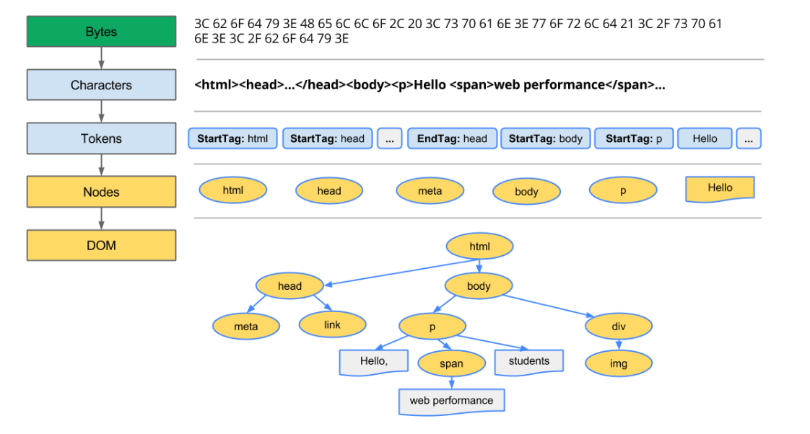
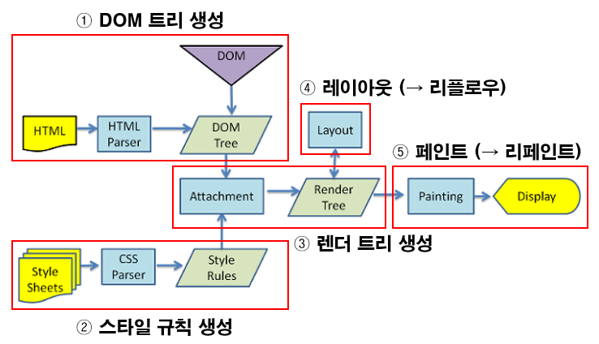

# 브라우저 렌더링 과정  (Critical rendering path)

> 렌더링 : html, css, js로 작성된 문서를 해석해 브라우저에 시각적으로 출력하는 것
>
> 렌더링 엔진 : html, css, js의 내용을 토대로 브라우저 화면에 표시하는 일을 함 (사파리, 크롬에서는 웹킷 엔진 사용)
>
> CRP :  웹 브라우저가 사용자의 스크린에 시각적인 표현을 나타낼 때까지 HTML, CSS, JavaScript를 코드로 변환하는 일련의 과정을 의미


1. **HTML 데이터 파싱**

   브라우저가 첫 번째 데이터의 청크를 받으면, 수신된 HTML 문서 정보를 파싱하기 시작함

   [파싱](https://developer.mozilla.org/ko/docs/Glossary/Speculative_parsing)은 브라우저가 네트워크를 통해 받은 데이터를 [DOM](https://developer.mozilla.org/ko/docs/Glossary/DOM)이나 [CSSOM](https://developer.mozilla.org/ko/docs/Glossary/CSSOM)으로 바꾸는 단계 → 이는 렌더러가 화면에 페이지를 그리는데 사용됨

2. **DOM(Document Object Model) 트리 만들기**

   - 브라우저는 마크업을 내부적으로 DOM으로 표현함
   - 각 노드는 HTML 요소에 해당하며 해당 요소의 속성, 콘텐츠 및 트리 내 위치를 설명하는 속성을 가지며, 노드가 트리 형태로 저장됨
   - DOM은 공개되어있고 Javascript의 다양한 API를 통해 조작할 수 있음

---

**DOM 트리 생성 과정**



​	

1. 변환

   - 브라우저가 HTML의 원시 바이트를 읽은 후, 파일의 지정된 인코딩 (ex: UTF-8)에 따라 개별 문자로 변환함

2) 토큰화

   - W3C HTML5 표준(ex: `<html>`, `<body>`)에 지정된 대로 문자열을 고유한 토큰과 꺾쇠괄호로 묶은 기타 문자열로 변환함
   - 각 토큰에는 특별한 의미와 고유한 규칙 집합이 있음 (HTML 토큰은 시작 및 종료 태그 그리고 속성 이름 및 값을 포함함)

3) 렉싱

   - 생성된 토큰을 기반으로 속성과 규칙을 정의하는 ‘객체’로 변환함 

     이 때, `StartTag:html`이 들어왔으면 `EndTags:html`을 만나기 전까지 들어오는 토큰들은 html 노드의 자식 노드로 넣는 식의 변환이 이루어짐

4) DOM 생성

   - HTML 마크업이 여러 태그 간의 관계를 정의함
   - 생성된 객체는 원래 마크업에 정의된 상-하위 관계도 함께 캡처하는 트리 데이터 구조로 연결됩니다.

   

이러한 DOM 트리는 문서의 내용을 설명하고, 요소 하나하나가 노드로 설정이 되어 트리 형태로 저장됨 (브라우저는 DOM을 점진적으로 빌드하게 됨)

---

파싱은 이미지와 같은 논 블로킹 자원을 발견하면, 브라우저는 해당 자원을 요청하고 분석을 계속하고, 구문 분석은 CSS 파일을 만났을 때도 지속될 수 있음

하지만, `async`나 `defer` 같은 설정이 되어있지 않은 `<script>` 태그는 렌더링을 막고, HTML 분석을 중지시킴

→ 브라우저 프리로드 스캐너가 이 작업을 가속화하지만, 과도한 스크립트는 주요한 병목 구간이 될 수 있음


- 프리로드 스캐너

  DOM 트리를 만드는 프로세스는 메인 스레드를 차지하기 때문에, *프리로드 스캐너* 는 사용 가능한 컨텐츠를 분석하고 CSS나 Javscript, 웹 폰트 같이 우선순위가 높은 자원을 요청함

  프리로드 스캐너 덕에 파서가 외부 자원에 대한 참조를 찾아 요청하기까지 기다리지 않아도 됨 (프리로드 스캐너가 자원을 뒤에서 미리 요청하기 때문에, 파서가 요청되는 자원에 다다를 때 쯤이면 이미 그 자원들을 전송받고 있거나 전송받은 후임)

  → 프리로드 스캐너가 제공하는 최적화는 블록킹을 줄여줌

----


3. **CSSOM 트리 만들기**

   > CSS 객체 모델 (CSS Object Model, CSSOM)에는 DOM의 스타일을 지정하는 방법에 대한 모든 정보가 포함되어 있음

   - HTML을 파싱하다가 CSS 링크를 만나면 CSS 파일을 요청해서 받아오게 됨

     이 과정은 DOM 트리 구축과 **동시에** 일어나게 되고, CSS에 있는 각각의 노드에 정해진 스타일 규칙을 읽고  `CSS 파서`에 의해  CSSOM 트리 만듦

   - CSS 파싱은 CSS 특성상 자식 노드들이 부모 노드의 특성을 계속해서 이어받는 규칙이 추가된다는 것을 빼고는 HTML 파싱과 동일하게 이루어짐 (바이트 > 문자 > 노드 > CSSOM)

   - CSSOM이 트리 구조를 가지는 이유

     - 페이지에 있는 객체의 최종 스타일 집합을 계산할 때, 브라우저는 해당 노드에 적용 가능한 가장 일반적인 규칙으로 시작한 다음 더 구체적인 규칙을 적용하여 계산된 스타일을 재귀적으로 미세 조정합니다. (ex: `body` 요소의 하위 요소인 경우, 모든 `body` 스타일이 적용됨)

       즉, 규칙을 ‘하향식 (cascading)’으로 적용합니다.

   - DOM과 CSSOM의  다른 차이점 : **CSSOM은 점진적으로 구성되지 않는다!**

   - CSS가 Render-blocking 리소스인 이유

     - 조금씩 처리할 수 있는 HTML과 달리 CSS는 한 번에 처리해야 함
     - 이는 CSS 파일에서 일부 스타일이 나중에 다른 스타일로 덮어쓰기 때문에 브라우저가 전체 CSS 파일을 읽을 때까지 기다려야 적용할 스타일을 결정할 수 있기 때문임
     - 이는 나중에 덮어쓰게 될 스타일을 표시하여 리소스를 낭비하는 것을 방지하기 위한 것
     - **간단히 말해 브라우저는 모든 CSS를 수신하고 파싱할 때까지 렌더링 프로세스를 차단하기 때문에** CSSOM을 구성하는 것이 모두 끝나야 이후의 Rendering 과정을 시작할 수 있음

   - 특정 리소스에서 렌더링을 차단할 필요가 없는경우 CSS `미디어 유형`과 `미디어 쿼리`를 사용해 해결할 수 있음

     ```html
     <!-- 렌더링을 차단함 --> 
     <link href="style.css" rel="stylesheet">
     <!-- 렌더링을 차단함 --> 
     <!-- all이 기본 유형이므로 특정 유형을 지정하지 않은 경우 디폴트로 all로 설정됨 --> 
     <link href="style.css" rel="stylesheet" media="all">
     <!-- 페이지가 인쇄될 때만 적용됨 --> 
     <!-- 페이지가 브라우저에서 처음 로드될 때는 렌더링이 차단되지 않음 -->
     <link href="print.css" rel="stylesheet" media="print">
     ```

     ▷ 미디어 유형과 미디어 쿼리 등의 요소는 렌더링의 성능에 큰 영향을 미치기 때문에, 스타일시트 자산을 선언할 때 미디어 유형과 미디어 쿼리에 세심한 주의를 기울여야 함


4. **JavaScript 실행**

   HTML 파서는 파싱을 하다가 script tag를 만나면 JavaScript코드를 실행하기 위해서 **파싱을 중단**하는데, 이 때 제어 권한을 JavaScript engine에 넘기고 JavaScript코드 또는 파일을 로드해서 파싱하고 실행함

   따라서 문서 내의 요소를 참조하는 JavaScript 파일이 있는 경우 해당 문서가 표시된 후에 배치해야 함

   

5. **Render 트리 만들기**

   - DOM과 CSSOM은 문서의 각기 다른 측면을 표현하는 서로 독립적인 객체

     하나는 콘텐츠를 설명하고, 하나는 문서에 적용되어야 하는 스타일 규칙을 설명함

     이 두가지를 병합해 브라우저가 어떻게 화면에 픽셀을 렌더링하는지에 대한 정보를 가진 Render 트리를 만듦 (화면에 표시되는 모든 컨텐츠의 내용과 스타일 정보를 모두 포함)

   - 렌더 트리는 DOM 트리의 루트부터 시작하여 눈에 보이는 노드를 순회하며 만들어지는데, 표시되는 각 노드에 대해 적절한 CSSOM 규칙을 찾아 적용한 후 컨텐츠 및 계산된 스타일과 함께 표시되는 노드를 내보냄

     이 때,  `<head>` 태그와 그 자식 요소 혹은 `display: none` 스타일 속성을 가진 요소와 같이  화면에 나타나지 않는 태그의 경우 렌더 트리에 포함되지 않고,  `font-size` 등 상속적인 스타일은 부모 노드에만 위치하도록 설계하는 등 최적화를 거쳐 렌더 레이어가 완성됨 (오직 화면에 렌더링 되는 노드만으로 구성됨)

     ※ `display: none`은 렌더 트리에 존재하지 않지만, `visibility: hidden`은 요소를 보이지 않게 하지만, 요소는 여전히 레이아웃에서 공간을 차지함

   


6. **레이아웃** (플로우)

   - *`레이아웃`* 은 렌더 트리에 있는 모든 노드의 너비, 높이, 위치를 결정하는 프로세스

     추가로 페이지에서 각 객체의 크기와 위치를 계산함

   - *`리플로우`* 는 레이아웃 이후에 있는 페이지의 일부분이나 전체 문서에 대한 크기나 위치에 대한 결정

   - 처음 노드의 사이즈와 위치가 결정되는 것을 *`레이아웃`* 이라고 부르고, 이후에 노드의 크기와 위치를 다시 계산하는 것은 *`리플로우`*라고 부름

   - 렌더 트리가 한 번 만들어지고 나면, 레이아웃이 시작됨

     렌더 트리는 (보이지 않더라도) 계산된 스타일과 함께 어떤 노드가 화면에 표시될지 식별하지만,  각 노드의 위치나 좌표를 알지는 못함 → 각 객체의 정확한 크기와 위치를 결정하기 위해서, 브라우저는 렌더 트리의 루트부터 시작하여 순회함

   - 웹 페이지에서 대부분은 박스 형태이고, 다른 기기, 다른 데스크탑 설정은 제한 없이 매우 다양한 뷰 포트 크기를 가짐

     - 뷰포트 크기는 `<meta>` 태그의 `viewport` 속성을 통해 결정되는데, 기본 뷰 포트 너비는 **980px**

     ```html
     <!-- 이 태그가 있어야만 브라우저는 <html> 태그의 너비를 장치의 너비에 맞춤 -->
     <meta name="viewport" content="width=device-width,initial-scale=1">
     ```

     레이아웃 단계에서 뷰 포트의 크기를 고려해서 브라우저는 화면에 표시될 모든 다른 상자의 크기를 결정하고, 레이아웃은 일반적으로 본문에서 시작해 모든 후손의 크기를 각 요소의 박스 모델 속성을 통해 계산하되, 이미지와 같이 크기를 모르는 요소를 위해서 위치 표시 공간을 남겨둠


7. **페인팅**

   - 페인팅 혹은 레지스터화 단계에서, 브라우저는 레이아웃 단계에서 계산된 각 박스를 실제 화면의 픽셀로 변환함

   - 페인팅에서 텍스트, 색깔, 경계, 그림자 및 버튼이나 이미지 같은 대체 요소를 포함하여 모든 요소의 시각적인 부분을 화면에 그리는 작업이 포함됨

   - 픽셀로 변환된 결과는 포토샵의 레이어처럼 생성되어 개별 레이어로 관리됨

     단, 각각의 엘리먼트가 모두 레이어가 되는 것이 아니라. `transform` 속성 등을 사용하면 엘리먼트가 레이어화 되는데 이 과정을 페인트 라고 함


8. **레이어 합치기 (composite layer)**

   - 문서의 각 섹션이 다른 레이어에서 그려질 때, 섹션을 겹쳐놓으면서 그것들이 올바른 순서로 화면에 그려지는 것과 정확한 렌더링을 보장하기 위해 합성이 필요함

   - 페인트 단계에서 생성된 레이어를 합성하여 스크린을 업데이트

     

### 리플로우와 리페인트




스타일 → 레이아웃 → 페인트 → 합성을 **렌더링**이라고 하며, 이 렌더링 과정은 상황에 따라 반복하여 발생할 수 있음

- **Reflow(=Layout) 발생하는 경우** → 렌더 트리가 재구성됨 (레이아웃부터 과정 수행)
  \- DOM의 추가/삭제
  \- CSS 속성 변경을 통해 기하학적(높이/넓이/위치 등)인 변화 
  ex) margin, padding, width, height, ...
- **Repaint(=Paint)가 발생하는 경우** (페인트부터 과정 수행)
  \- CSS 속성 변경이 기하학적 변화가 발생하지 않았을 경우
  ex) color, background, transform, box-shadow, ...


레이아웃이 일어나면 전체 픽셀을 다시 계산해야 하므로 부하가 큰 반면 리페인트는 이미 계산된 픽셀값을 이용해 화면을 그리기 때문에 레이아웃에 비해 부하가 적음


그래서 **reflow가 순간적으로 많이 발생할 경우 성능에 치명적**


다음은 어떤 엘리먼트에 레이아웃과 리페인트를 발생시키는 CSS 속성과 해당 속성값을 변경했을 때 차이를 보여줌

```html
<div id="sample" style="background:red;width:150px;height:50px;">
  Sample
</div>
```


**요소에 기하적인 영향을 주는 CSS 속성값 변경**

- CSS 속성값 : `height`, `width`, `left`, `top`, `font-size`, `line-height` 등

  ```jsx
  const example = document.getElementById('example');
  
  example.style.width = '400px';
  ```

- 레이아웃 발생

  

**요소에 기하적인 영향을 주지 않는 CSS 속성값 변경**

- CSS 속성값 : `background-color`, `color`, `visibility`, `text-decoration` 등

  ```jsx
  const sample = document.getElementById('example');
  
  example.style.backgroundColor = 'blue';
  ```

- 리페인트 발생

  


**결론 ) 레이아웃이 발생하면 실행 시간만큼 렌더링 시간도 늘어나게 되기 때문에 불필요한 레이아웃이 발생하지 않도록 신경 써야 함**


# ‼️ 오늘의 문제

**Q) 렌더트리와 DOM 트리는 1: 1 대응이다** (⭕, ❌)

**Q) CSSOM은 점진적으로 구성된다.** (⭕, ❌)


# 참고

[Critical Rendering Path: What It Is and How to Optimize It](https://nitropack.io/blog/post/critical-rendering-path-optimization)

[객체 모델 생성  | Articles  | web.dev](https://web.dev/articles/critical-rendering-path/constructing-the-object-model?hl=ko)

[렌더링 트리 생성, 레이아웃 및 페인트  | Articles  | web.dev](https://web.dev/articles/critical-rendering-path/render-tree-construction?hl=ko)


