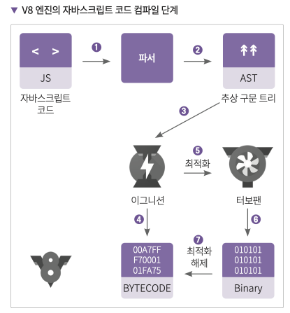

## 01. V8 엔진이란?


V8 엔진은 C++로 개발된, 구글에서 만든 가장 대중적인 `자바스크립트 런타임 엔진`이다.
현재 Google Chrome과 NodeJS에서 사용되고 있다.

### ✴︎ `자바스크립트 엔진`이란?


기계어는 컴퓨터가 사용하는 언어로, 0과 1로 이루어진 이진법을 이용한 **저수준의 언어**를 사용한다. 반면 자바스크립트 코드는 **고수준 언어**이다. 이렇듯 인간이 작성한 고수준의 자바스크립트 파일을 저수준의 언어를 사용하는 컴퓨터가 읽을 수 있게 해주는 것이 바로 **자바스크립트 엔진**이다.

자바스크립트 엔진(JS Engine)이 일련의 과정을 거쳐 컴퓨터에게 최적화된 코드로 변환하여 전달하면 이를 컴퓨터가 수행하게 된다.

정리하면 자바스크립트 엔진은 자바스크립트 코드를 마이크로프로세서가 이해할 수 있게 기계어로 변환하는 **인터프리터** 역할을 한다.

<br />

> **🧩 P1. 컴파일러와 인터프리터**
>
> **🗣 인터프리터**
>
> 코드를 위에서부터 **한 줄씩 해석**하면서 기계어로 번역하는 방식이다. 코드를 실행하기 전 컴파일 단계가 없기 때문에 **실행 속도가 빠르다**는 장점이 있다.
>
> **🗣 컴파일러**
>
> **파일 전체를 읽은 뒤**, 이를 컴파일하여 기계어로 변환하는 방식이다. 컴파일러는 작업을 단순화시키는 장점이 있다. 예를 들어 특정 함수를 10억번 반복해야 할 경우, 컴파일 과정에서 함수를 반복하는 것이 아니라 함수의 결과물을 반복하도록 컴파일한다.
>
> 이처럼 불필요한 동작을 제거하는 방식을 **최적화(Optimization)** 라고 한다.

<br />

### ✴︎ V8 엔진이 만들어진 이유

위 글과 같이`자바스크립트 엔진`은 웹 특성 상 유저와 상호작용을 위해 즉시성이 있는 인터프리터 방식을 사용하는데, 문제는 **코드가 많아질수록 속도가 느려진다**는 것이다.

떄문에 V8 엔진은 `웹 브라우저 내부에서 자바스크립트 수행 속도의 개선을 목표`로 고안되게 된다.

👉 V8 엔진은 인터프리터 대신 **JIT 컴파일러**를 구현함으로써 코드 실행 시 **`자바스크립트 코드를 머신 코드로 컴파일`** 하게 된다.

<br />

### ✴︎ JIT 컴파일러(just-in-time compiler)

**JIT(just-in-time) 컴파일** 또는 **동적 번역 (dynamic translation)** 은 프로그램을 실제 실행하는 시점에, 기계어로 번역하는 컴파일 기법이다.

쉽게 설명하면, JIT 컴파일러로 프로파일링을 통해 최적화할 코드를 선별한 후 해당 코드들만 컴파일한다. 이 기법을 통해 프로그램의 실행 속도를 향상시킨다.

<br />

## 02. V8 엔진의 구조와 동작 원리



### ❶ 파서(Parser) → 파싱(Parsing) → AST Tree

V8 엔진은 `JavaScript Source Code`를 가져와 가장 먼저 `Parser(파서)`에게 전달한다.  
`Parser`는 파싱 과정을 통해 JavaScript 코드를 분석하여 토큰으로 분해한다.

```js
const a = 5;
["const", "a", "=", "5"];
```

그리고 분해된 토큰을 바탕으로 **추상 구문 트리(AST, Abstract Syntax Tree)** 를 생성한다.

```js
function hello (name) {
  return 'Hello,' + name;
}

// 위 코드를 파싱하면 대략 이런 추상 구문 트리가 된다.

{
  type: 'FunctionDeclaration',
  name: 'hello'
  arguments: [
    {
      type: 'Variable',
      name: 'name'
    }
  ]
  // ...
}
```

> - parsing(구문 분석) : 프로그래밍 언어로 작성된 문장의 구성 성분을 분해하여 문법적 관계를 분석하는 행위를 말한다.
> - Token(토큰) : 소스 코드를 자바스크립트 문법 규칙에 따라 구문(어휘) 분석하여 나온 문자열 조각들

<br />

### ❷ Ignition으로 바이트 코드(Bytecode) 변환하기

**Ignition**는 `JavaScript code`를 `Byte code(바이트 코드)`로 변환하는 인터프리터이다.

> **🧩 P2. 바이트 코드(Bytecode)란?**
>
> `바이트 코드(Bytecode)`는 고급 언어로 작성된 소스 코드를 VM(Virtual Machine, 가상머신)이 해석하기 쉬운 중간 코드로 한번 컴파일한 것을 의미한다.  
> V8 엔진에서 이 역할을 수행하는 것이 바로, 인터프리터인 `Ignition`이다.

**Ignition**를 통해 `JavaScript code`를 `Byte code(바이트 코드)`로 변환하며 다음 3가지 이점이 생긴다.

**1. 메모리 사용량 감소** : 자바스크립트 코드를 바이트 코드로 컴파일하면 이를 기계어로 컴파일 했을 때 보다 코드 실행 시 차지하는 메모리 공간이 적다.  
**2. 파싱 시 오버헤드 감소** : 바이트 코드는 간결하기 때문에, 다시 원본 코드로 파싱이 필요한 경우에도 복잡도가 줄어든다.  
**3. 컴파일 파이프 라인의 복잡성 감소** : 바이트 코드로 인해 `Optimizing(최적화)`과 `Deoptimizing(최적화 해제)` 모두 간편하다.

이렇게 변환된 바이트 코드는 실제 컴퓨터에서 실행되어 동작하게 되고, 그 중 자주 사용되는 코드는 컴파일러인 **TurboFan**으로 보내지게 된다.

<br />

### ❸ TurboFan → Optimized

**TurboFan**은 V8엔진에서 최적화를 담당하는 컴파일러로, 최적화 조건에 부합하는 바이트 코드에 대해 기계어로 변환하여 최적화를 진행한다.

이렇게 최적화가 진행된 코드를 Optimized Machine Code(최적화된 코드)라고 하며, 0과 1로 이뤄진 이진 코드이다.

이때, 최적화되는 조건은 다음과 같다.  
**1. Hot & Stable** : 자주 호출되고(hot), 변하지 않는 코드를 말한다. 예로 매번 같은 행동을 수행하는 순수함수가 있다.  
**2. short** : 인터프리팅된 바이트 코드 길이가 특정 임계점을 넘기지 않는다면, 작은 함수라고 판단하여 최적화를 진행한다. 작고 단순한 함수는 크고 복잡한 함수보다 동작이 매우 추상적이거나 제한적인 확률이 더 높기 때문에 안정적이라고 판단한다.

> **👀 Behind Story**
>
> 여기서 사용되는 용어들이 굉장히 재미있는데, V8은 원래 8기통 엔진의 종류를 의미하는 단어다.(제네시스 G90이나 기아 K9같은 차에 들어간다고 한다.)
>
> 그리고 Ignition는 엔진에 시동걸 때 사용하는 "점화기"라는 뜻이다.
>
> 👉 이를 결합해보면, `V8`엔진 속 `Ignition`라는 점화기로 불을 붙여 코드가 실행되고, 엔진이 과열되지 않고 잘 작동될 수 있도록 `TurboFan`으로 최적화 작업을 통해 식혀준다!

<br />

> 📂 참고자료
>
> - [V8 엔진은 어떻게 내 코드를 실행하는 걸까?](https://evan-moon.github.io/2019/06/28/v8-analysis/#v8-%EC%97%94%EC%A7%84%EC%9D%B4%EB%9E%80)
> - [V8 엔진이란?](https://velog.io/@remon/V8-%EC%97%94%EC%A7%84%EC%9D%B4-%EB%8C%80%EC%B2%B4-%EB%AD%90%EC%95%BC)
> - [Node.js 백엔드 개발자 되기](https://wikidocs.net/223219)
