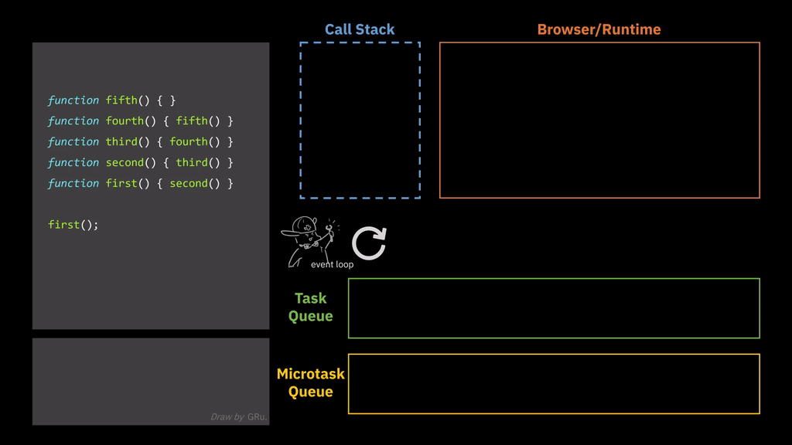
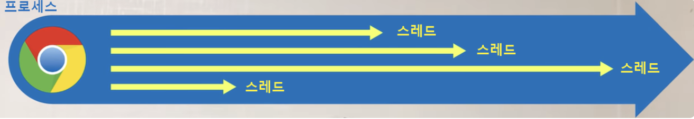
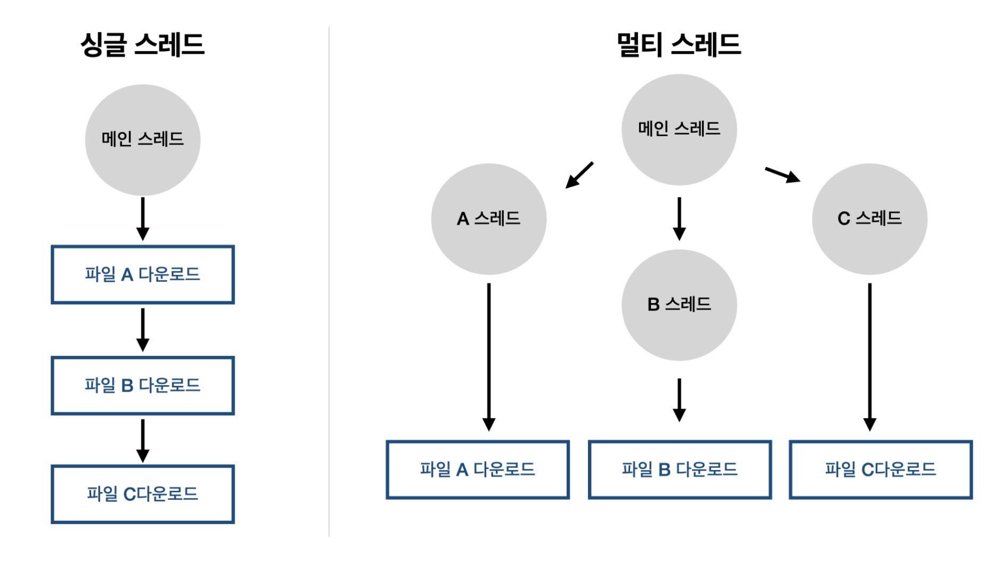
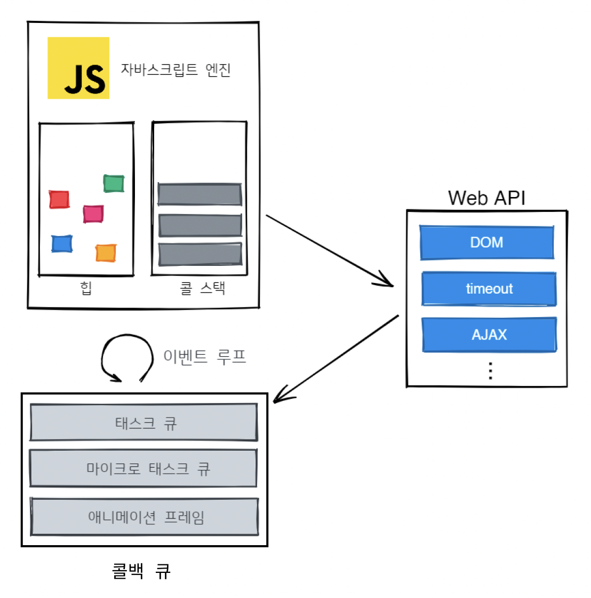
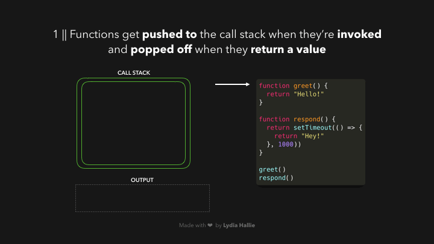
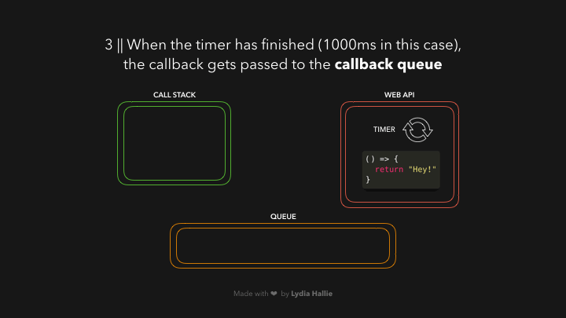
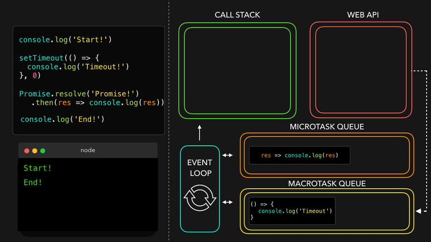
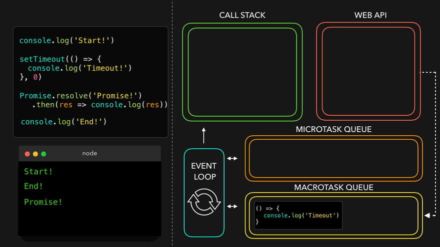

# 00. 들어가기 전에,

자바스크립트는 **`싱글 스레드`** 기반의 언어이고, 자바스크립트 엔진은 오직 **하나의 콜스택**을 사용한다.  
즉, 한 번에 최대 하나의 작업만 처리할 수 있다.



<br />

> **🧩 P1. 스레드에 대한 의문**
>
> **1. "스레드"란 무엇인가**
>
> - **프로세스(Process)** : 크롬, 카카오톡 같이 `실행 중인 프로그램`을 말한다.
> - **스레드(thread)** : 프로세스 내에서 실행되는 `특정한 수행 경로`를 말한다.
>   
>   
>
> **2."싱글" 스레드란 무엇인가**
>
> - 스레드가 하나이면 `싱글`스레드, 하나 이상이면 `멀티`스레드이다.
>
>    
>
> **3. 자바스크립트는 "왜" 싱글 스레드를 기반으로 하는가**
>
> 자바스크립트가 만들어진 배경에 이유가 있는데, 자바스크립트는 **웹페이지의 보조적인 기능을 수행**하기 위해 브라우저에서 동작하는 **경량 프로그래밍 언어**를 도입하기 위해 만들어진 언어이다.
>
> 멀티 스레드인 자바는 다소 무겁고 어렵다는 인식과, 동시성 문제가 있다보니, 복잡한 시나리오를 신경쓸 필요 없는 싱글 스레드 형식이 채택되었다.

<br />

만약 이때 네트워크 요청과 같이 오버헤드가 큰 작업이 동기적으로 처리된다면, 해당 작업이 완료되기 전까진 아무 작업도 처리 할 수 없게 된다.

따라서 자바스크립트 런타임(실행 환경)인 **브라우저**나, **Node.js**에서는 싱글 스레드인 자바스크립트가 비동기 작업을 수행할 수 있도록 도와주는데, 이때 사용되는 것이 바로 **이벤트 루프(Event Loop)** 이다.

이벤트 루프(Event Loop)는 싱글 스레드로 동작하는 자바스크립트가 비동기적인 작업을 처리할 수 있도록 도와주는 역할을 한다.

> **🔄 왜 이벤트 "루프"일까?**
>
> 이벤트 "루프"라고 불리는 이유는, 이벤트 루프의 동작 방식이 계속해서 작업들을 실행하는 무한 루프의 구조이기 때문이다.
>
> ```jsx
> while (eventLoop.waitForTask()) {
>   // 작업이 있는지 확인한 다음,
>   eventLoop.processNextTask(); // 있다면 작업을 처리해라.
> }
> ```

<br />

# 01. 브라우저에서의 자바스크립트 런타임(실행 환경) 작동 방식



## ① 자바스크립트 엔진(JS Engine)

- 자바스크립트 엔진은 Memory Heap 과 Call Stack 으로 구성되어 있다.
- 가장 유명한 JS Engine으론 구글의 V8 Engine이 있다.

### ❶ 메모리 힙(Memory Heap)

- 쉽게 말해 컴퓨터가 참조 타입의 주소 정보를 저장하는 "주소록"이다.
- 객체, 배열, 함수 등 데이터 정보가 저장되는 공간이다.

### ❷ 콜 스택(Call Stack)

- "자바스크립트의 할 일 목록"이라고 할 수 있다.
- 함수를 호출하게 되면 해당 함수의 정보가 콜 스택에 쌓이고, 먼저 들어간 것이 가장 마지막에 나오는 **FILO(First In Last Out)** 구조이다.

<br />

## ② 웹 API(Web API)

- 브라우저가 제공하는 다양한 기능들을 의미하며, 대표적으로 `HTTP 요청`, `setTimeout` 등이 있다.
- 주로 비동기적으로 처리되므로 완료시점을 정확히 알 수 없다는 것이 특징이다.

<br />

## ③ 콜백 큐(Callback Queue)

- Web APIs와 같이 **비동기 작업**의 결과나 **나중에 실행**되어야 하는 작업들이 대기하는 공간이다.
- 먼저 들어간 작업이 먼저 나가는 **FIFO(First In First Out)** 구조로 콜스택이 비어졌을 때, 순서대로 수행된다.

이때 비동기 함수들은 무작위로 콜백 큐에 쌓이는 게 아니라, 종류에 따라 콜백 큐 안에서 분류된다.

### ❶ 태스크/매크로태스크 큐 (Tesk/Macrotesk Queue)

- `setTimeout`, `setInterval` 등의 비동기 작업이 적재된다.

### ❷ 마이크로태스크 큐(Microtask Queue)

- `Promise(프로미스)의 콜백 함수`나 `async/await`와 같은 자바스크립트의 비동기 함수가 적재된다.

### ❸ 애니메이션 프레임(Animation Frames)

- 브라우저 환경에서 **화면을 업데이트하는 작업(Rendering)** 도 비동기적으로 처리된다.
- `requestAnimationFrames` 등이 적재된다.

> **🧩 P2. 콜백 큐의 실행 순서는 어떻게 될까?**
>
> 마이크로태스크 큐(Microtask Queue) > 애니메이션 프레임(Animation Frames) > 태스크 큐(Task Queue) 순으로,  Microtask Queue가 가장 먼저 실행되고 Task Queue가 가장 늦게 실행되는 우선순위를 가진다.

 <br />

## ④ 이벤트 루프(Event Loop)


- 이벤트 루프는 콜 스택과 콜백 큐를 지속적으로 확인해 → 콜 스택이 비어 있으면, 콜백 큐에서 **가장 오래 된 작업(FIFO)** 을 꺼내 콜 스택으로 옮기는 역할을 한다.
- 콜백 큐에서 나중에 실행되야 할 작업들의 **실행 순서를 보장**할 수 있는 이유가 바로 이벤트 루프 덕분이다.

<br />

# 02. 이벤트 루프(Event Loop)의 동작 과정

**1. 콜 스택(Call Stack) 확인**  
이벤트 루프는 먼저 현재 콜 스택이 비어 있는지 확인한다.  
아직 콜 스택에 처리되지 않은 함수가 있다면, 해당 함수가 완전히 실행되어 콜 스택이 비워질 때까지 기다린다.

**2. 콜백 큐(Callback Queue) 확인**  
콜 스택이 비어있다면 다음으로, 콜백 큐에 대기 중인 콜백 함수를 확인 한다.

**3. 함수 이동**  
콜백 큐에서 가장 오래된 함수를 꺼내어 콜 스택으로 옮긴다.

**4. 함수 실행**  
콜 스택으로 옮겨진 함수가 실행되어 종료되면 콜 스택에서 제거된다.

**5. 반복**  
위 과정을 프로그램이 종료될 때까지 반복한다.

<br />

# 03. 이벤트 루프(Event Loop) 예제

## ① setTimeout

```jsx
const greet = () => {
  return "Hello!";
};

const respond = () => {
  return setTimeout(() => {
    return "Good Moring!";
  }, 1000);
};

greet();
respond();
```

> 👀 javascript는 인터프리터 언어로, 가장 위부터 소스 코드를 한줄 씩 읽어가며 명령을 바로 처리한다. 즉 읽기와 실행이 동시에 이루어진다.



1. greet 함수를 호출하고, 현재 콜 스택에 실행 중인 함수가 없기 때문에 콜 스택에 바로 greet함수가 들어간다.  
   그 후 바로 "Hello"가 출력되고 콜 스택에서 제거된다.

2. 다음으로 respond 함수를 호출한다.

   이때 respond 함수는 Web API가 제공하는 비동기 함수, `setTimeout`함수를 반환하기 때문에 바로 콜 스택에 들어가게 되면 해당 함수의 실행이 완료될 때까지 모든 작업들은 대기(Blocking)상태에 놓이게 된다.

   따라서 `setTimeout`함수는 콜 스택으로 바로 들어가지 않고, Web API로 전달된다.


3. respond 함수는 콜 스택에서 빠져나오면서 `setTimeout`함수를 반환하게 되고, `setTimeout`함수에게 전달한 콜백 함수는 따로 빠져나와 Web API로 이동하게 된다.

   그리고 Web API에서 두 번째 인자로 전달받은 1000ms(1초)만큼 실행한다.



4. 그 후 해당 콜백 함수는 Callback Queue, 자세하게는 `태스크/매크로태스크 큐 (Tesk/Macrotesk Queue)`에 들어간다.


5. 이벤트 루프를 통해 콜 스택이 비어 있는지 확인 후, 비어있다면 콜백 큐에 있는 콜백 함수를 콜 스택에 추가한다.


6. 콜 스택에 추가된 콜백 함수는 호출 후 값을 반환한 후에 콜 스택에서 제거된다.

<br />

## ② setTimeout과 Promise

> 💡 중요한 건, 비동기 함수라고 모두 같은 콜백 큐에 추가되는 것이 아니라, **우선 순위**에 따른다.

```jsx
console.log("Start");

setTimeout(() => {
  console.log("Timeout");
}, 0);

Promise.resolve("Promise").then((res) => console.log(res));

console.log("End");
```


1. 먼저 `console.log` 코드를 만나 콜 스택에 추가되어 값을 출력 한 후, 콜 스택에서 제거된다.


2. 다음으로 `setTimeout` 함수를 만나 내부의 콜백 함수는 콜 스택이 아닌 **Web API**로 전달된다. 그 후 두 번째 인자만큼(0ms)실행된 후에 `태스크/매크로태스크 큐 (Tesk/Macrotesk Queue)`에 적재된다.


3.  다음으로 Promise(프로미스)를 만나 `Promise.resolve`가 콜 스택에 추가 되고, 프로미스의 콜백 함수가 `태스크/매크로태스크 큐 (Tesk/Macrotesk Queue)`에 추가 된다.

    그 후 `Promise.resolve`는 콜 스택에서 제거된다.


4. 마지막 코드인 `console.log`가 콜 스택에 추가되어 실행 결과를 출력하고 콜 스택에서 제거된다.



5.  `console.log`가 제거되면서 콜 스택이 비어있으므로 이벤트 루프는 콜백 큐에 대기 중인 작업이 있는지 확인 후, 콜 스택에 추가한다.

> 🚨 이때 추가되는 우선순위는 **마이크로태스크 큐(Microtask Queue) > 애니메이션 프레임(Animation Frames) > 태스크 큐(Task Queue)** 이다.

따라서 `마이크로태스크 큐(Microtask Queue)`에 대기 중인 **Promise의 callback 함수**가 콜 스택에 추가되고 실행 후, 제거된다.



6. 마지막으로 `태스크/매크로태스크 큐 (Tesk/Macrotesk Queue)`에 대기 중이던 **setTimeout의 콜백 함수** 가 콜 스택에 추가되고, 실행 후 제거된다.

> **🧩 P3. aysnc/await와 Promise 동작 방식의 차이점**
>
> 
> aysnc/await와 Promise는 모두 **비동기** 작업을 하는 함수지만, 동작 방식엔 차이점이 존재한다.
>
> - **Promise** : Promise 객체가 resolve 또는 reject 되면 .thene() 또는 .catch() 내부의 **콜백 함수**가 `마이크로태스크 큐`에 추가된다.
> - **async / await** : async함수 내에서 await 키워드를 만나면 말그대로 해당 함수의 실행이 **일시 중단** 된다.
>
>   따라서 일시 중단된 **해당 함수**가 `마이크로태스크 큐`로 이동하게 된다.
>
>   

<br />

# 04. 마무리

이벤트 루프와 각 큐의 동작 방식을 통해 자바스크립트 코드의 동작 원리를 깊게 이해하고 성능 최적화와 디버깅에도 큰 도움을 얻을 수 있다.

<br />

> 📂 참고자료
>
> - [이벤트 루프(Event Loop)에 대해서](https://yong-nyong.tistory.com/71)
> - [JavaScript Visualized: Event Loop](https://dev.to/lydiahallie/javascript-visualized-event-loop-3dif)
