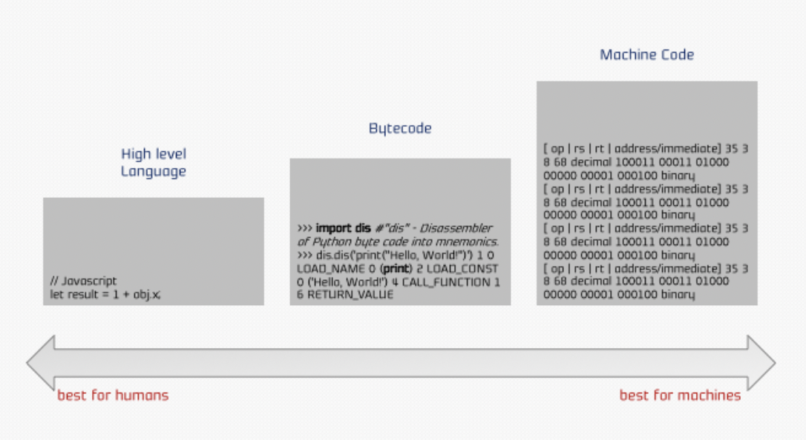
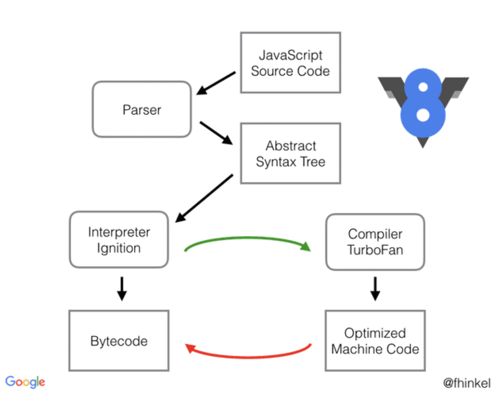

# V8 엔진 작동 원리

## 자바스크립트 엔진

컴퓨터는 0과 1만을 이해할 수 있는데, 자바스크립트 파일을 컴퓨터가 읽을 수 있는 것은 자바스크립트 엔진이 있기 때문에 가능하다.

→ 자바스크립트 엔진은 자바스크립트 코드를 마이크로프로세서가 이해할 수 있게 기계어로 변환해서 실행하는 프로그램 또는 인터프리터를 말한다.
<br>

## V8 엔진이란?

V8 엔진은 Google이 개발한 오픈소스로 가장 대중적인 자바스크립트 엔진이다.
C++로 개발하였고 Node JS 런타임 및 Chrome 브라우저에서 사용되며, 웹 브라우저 안에서 실행되는 JavaScript의 성능을 높이기 위해 처음 고안되었다.

#### V8 엔진의 역할

- JS 코드 컴파일, 실행
- 콜 스택 처리( 함수 실행 )
- 메모리 할당
- 가비지 컬렉션

## 컴파일러와 인터프리터

프로그래밍 언어의 소스 코드를 기계어로 변환하여 실행하는데 두가지 방식이 있다.

- **✓ 컴파일러:** 한 줄 한 줄 번역하지 않고 파일 전체를 읽은 뒤, 코드의 의미를 해석하고 파일 전체를 기계어로 컴파일해서 변환한다.
  <br>

  - 장점 : 컴파일러는 작업을 단순화시킨다. 예를 들어 특정 함수를 10억번 반복해야 할 경우, 컴파일 과정에서 함수를 반복하는 것이 아니라 함수의 결과물을 반복하도록 컴파일 한다. 이처럼 불필요한 동작을 제거하는 컴파일러의 방식을 최적화, optimization이라고 한다. (인터프리터는 optimize하지 않는다.)

  - 단점 : 코드를 바로 실행하지 않고, 코드 실행 전 전체를 컴파일 하는 과정이 필요하기 때문에 초기에 속도가 느릴 수 밖에 없다.

<br>

- **✓ 인터프리터:** 코드를 한 줄 한 줄 읽어내려가며 한 줄씩 Bytecode로 변환한다.
  <br>

  - 장점 : 코드 전체가 컴파일 된 Compilation이 완성되는 것을 기다릴 필요 없이, 한 줄 한 줄 변환하기 때문에 실행 속도가 빠르다. ❗️자바스크립트는 웹을 위해 개발된 언어이고, 유저에게 최상의 경험을 제공해야 하기 때문에 빠르게 실행되는 것이 중요한 자바스크립트에 이상적인 코드 변환 방식이다.

  - 단점 : 자바스크립트 코드가 복잡해질수록 점점 속도가 느려진다. 예를 들어, 같은 코드를 여러차례 반복하는 반복문의 경우, 같은 결과를 반복하는 것임에도 불구하고 코드를 한 줄 한 줄 읽는 방식 때문에 10억번을 반복해야 한다면 말 그대로 10억번을 반복해서 코드 변환을 진행하게 된다.

  

## V8의 작동원리

V8은 소스코드를 parser에게 넘긴다. parser는 소스코드를 분석한 후에 AST(Abstract Syntax Tree) 로 변환하게 된다. 만들어진 추상 구문 트리를 Ignition에게 넘기게 된다. Ignition은 자바스크립트를 바이트 코드로 변환하는 Interpreter이다. 컴퓨터는 원본 소스코드 보다 바이트코드를 해석하기 쉽기 때문에 바이트 코드로 변환하면 속도와 메모리 공간의 이점이 있다.

바이트 코드를 실행하게 되면 소스 코드가 작동하게 되고 자주 사용되는 코드는 TurboFan Compiler로 보내져서 Optimized Machine Code 최적화된 코드로 다시 컴파일 된다. 사용이 덜 되면 다시 Deoptimizing 한다.
<br>


1️⃣ **Parser:** 코드의 의미를 이해하기 위해, 낱말 분석(Lexical Analysis) 이라는 과정을 통해 코드를 토큰으로 분해한다.

ex) 'var a = 5' -> ['var' , 'a' , '=' , '5']

2️⃣ **AST(Abstract Syntax Tree) 생성:** Parser에서 분해된 토큰을 바탕으로 tree를 생성한다.
<br>
(프로그래밍 언어로 작성된 소스 코드의 추상 구문 구조의 트리로, 추상적이라는 이유는 실제 구문에서 나타나는 모든 세세한 정보를 표현하지 않는다는 것을 의미)

- 코드에서 이해를 돕기 위한 그룹핑을 위한 괄호까지 명시적으로 분리된 노드로 표현될 필요는 없다.
- if-condition-then 구문은 3개의 브랜치를 가진 단일 노드로 표현될 수 있다. (위의 예제 그림에서 condition, assign (if-body), assign (else-body) 을 살펴볼 수 있다.)
  <br>

  

3️⃣ **Interpreter Ignition로 Bytecode 생성:**
AST에서 나온 코드가 인터프리터(ignition)에게 전달되고, 인터프리터는 코드를 Bytecode로 변환한다.

- 바이트 코드(Bytecode): 고수준언어로 작성된 소스 코드를 가상머신이 이해할 수 있도록 중간 코드로 한번 컴파일 한것을 의미한다. V8에서는 Ignition이 이 역할을 수행한다.4

Ignition을 컴파일 방식이 아닌 코드 한줄 한줄이 실행될 때마다 해석하는 인터프리트 방식을 채택하여 다음 세가지 이점을 가져가고자 하였다.

- 메모리 사용량 감소. 자바스크립트코드에서 기계어로 컴파일하는 것보다 바이트코드로 컴파일하는 것이 더 편하다.
- 파싱 시 오버헤드 감소. 바이트 코드는 간결하기 때문에 다시 파싱하기도 편하다.
- 컴파일 파이프 라인의 복잡성 감소. Optimizing이든 Deoptimizing이든 바이트 코드 하나만 생각하면 되기 때문에 편하다.원본 소스 코드보다 컴퓨터가 해석하기 쉬운 바이트 코드로 변환함으로써 원본 코드를 다시 파싱(Parsing)해야하는 수고를 덜고 코드의 양도 줄이면서 코드 실행 때 차지하는 메모리 공간을 아끼려는 것이다.
-

4️⃣ **Bytecode 실행 → TurboFan → Optimized:**
<br>

- 코드를 점화하여 Bytecode를 생성 및 실행한다.
- V8 Engine은 런타임 과정 중 Profiler(프로그램이 실행되는 동안의 성능 및 동작을 분석하는 도구)에게 지속적인 프로파일링(함수나 변수들의 호출 빈도와 같은 데이터를 모으라고 지시)을 통해 최적화 할 부분 Hot spot(반복되어 사용하는 코드)등 과열지점을 찾는다.

- 최적화 가능한 부분을 찾으면 Profiler는 이를 컴파일러에게 전달하고, 컴파일러는 인터프리터에 의해 실시간으로 웹사이트가 구동되는 동안 필요한 부분을 기계어로 변환하여 최적화를 진행하고, 과열 코드를 TurboFan(최적화 컴파일러)으로 보내 최적화 컴파일을 진행한다.

- 최적화 코드를 수행할 차례가 다가오면, Bytecode 대신 컴파일러가 변환한 최적화된 코드가 그 자리를 대체하여 실행된다.

      ✓최적화 기법

       - 히든 클래스: 비슷한 것들끼리 분류해놓고 가져다 쓰는 것,
       - 인라인 캐싱: 자주 사용되는 코드가 만약 hello()와 같은 함수의 호출부라면 이걸 function hello () { ... }와 같이 함수의 내용으로 바꿔버리는 것. 말 그대로 캐싱(Caching)

👉🏻 V8은 인터프리터와 컴파일러를 결합하여 사용하며, 이를 통해 초기에는 빠른 시작을 제공하면서, 동시에 실행 중에 프로그램을 최적화하여 높은 성능을 유지한다.

<br>
<br>

# 💟 오늘의 문제 💟

1. Web Apis는 각 API마다 스레드들이 할당 되어있고, 이들이 모여 멀티 스레드를 이룬다 (🅾️, ❌)
   <br>

2. 이 코드는 올바르게 동작할 수 있다. (🅾️, ❌)

```
const button = document.querySelector("button");
button.addEventListener("click", () => {
  const element = document.createElement("h1");
  element.style.color = "red";
  element.innerText = "hello";
  document.body.appendChild(element);
});
```
