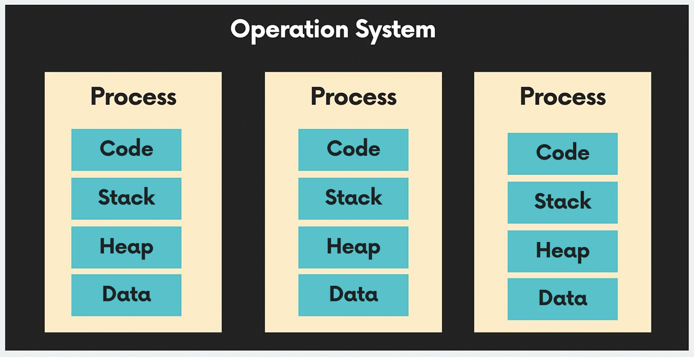
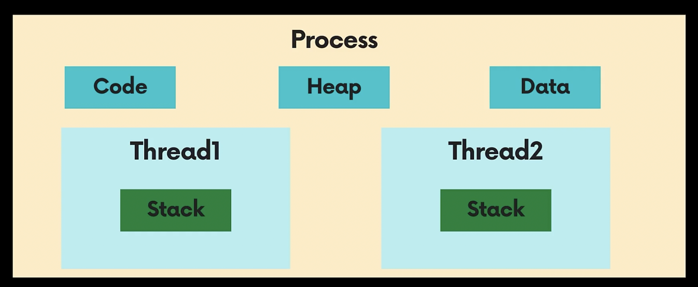
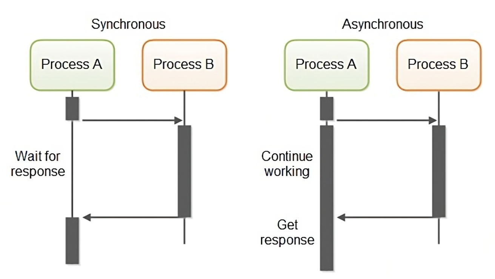
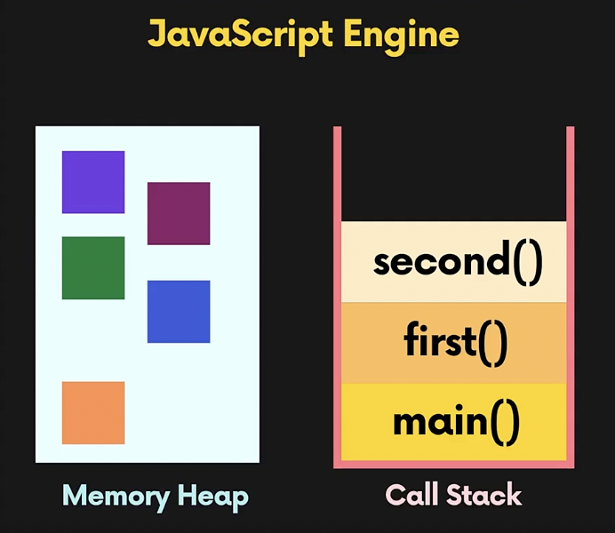
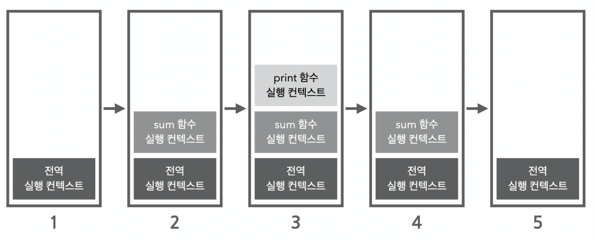
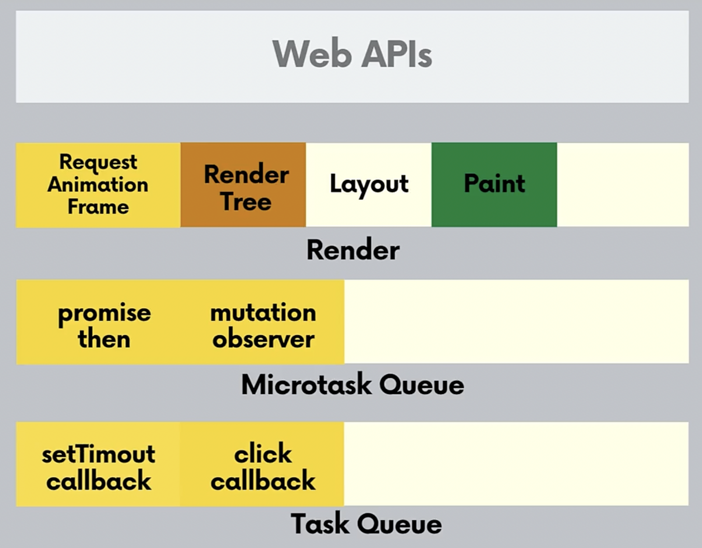
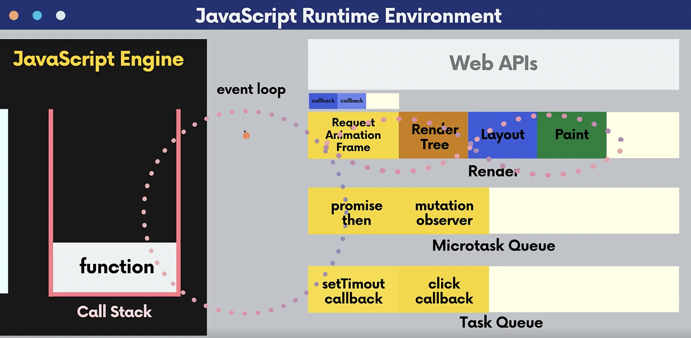

# 자바스크립트의 이벤트 루프 & 비동기 처리

## Process

프로세스는 실행 중인 프로그램으로, 메모리 공간, 시스템 자원, 파일 등을 포함하는 독립적인 실행 단위입니다. 각 프로세스는 운영 체제로부터 독립적인 메모리 공간을 할당받아 실행됩니다.



## Thread

스레드는 프로그램 내에서 실행되는 작업의 최소 단위로, 프로세스 내의 자원을 공유하면서 동시에 여러 작업을 독립적으로 실행한다.



- code : 프로그램의 실행 코드가 저장
- Heap: 동적으로 할당된 데이터를 저장하는 공간 (사용자가 직접 할당할 수 있는 저장공간 → 크기변동 O)
- Data: 전역 변수 및 정적 변수를 저장하는 공간 (프로그램이 실행되는 동안 유지될 데이터 저장 → 크기 변동X)
- stack: 함수 호출 정보 흐름 저장

### Single vs Multi Thread

- **Single Thread:** 하나의 실행 흐름을 가지는 모델을 나타냅니다. 즉, 한 번에 하나의 작업만을 수행할 수 있다.

- **Multi-Thread:** 여러 개의 스레드가 동시에 실행되는 모델로, 한 프로세스 내에서 각 스레드는 독립적으로 실행되지만, 공유된 자원(메모리, 파일 등)에 접근할 수 있다.
  <br>→ 여러 스레드가 공유된 자원에 동시에 접근할 때, 예측 불가능한 결과가 발생할 수 있기 때문에 **동기화 문제**에 주의해야한다.

<br>

### 🤔 Javascript가 Single Thread인 이유

자바스크립트는 1995년에 넷스케이프에서 개발된 스크립트 언어로써, 당시에는 멀티 코어 프로세서가 보편화되지 않았고, 자바스크립트는 웹 브라우저에서 간단한 스크립트 동작을 수행하는 데 주로 사용되었기 때문에 복잡한 병렬 처리를 필요로 하지 않아, 메모리 사용량이 적고, 동기화 문제를 피할 수 있는 싱글 스레드로 구현하였다고 한다.

→ 언어 자체의 설계를 바꾸는 것 보단, 브라우저의 멀티 스레드를 이용하여, 자바스크립트의 비동기 프로그래밍을 지원한다.

<br>

### 🤔 Javascript가 Single Thread지만, 동시 작업이 가능한 이유

**동기 VS 비동기**

- **Synchronous:** 작업 시간을 함께 맞춰서 실행한다 라는 뜻으로, 요청한 작업에 대해 완료 여부를 따져 순차대로 처리한다.
- **Asynchronous:** 동기와 반대로 요청한 작업에 대해 완료 여부를 따지지 않고, 자신의 다음 작업을 그대로 수행한다.


동기는 작업 B가 완료되어야 다음 작업을 수행하고, 비동기는 작업 B의 완료 여부를 따지지 않고 바로 다음 작업을 수행한다
<br>

**Web APIs**

Web APIs는 타이머, 네트워크 요청, 파일 입출력, 이벤트 처리 등 브라우저에서 제공하는 다양한 API를 포괄하는 총칭으로, Web API는 브라우저에서 `멀티 스레드`로 구현되어 있어, 비동기 작업에 대해 메인 스레드를 차단하지 않고 다른 스레드로 동시에 처리가 가능하다.

✓ 각 API마다 스레드들이 할당 되어있고, 이들이 모여 멀티 스레드로 이루어져 있다.

- setTimeout : Timer API 에서는 타이머 스레드를 사용
- XMLHttpRequest , fetch: 네트워크 관련 API는 네트워크 스레드를 사용

<br>
❗️모든 자바스크립트 코드를 비동기로 처리할 수 있는 것은 아니며, 비동기 전용 함수만 가능하다. (setTimeout, fetch, addEventListener)
<br>
👉🏻 이벤트 루프가 자바스크립트 엔진과 브라우저의 web API를 연결하여 비동기적인 일 처리를 해주기 때문에, 멀티쓰레드처럼 사용 가능하다.

<br>
<br>

## Event Loop

### Javascript Engine

JavaScript 엔진은 JavaScript 코드를 읽고 해석하여 실행하는 역할을 수행한다.
<br>
<br>


- **memory Heap:** 우리가 동적으로 할당한 메모리를 저장하는 공간으로, 객체, 변수, 함수 등의 데이터가 저장된다.
- **call stack:** 함수의 호출과 관련된 정보를 기록하는 스택 구조의 메모리 영역으로,
  함수가 호출되면 해당 함수의 정보(로컬 변수, 매개변수, 반환 주소 등)가 콜 스택에 push되고, 함수가 종료되면 해당 정보가 pop되어 스택에서 제거된다.

<br>

### 실행 컨텍스트

실행컨텍스트는 소스코드를 실행하는데 필요한 환경을 제공하고, 코드 실행결과를 실제로 관리하는 영역이다.

1. **Global Execution context:** 자바스크립트 엔진이 처음 코드를 실행할 때 Global Execution Context가 생성된다. 생성 과정에서 전역 객체인 Window Object (Node는 Global) 를 생성하고 this가 Window 객체를 가리키도록 한다.
2. **Function Execution context:** 자바스크립트 엔진은 함수가 호출 될 때마다 호출 된 함수를 위한 Execution Context를 생성한다.
3. **Eval Context** :eval 함수로 실행되는 코드로,
   이제 쓰지 않는 eval() 함수에 의해 생성되는 실행 컨텍스트이다.

### call stack

코드가 실행되면서 생성되는 Execution Context를 저장 & 관리하는 자료구조

식별자와 스코프는 실행컨텍스트의 렉시컬 환경으로 관리하고, 코드 실행순서는 실행 컨텍스트 스택으로 관리한다. 엔진이 처음 script를 실행할 때, Global Execution Context를 생성하고 이를 Call Stack에 push한다. 그 후 엔진이 함수를 호출할 때 마다 함수를 위한 Execution Context를 생성하고 이를 Call Stack에 push 한다.

자바스크립트 엔진은 Call Stack의 Top에 위치한 함수를 실행하며 함수가 종료되면 stack에서 제거(pop)하고 제어를 다음 Top에 위치한 함수로 이동한다.

👉🏻 프로그램이 함수 호출을 추적할때 사용



```
1. 전역 컨텍스트가 호출되면서 전역 실행 컨텍스트가 실행 스택에 push 되고
2. sum 함수가 호출 및 실행되면서 sum 함수의 함수 실행 컨텍스트가 실행 스택에 push
3. print 함수가 호출 및 실행되면서 print 함수의 함수 실행 컨텍스트를 실행 스택에 push. 그리고 실행이 끝나면 print 함수의 함수 실행 컨텍스트는 pop (제거)
4. sum 함수의 실행 또한 완료되며 함수 실행 컨텍스트가 pop (제거)
5. 전역 실행 컨텍스트 만 남게된다.
```

<br>


Callback Queue에는 task queue와 microtask queue 두 가지 종류가 있다. 
<br>

### Task Queue

`setTimeout, setInterval, fetch, addEventListener` 같은  비동기로 처리되는 함수들의 콜백 함수가 들어가는 큐

### Microtask Queue

`promise.then, process.nextTick, MutationObserver`
promise에 등록된 콜백, mutation observer 같은 우선적으로 비동기 처리되는 콜백함수가 들어가는 큐

### AnimationFrame Queue

자바스크립트 애니메이션 동작을 제어하는 requestAnimationFrame 메소드를 통해 콜백을 등록하면, 이 큐에 적재되어 브라우저가 repaint 되기전에 AnimationFrame Queue에 있는 콜백 함수 작업들을 전부 처리한다. 따라서 자바스크립트 스타일 관련 코드들을 AnimationFrame Queue에 비동기로 처리하도록 구성하면 브라우저가 애니메이션의 타이밍을 관리하고, 적절한 프레임 속도를 유지하고, 다른 탭이나 창에 있을 때 애니메이션을 중지함으로써 브라우저의 애니메이션 동작의 성능과 품질을 향상시킬 수 있다.

<br>

### Event Loop 작동


이벤트 루프는 Call Stack에 현재 실행 중인 작업이 있는지 확인하며, call stakc이 비어있다면 Task Queue, Microtask Queue의 비동기 콜백함수를 callstack으로 적재하여 실행한다.

❗️브라우저는 업데이트 하는 내용을 60fps(1초 동안 60개의 프레임)을 보여준다. 16.7ms범위에서 렌더를 업데이트한다고 한다.

<br>
