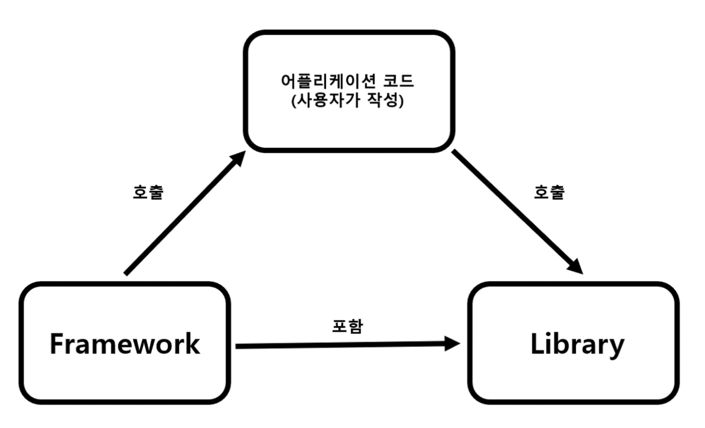
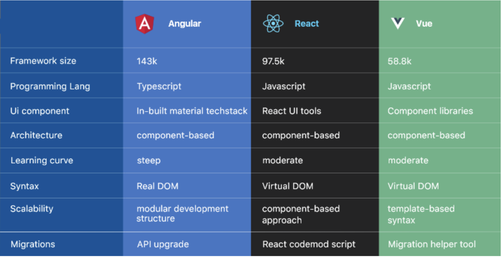

# 프레임워크와 라이브러리 차이

## 프레임워크

원하는 기능 구현에 집중하여 개발할 수 있도록 일정한 형태와 필요한 기능을 갖추고 있는 골격, 뼈대를 의미합니다.

- Java 서버 개발에 사용되는 Spring
- Python 서버 개발에 사용되는 Django, Flask
- 안드로이드 앱 개발에 사용되는 Android
- 아이폰 앱 개발에 사용되는 Cocoa Touch
- 웹 개발에 사용되는 Angular, Vue.js 등
- 자바 기반의 JSP를 위한 프레임 워크 Struts

🏠프레임워크는 모델하우스를 짓는것에 비유할 수 있다. 모델하우스의 소파의 위치, 의자와 책상의 위치, 방의 용도 등. **우리가 수정할 수 있는 범위는 제한적**이다. 주방의 위치, 기둥의 개수, 방의 개수 등 집을 이루고있는 굵직한 뼈대는 수정할 수 없다. 사용자는 `모델하우스가 제공하는 청사진 안에서"만" 움직일 수 있다.` 프레임워크가 제공하는 틀에 따라 코드를 작성해야 하는것이다. 즉,` 통제권은 사용자가 아닌 프레임워크가 쥐고 있다.`

## 라이브러리

소프트웨어를 개발할 때 컴퓨터 프로그램이 사용하는 비휘발성 자원의 모임.
특정 기능을 모아둔 코드, 함수들의 집합이며 코드 작성 시 활용 가능한 도구들을 의미합니다.

(구성 데이터, 문서, 도움말 자료, 메시지 틀, 미리 작성된 코드, 서브루틴, 클래스, 값, 자료형 사양을 포함)

🛏 라이브러리는 이케아에서 산 재료로 가구를 조립하는것에 비유할 수 있다. 가구점에 가서 기본적인 재료를 사서 입맛대로 조립하고 배치할 수 있다. `재료의 선택권이나 통제권은 사용자에게 있는 것이다.`

- Python pip로 설치한 패키지/모듈 (tensorflow, pandas, beautifulsoup 등등)
- C++의 표준 템플릿 라이브러리 (STL)
- Node.js에서 npm으로 설치한 모듈
- HTML의 클라이언트 사이드 조작을 단순화하는 JQuery
- 웹에서 사용자 인터페이스 개발에 사용되는 React.js

## 제어역전

제어의 역전(Inversion of Control, IoC)은 개발에서 특정 부분의 제어 흐름이 개발자가 아니라 **프레임워크나 런타임 환경에 의해 결정되는 디자인 패턴**을 말합니다.

❗️ 프레임워크와 라이브러리의 가장 큰 차이점은 "제어 흐름"이 어디에 있는가이다.

- `프레임워크`는 제어의 역전(IoC : Inversion of Control) 개념이 적용되어 프레임워크에게 제어의 흐름을 넘겨 개발자가 작성하는 코드에서 신경 써야 할 부분을 줄인다. 프레임워크는 전체적인 흐름을 쥐고 있으며 애플리케이션의 코드는 프레임워크에 의해 사용된다. 애플리케이션 코드는 프레임워크가 짜놓은 틀 안에서 수동적으로 동작하기 때문에 제어의 흐름은 프레임워크에게 있다.

- `라이브러리`는 개발자가 전체적인 흐름을 만들며 라이브러리를 가져다 쓰기 때문에, 개발자에게 전적으로 제어 흐름이 있으며 필요할 때마다 능동적으로 라이브러리를 호출하여 사용한다.



👉🏻 프레임워크와 라이브러리는 둘 다 코드 작성에 도움이 되는 타인이 작성한 코드의 집합이다.
👉🏻 프레임워크는 개발자가 특정한 규칙과 구조 안에서 코드를 작성하고, 프레임워크가 해당 코드를 호출하는 방식으로 동작하며 라이브러리는 개발자가 필요할 때 마다 설치, 혹은 호출함으로써 개발자가 능동적으로 사용하게 된다.

# React와 타 프레임워크(Vue.js, Angular 등)와 비교

### React

Facebook에서 만든 자바스크립트 UI 라이브러리
<br>
<br>
장점

- Virtual DOM을 활용하여 빠른 UI 업데이트 (vue도 사용)
- JSX 라는 Javascript에 XML을 확장한 문법을 사용하여 직관적인 코드(vue,angular X)
- 컴포넌트 기반으로, 재사용 가능한 컴포넌트를 통해 코드의 가독성과 유지보수성을 향상시킵니다.

단점

- 별도의 라우팅 및 상태 관리 라이브러리 필요하다. React 자체는 뷰 렌더링에 초점을 맞춘 라이브러리이므로, 라우팅이나 상태 관리와 같은 추가 기능은 별도의 라이브러리가 필요하다.
- 초기 로딩시간이 길다는 단점이 있다.

👉🏻 대규모 애플리케이션 개발에 적합한 프레임워크로, 유연성과 성능에 초점을 둡니다. 가상 DOM기반, JSX, 다양한 라이브러리와 활발한 생태계가 특징이다.

<br>

### Vue.js

가벼운 UI를 위한 자바스크립트 프레임워크로서, 개발자 친화적인 문법과 유연한 구조를 제공

장점

- HTML 템플릿과 자바스크립트를 쉽게 결합할 수 있는 직관적인 문법을 제공합니다.
- 간단한 템플릿 구문을 활용해 선언적으로 DOM에 데이터를 렌더링하는 것입니다.(Declartive Rendering)
- 마찬가지로 Virtual DOM을 이용하였고, 컴포넌트를 사용합니다.
- 기존 프로젝트에 점진적으로 Vue를 도입할 수 있습니다.
- 가벼운 크기와 빠른 속도로 알려져 있다.

단점

- React나 Angular에 비해 Vue의 생태계는 상대적으로 작을 수 있습니다. 따라서 지원되는 플러그인과 라이브러리의 수가 적을 수 있습니다.
- Vue는 작은 규모의 애플리케이션에 적합하며, 복잡한 상태 관리가 필요한 대규모 프로젝트에는 추가적인 라이브러리나 패턴이 필요할 수 있습니다.
- Vue의 성능은 대부분의 경우 충분하지만, React나 Angular에 비해 빠르다고 할 수는 없습니다.

<br>

### Angular

구글에서 만든 타입스크립트 기반의 웹 어플리케이션 오픈소스 프레임워크입니다. 가장 다루기 어렵고 가장 많은 것을 만들 수 있는 프레임워크

장점

- Angular는 라우팅, 폼 처리, 상태 관리 등을 포함한 완전한 기능 세트를 제공합니다.
- Angular의 템플릿 기능은 데이터 바인딩과 DOM 조작을 쉽게 처리할 수 있게 해줍니다.
- TypeScript를 기반으로 하여 정적 타입 검사를 지원하므로 코드의 안정성을 높일 수 있습니다.
- 초기 로딩속도는 느리지만 페이지간 전환 속도는 빠른 편입니다.

단점

- 마찬가지로 컴포넌트 기반이며, 많은 기능을 제공하는 만큼 프레임워크 자체가 무겁다.
- Angular는 업데이트 주기가 빠르고 업데이트에 따라 코드를 변경해야 할 수도 있습니다.



<br>

## Vue와 비교하는 React

React를 기점으로, Vue와 다른점을 비교해보자.

react 프로젝트에서 사용되는 환경
라우팅 : react-router-dom
상태 관리 : redux, mobx, zustand, react-query 등
빌드 : webpack, vite
테스팅 : eslint, typescript, jest, testing-library 등

### Virtual DOM

React, Vue 모두 실제 DOM 변화를 최소화시켜주는 Virtual DOM 방식을 사용한다.

브라우저는 HTML 파일을 스크린에 보여주기 위해 DOM 노드 트리 생성, 렌더 트리 생성, 레이아웃, 페인팅 과정을 거친다. DOM 노드는 HTML의 각 엘리먼트와 연관되어 있기 때문에 **HTML 파일에 20개의 변화가 생기면 DOM 노드가 변경되고 그 이후의 과정 역시 20회가 이루어진다.** 작은 변화에도 복잡한 과정들이 다시 실행되기 때문에 DOM 변화와 성능은 비례한다.

💡 Virtual DOM은 뷰에 변화가 있으면 그 변화가 실제 DOM에 적용되기 전에 Virtual DOM에 적용 시키고 최종 결과만 실제 DOM에 전달한다. 따라서 20개의 변화가 있다면 Virtual DOM은 **변화된 부분만 가려내 실제 DOM에 전달하고 실제 DOM은 그 변화를 1회로 인식해서 한 번의 렌더링 과정만 거치게 된다.**

### SPA (Single Page Application)

전통적인 SSR 방식에서 진화된 형태, Single Page Application은 웹 사이트의 여러 페이지를 하나의 HTML에 담아 동적으로 동적으로 표현한다.
HTML5의 History API를 사용하여 하나의 HTML에서 여러 페이지 이동이 일어난 것처럼 작동하게 한다.

```
React는 React-Router-Dom을 사용하고, Vue에서는 Vue-Router를 사용한다.
```

### JSX (JavaScript eXtension)

자바스크립트 확장 문법이며, JSX의 장점은 HTML 마크업 구조에 JS 로직을 같이 사용할 수 있다는 것이다.

```
const render = ({ text, handleClick }) => {
  return (
    <>
      <button onClick={handleClick}>눌러줘</button>
      <p>{text}</p>
    </>
  )
}
```

```
const render = ({ text, handleClick }) => {
  return React.createFragment([
      React.createElement('button', {onClick: handleClick}, '눌러줘'),
      React.createElement('p', null, text)
  ])
}
```

JSX는 실제로 브라우저에서 사용될 때 DOM을 생성하는 함수로 적절하게 변환된다.

❗️React는 JSX를 브라우저에서 작동 가능한 코드로 변환해주는 작업환경이 필수적이지만 Vue는 이미 존재하는 HTML/Javascript 문법을 통해 React가 제공하는 일을 하도록 만들어졌다.
→ Vue는 특별한 개발환경이 없는 상황에서도 사용자가 작성한 템플릿을 문제없이 읽어내고 그걸 DOM API로 변환하는 기능을 가지도록 만들어졌다.

```
<div id="root">
  <button v-on:click="handleClick">눌러줘</button>
  <p>{{text}}</p>
</div>
```

Vue에서는 일반 HTML속성이 아닌 Vue에서 관리하도록 만들 이벤트핸들러를 설정할 때에도 그냥 쌍따옴표를 쓴다. 때문에 속성의 값 부분에서 HTML문법에러가 일어나지 않으며, 브라우저는 이걸 강제로 수정하지 않는다.

👉🏻 주로 React에서 (Vue도 JSX를 지원하지만 SFC 구조를 많이 사용.) JSX를 사용하여 화면 UI를 보여준다.

### State

컴포넌트 안에서 관리/사용되는 변경가능한(mutable) 데이터. React에서는 state가 변경되면 컴포넌트 함수를 평가한 뒤 재실행/리렌더링한다. 그러므로 리렌더링이 필요할 때 컴포넌트 내 state를 변경한다. 즉, React 컴포넌트 렌더링은 state와 연관이 있다.

```
React에서는 통칭 state라고 부른다. Vue에서는 data(Option-base API 방식), ref/reactive(Composition API 방식)라고 부른다.
```

### Props

React, Vue 모두 Props를 통해 부모 컴포넌트에서 자식 컴포넌트로 데이터를 내려준다. props는 immutable이므로 자식 컴포넌트에서는 변경할 수 없다.

```
참고로 Vue에서는 Emit을 통해 자식 컴포넌트에서 부모 컴포넌트로 값을 올려줄 수 있다. Vue의 props, emit 로직을 하나로 합쳐 양방향 바인딩(v-model)을 구현할 수 있다.
```

React의 Callback Props와 Vue의 Custom Event는 유사하지만 Custom Event는 Event-Driven Approach를 사용하고 있으며, 추가적인 추상화 계층을 사용한다. 그러므로 정의되지 않는 callback props에 대해 걱정하지 않아도 된다고한다.

## React가 이 세상을 점령한 이유

다양한 이유가 있겠지만, 다수가 이야기하는 React가 강력한 이유는 다음과 같다.

1. learing curve
   React는 View layer만을 담당하는 가벼운 라이브러리로, Javascript를 잘 익힌다면 학습이 간단한 편이다.
2. 컴포넌트 재사용성
   개발자들이 원했던건 복잡한 내용을 별개의 섹션으로 나누어 다시끔 그 코드를 재사용하여 프로젝트를 완료 할 수 있는 프레임워크이다. 컴포넌트를 통해 복잡한 UI를 작은 단위로 쪼개어 나눌 수 있고, 각각의 컴포넌트를 보다 직관적으로 만들어 준다.

3. Virtual DOM을 통한 빠른 렌더링
   React는 Virtual DOM을 통해 에플리케이션을 빠르게 만들어주는데,
   React는 Virtual DOM을 통해 데이터가 변했을 때 그것을 감지 해낼 수 있으므로 이를 통해 React에게 언제 다시 렌더링을 하고 언제 DOM의 세부 사항들을 무시해도 좋은지 알려주는 것이다.
   그리고 그렇게 곧 바로 변화에 반응을 해야하는 UI야 말로 유저 인터페이스를 보강하기 위해 필요한 주요 사항이다.

4. React Native
   Android, IOS app 모두 React Native를 이용하여 만들 수 있다.
   Web에서 사용한 코드를 그대로 사용할 순 없지만 그 방법론과 구조 자체는 같아 유용하다.
