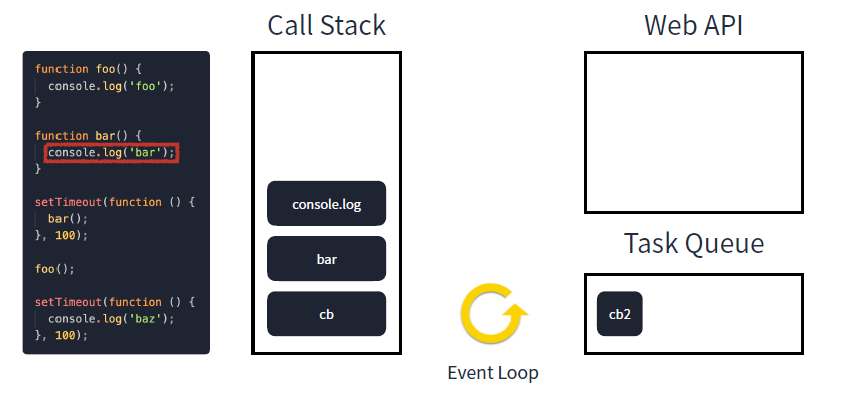

# 싱글 스레드 자바스크립트

> Modern JavaScript Deep Dive & Modern React Deep Dive에서 발췌


## 스레드와 프로세스

과거 프로그램을 실행하는 단위는 오직 **프로세스** 뿐 (프로그램을 실행할 때 프로세스 하나만을 사용해서 이용했음)


### 프로세스와 프로그램

<br />

**프로세스 (Process)**

- 프로그램을 구동해 프로그램의 상태가 메모리 상에서 실행되는 **작업 단위**를 의미 (운영체제로부터 자원을 할당받은 **작업의 단위**)
- 하나의 프로그램 실행은 하나의 프로세스를 가지고 그 프로세스 내부에서 모든 작업이 처리됨

▷ 프로세스 내부에서 여러 개의 스레드를 활용하면서 동시 다발적인 작업을 처리할 수 있게 됨

<br />

**프로그램과 프로세스**

- **프로그램**

  컴퓨터에서 **실행 할 수 있는 파일** 

  단, 아직 파일을 실행하지 않은 상태이기 때문에 **정적 프로그램(Static Program)** 줄여서 프로그램(Program)이라고 부른 것 (저장 장치에 있지만 메모리에는 올라가 있지 않은 정적인 상태인 일종의 코드 덩어리)

- **프로세스**

  컴퓨터에서 **작업 중**인 프로그램

  프로그램을 실행 시켜 정적인 프로그램이  **동적(動的)으로 변하여 프로그램이 돌아가고 있는 상태** (메모리에 적재되고 CPU 자원을 할당받아 프로그램이 실행되고 있는 상태)


→ 모든 프로그램은 운영체제가 실행되기 위한 메모리 공간을 할당해 줘야 실행될 수 있기 때문에 프로그램을 실행하는 순간 파일은 컴퓨터 메모리에 올라가게 되고, 운영체제로부터 시스템 자원(CPU)을 할당받아 프로그램 코드를 실행시켜 우리가 서비스를 이용할 수 있게 되는 것  (CPU는 메모리에 저장된 명령어를 읽어들이고, 읽어 들인 명령어를 해석하고 실행하는 부품!)


---

### 프로세스의 한계

소프트웨어가 복잡해지면서 프로세스 작업 하나만을 사용해서 프로그램에을 실행하는 데에 한계가 있었고, 그렇다고 해서 동일한 프로그램을 여러 개의 프로세스로 만들게 되면, 그만큼 메모리를 차지하고 CPU에서 할당받는 자원이 중복되게 될 것 

→ 하나의 프로그램에서 동시에 여러 개의 복잡한 작업을 수행할 필요성이 대두되면서 **스레드 (Thread) ** 탄생

<br />

### 스레드 (Thread)

- 프로세스가 할당받은 자원을 이용하는 **실행 흐름의 단위** (프로세스 내에서 동시에 진행되는 작업 갈래, 흐름의 단위)

- 일반적으로 하나의 프로그램은 하나 이상의 프로세스를 가지고 있고, 하나의 프로세스는 반드시 하나 이상의 스레드를 가짐 (프로세스를 생성하면 기본적으로 main 스레드가 생성되고, 이 때 다중 스레드는 프로그램을 개발한 개발자가 직접 프로그래밍하여 위치 시켜주어야 함)
- 스레드끼리는 메모리를 공유할 수 있어 여러 가지 작업을 동시에 수행할 수 있음

<br />

### 멀티 스레드

멀티 스레드는 스레드끼리 **프로세스의 자원을 공유**하면서 프로세스 실행 흐름의 일부가 되기 때문에 동시 작업이 가능하게 됨

[](https://blog.kakaocdn.net/dn/rEyKM/btrjvscVVdS/KIm70G6RBncpnX4xBi8Rh0/img.png)

이 때,  프로세스의 4가지 메모리 영역(Code, Data, Heap, Stack) 중 스레드는 Stack만 할당받아 복사하고, Code, Data, Heap은 프로세스내의 다른 스레드들과 공유됨 → 각각의 스레드는 별도의 stack을 가지고 있지만 heap 메모리는 고유하기 때문에 서로 다른 스레드에서 가져와 읽고 쓸 수 있게 됨

[](https://blog.kakaocdn.net/dn/c6hP8P/btr5A5vOmq1/lc1Ya3NafKtUsg6s10SCIK/img.png)

> Stack은 함수 호출 시 전달되는 인자, 되돌아갈 주소값, 함수 내에서 선언하는 변수 등을 저장하는 메모리 공간이기 때문에, 독립적인 스택을 가졌다는 것은 독립적인 함수 호출이 가능하다 라는 의미이고, 독립적인 함수 호출이 가능하다는 것은 독립적인 실행 흐름이 추가된다는 말
>
> 즉, stack을 가짐으로써 스레드는 독립적인 실행 흐름을 가질 수 있게 됨
>
> (프로세스는 기본적으로 다른 프로세스의 메모리에 직접 접근할 수 없음)

이렇게 구성한 이유는 하나의 프로세스를 다수의 실행 단위인 스레드로 구분하여 자원을 공유하고, 자원의 생성과 관리의 중복성을 최소화하여 수행 능력을 올리기 위해서임

<br />

## 자바스크립트 탄생

- 1995년, 약 90% 시장 점유율으로 웹 브라우저 시장을 지배한 넷스케이프 커뮤니케이션즈에서 개발
- 자바스크립트의 아버지 : 브렌던 아이크
- Mocha (Brendan Eich) → LiveScript (Netscape사내) → JavaScript


> [😇 **TMI**] **왜 자바스크립트라는 이름을 사용했을까?**
> JavaScript라는 이름이 사용된 이유는 언어가 Java 개발자들을 타깃으로 하고 있었고 당시에 가벼운 프로그램을 지칭하기 위한 단어로 script가 많이 사용되었고, 이 가벼운 "script"가 당시에 생긴 지 얼마 안 된 웹에서 사용될 것이었기 때문이었음
>
> 즉, JavaScript는 당시의 무겁고 잘 알려진 Java를 대체하는 언어로 자리매김하고자 사용된 마케팅 전략!

<br />

## 싱글 스레드 자바스크립트

### 프로세스의 자원 구조

[](https://blog.kakaocdn.net/dn/brkLMD/btr62G1oUxX/ViLrf3C3n5j2Vi5rUuroUk/img.png)

- **코드 영역(Code / Text)**  

  프로그래머가 작성한 프로그램 함수들의 코드가 CPU가 해석 가능한 기계어 형태로 저장되어 있음

- **데이터 영역(Data)**

  코드가 실행되면서 사용하는 전역 변수나 각종 데이터들이 모여있음 

  > 데이터영역은 .data ,.rodata, .bss 영역으로 세분화 됨
  >
  > - `.data` : 전역 변수 또는 static 변수 등 프로그램이 사용하는 데이터를 저장
  > - `.BSS` : 초기값 없는 전역 변수, static 변수가 저장
  > - `.rodata` : const같은 상수 키워드 선언 된 변수나 문자열 상수가 저장

- **스택 영역(Stack)**

  지역 변수와 같은 호출한 함수가 종료되면 되돌아올 임시적인 자료를 저장하는 독립적인 공간

  Stack은 함수의 호출과 함께 할당되며, 함수의 호출이 완료되면 소멸하는데,  만일 stack 영역을 초과하면 stack overflow 에러가 발생함

- **힙 영역(Heap)**

  생성자, 인스턴스와 같은 동적으로 할당되는 데이터들을 위해 존재하는 공간

  사용자에 의해 메모리 공간이 동적으로 할당되고 해제됨


>  코드 영역과 데이터 영역은 선언할 때 그 크기가 결정되는 **정적 영역**이지만, 스택 영역과 힙 영역은 프로세스가 실행되는 동안 크기가 늘어났다 줄어들기도 하는 **동적 영역**

<br />

### 자바스크립트의 메모리 관리

자바스크립트에서는 변수나 함수 등을 생성하는 데이터를 저장하는 동작을 할 때 JS 엔진을 통해 그에 대한 메모리를 할당하고, 필요하지 않으면 해제함

<br />

이 메모리는 아래와 같은 단계를 거치게 됩니다.

- 메모리 할당 : 사용할 데이터를 메모리에 할당

- 메모리 사용 : 메모리를 읽거나 쓰는 작업으로, 변수를 읽거나 변수에 쓰는 작업을 의미

- 메모리 해제 : 할당된 메모리를 해제하여 새로운 용도로 사용할 수 있음

→ 이런 메모리가 저장되는 공간은 **힙과 스택**

<br />

---

**예시**

`let variable = 126;`


💡 **변수 선언 시 자바스크립트 내부에서는 어떤 일이 발생할까?**

변수의 고유 식별자를 생성하고 메모리에 주소를 할당 후 최종적으로 생성한 주소에 값을 넣게 됨 

즉, 선언한 변수나 상수는 값을 바라보고 있는 것이 아닌 메모리 주소를 바라보고 있음

<br />

💡 **새로운 변수에 기존 변수를 대입한다면?**

기존 변수의 메모리 주소 참조함

<br />

💡 **기존 변수를 조작하면?**

새로운 메모리 주소를 할당받고, 그 곳에 값을 넣음

(자바스크립트에서 원시 타입은 변경 불가능하기 때문에  원시 타입의 값 변경될 때 항상 메모리가 새로 할당됨)

- 스택에는 변수명, 변수에 대한 원시 값, 참조 타입의 값이 위치한 Heap의 주소 값이 메모리에 할당되고, 힙에는 참조 타입의 값들이 할당됨

  ---

  **엄격하게는 변수명은 따로 있는 것으로 보이는데, 변수명이 메모리 주소를 가리킨다는 것을 누가 알려줄까?**

  > https://stackoverflow.com/questions/14612314/how-are-variable-names-stored-in-memory-in-c

  c언어 기준이지만, c컴파일러는 symbol table(변수명과 그 변수가 메모리 어디에 위치에 있는지에 대한 관계)을 먼저 만들고, 컴파일할 때 이 테이블을 이용해 변수의 인스턴스를 구체적인 메모리 주소로 대체시킨다고 함

  구체적으로는 컴파일러는 레퍼런스를 추적하고, 링커가 올바른 주소를 넣어준다고 함 (매핑 정보는 컴파일러의 메모리를 사용하고, 런타임과는 전혀 상관없는 메모리 공간)

  > 궁금하면 [변수의 이름은 어디에 저장되는가]( https://velog.io/@dhkim01/변수의-이름은-어디에-저장-되는가 ) 처럼 어셈블리어로 직접 뜯어보기^^... 

  ---

  


---

자바스크립트 엔진은 가상 머신 (Virtual Machine)으로 구성되어 있고, 가상 머신은 메모리 모델을 구현해야 하는데, 각각 하나의 Heap 영역과 Call Stack 영역으로 구성되어 있는 싱글 스레드이고, Heap은 참조 타입, Call Stack은 원시 타입이 들어가는 것


<br />

#### 스택 (stack)

- 정적 데이터를 할당하는데 사용함

  > **정적 데이터**
  >
  > - 컴파일 시에 정해진 크기를 가지고 있는 데이터를 의미
  > - 원시 타입 데이터, 참조 타입에 대한 주소 값이 해당됨

- 할당 될 값들이 정해진 크기를 가지기 때문에, JS 엔진이 각 값에 대해 고정된 크기의 메모리를 사전에 할당함

- 함수를 호출하면 호출 스택에 새로운 **프레임**을 추가하고,  이 프레임은 함수의 인수, 지역 변수, 반환 주소 등을 저장함

  함수 실행을 완료하면 해당 프레임이 호출 스택에서 제거함 ▷ 현재 실행 중인 함수가 스택이 맨 위에 위치하게 됨 (호출 스택의 각 단계를 프레임이라고 함)

- 자바스크립트 엔진은 호출 스택을 사용해 실행 중인 코드의 실행 흐름을 추적하는데, 호출 스택 크기는 한정되어 있어 너무 많은 함수를 중첩하여 호출하는 경우 `스택 오버플로우`가 발생할 수 있음

<br />

#### 힙 (Heap)

- 동적 데이터를 할당하는데 사용함

  > **동적 데이터**
  >
  > - 객체나 배열, 함수와 같이 정해진 크기를 가지지 않는 데이터를 의미함
  > - 필요에 따라 유동적인 크기 변경이 가능함

- 런타임 직전에 필요한 크기의 메모리를 할당함
- 이 메모리는 자동으로 관리하고 사용하지 않는 메모리를 자동으로 해제함 (by **가비지 컬렉터**)

<br />

---

**예제**


1. 순차적으로 a, b 변수들 쌓임

2. 배열은 object type이기 때문에 참조 타입으로 분류됨

3. 배열을 선언하면 heap에 배열 영역이 생성되는데, call stack에 생성된 배열 변수는 heap에서 생성된 배열의 메모리 주소를 참조

4. heap 영역 메모리는 동적으로 변할 수 있으며, 배열에 값 추가하면 heap 메모리 영역에 그대로 할당됨 (바뀌는 배열을 const로 선언했는데 동작하는 이유 중 하나임)

   → **상수여도 push가 동작하는 이유는 call stack 할당된 메모리를 변경하는 것이 아닌 heap 메모리를 변경하는 것이기 때문**

---


**그렇다면 사용 마친 메모리는 어떻게 정리될까?**

 JavaScript 엔진은 Garbage Collector를 통해 메모리 완료한 것 정리

 **Garbage Collector** : 사용하지 않는 메모리 해제하는 역할

<br />

#### 자바스크립트 가비지 콜렉터

- 메모리 해제를 담당하며, 가비지 콜렉터가 수행하는 작업이 암묵적으로 이루어짐
- 현대 브라우저 Garbage Collector는 **Mark and Sweep Algorithm**을 통해 메모리 정리 → 닿을 수 없는 주소를 더 이상 필요없는 주소로 정의하고 지우는 알고리즘

<br />

**Mark and Sweep Algorithm**

> 루트 객체 (브라우저에서는 최상위 객체인 window, Node.js에서는 global)에서 시작해 닿을 수 없는 주소(접근 불가능한 변수)는 필요없는 주소로 생각하여 지움


→ string은 닿지 않으니 메모리에서 삭제

<br />

즉, JS 엔진을 통해 실행되는 프로그램에서 항상 그 시작점은 루트 객체, 전역 객체이기 때문에 루트 객체에서부터 각 데이터에 접근할 수 있는지 참조해가면서 가비지 콜렉팅을 수행할 메모리들을 찾아내 제거함

결국 어딘가에서 참조가 되는 데이터라면 가비지 콜렉터에 의해서 제거될 수 없으며, 실제로 사용되지 않지만 누군가로부터 참조 되는 데이터들 때문에 메모리 누수가 발생하게 됨


<br />

## 실행 컨텍스트와 호이스팅

### 실행 컨텍스트

> 실행할 코드에 제공할 환경 정보들을 모아놓은 객체
>
> 이러한 실행 컨텍스트를 JS엔진의 콜 스택에 쌓아올림으로써 그 실행 순서를 보장할 수 있음


> 처음 자바스크립트 코드를 실행하는 순간 사진의 (1) 처럼 전역 컨텍스트가 콜스택에 담기기 때문에, 브라우저의 경우 `window`, node 환경의 경우 `global` 같은 객체를 사용할 수 있는 것!
>
> - (1) 콜스택엔 전역 컨텍스트를 제외하곤 다른 컨텍스트가 없기에 전역 컨텍스트와 관련된 코드를 진행함
> - (2) 전역 컨텍스트와 관련된 코드를 진행 중 a함수를 실행하였기에 **a 함수의 환경 정보들을 수집**하여 **a 실행 컨텍스트를 생성**, 콜스택에 담습니다.
>   콜스택 최상단에 a 실행 컨텍스트가 있기에 **기존의 전역 컨텍스트와 관련된 코드의 실행을 일시적으로 중단**한 후 a 실행 컨텍스트의 코드를 실행함
> - (3) a 함수 내부에서 b 함수를 실행하였기에 **b 함수의 환경 정보들을 수집, 실행 컨텍스트를 생성**, 콜스택에 담는데, 이전과 똑같이 콜스택 최상단에 b 실행 컨텍스트가 있기에 **기존 a 실행 컨텍스트와 관련된 코드의 실행을 일시적 중단**함
> - (4) b 함수가 종료된 후 b 실행 컨텍스트가 콜스택에서 제거됨. 제거 후 콜스택 최상단에는 a 실행 컨텍스트가 있기에 이전에 중단된 지점부터 코드 진행이 재개됩니다.
> - (5) a 함수 또한 종료된 후 실행 컨텍스트가 콜스택에서 제거됨
> - 이후엔 전역 공간에 실행할 코드가 남아있지 않다면 콜스택에서 전역 컨텍스트 또한 제거되며 콜스택에 아무 것도 남지 않은 상태로 종료됨

<br />

#### 실행 컨텍스트 구조

> ` variable environment`, `lexical environment`, `this binding`이 존재

<br />

#### VariableEnvironment

- 현재 컨텍스트 내부의 식별자 정보 `environmentRecord`, 외부 환경 정보 `outerEnvironmentReference`가 포함되어 있음
- VariableEnvironment 에 먼저 정보를 담고, 그대로 LexicalEnvironment 에 복사해 사용함

<br />

#### LexicalEnvironment

- 초기에는 VariableEnvironment와 같지만 변경 사항이 실시간으로 적용됨 (`VariableEnvironment`에서 복사한 현재 실행 컨텍스트 내부의 식별자 정보인  `environmentRecord`, 복사한 외부 환경 정보 `outerEnvironmentReference`가 포함되어 있음)
- VariableEnvironment에서 복사된 **초기 상태를 기억**하고 있으며, LexicalEnvironment **최신 상태를 저장**하고 있음

<br />

**environmentRecord**

- 현재 컨텍스트와 관련된 식별자와 식별자에 바인딩된 값이 기록되는 공간
- 실행 컨텍스트 내부 전체를 처음부터 끝까지 확인하며 **순서대로** 수집함

<br />

#### thisBinding

- 실행 컨텍스트 내에서 `this`로 지정된 객체의 정보를 가지고 있음

<br />

**결론 )** 이렇게 실행 컨텍스트는 `VariableEnvironment`, `LexicalEnvironment`, `environmentRecord`, `outerEnvironmentReference`, `ThisBinding` 등등 여러 정보들이 합쳐져 실행 컨텍스트가 되고, 이것이 콜스택에 쌓여 우리가 작성한 코드가 실행됨

<br />

### 호이스팅

>  호이스팅이란, 변수의 선언 구간보다 먼저 사용 구간이 실행될 때, 끌어올려져 동작하는 것처럼 보이는 현상

<br />

자바스크립트 엔진은 런타임 초기에 실행 컨텍스트를 구성할 때, `environmentRecord`에 식별자 정보를 수집함

---

변수만 봤을 때, 자바스크립트 엔진은 아래와 같은 과정으로 동작함

- 수집 : 변수명을 `environmentRecord`에 저장
- 초기화 : `environmentRecord`에 저장된 변수명을 초기화
- 할당 : 저장된 변수명에 값을 할당

---

이 과정을 통해 자바스크립트 엔진은 함수를 실행하기 전에 이미 변수명들을 알고 있는 상태가 되는데, 변수 선언 예약어인 `var`와 `const`,`let`은 그 과정에 조금 차이가 있음

- `var`

  - 런타임 초기에 실행 컨텍스트 구성 시 수집과 초기화가 동시에 이루어짐

  - `environmentRecord`에 변수명을 저장하고, `undefined`로 초기화함

    ```jsx
    console.log(a); // undefined
    
    var a = 'testA';
    ```

- `const`, `let`

  - 런타임 초기에 실행 컨텍스트 구성 시, 수집만 일어남

  - `environmentRecord`에 변수명을 저장하고, 코드를 실행하는 단계에서 실제 해당 변수에 값이 할당할 때까지 TDZ 상태가 됨

    > TDZ ( Temporal Dead Zone ) :  "일시적 사각지대" 

    ```jsx
    console.log(b); // ReferrenceError: Cannot access 'b' before initialization
    
    const b = 'testB';
    ```

    

<br />

## 자바스크립트가 싱글 스레드로 설계된 이유

- 시기 상 멀티 스레드에 대한 개념이 대중화된 시기가 아니었고, 최초 자바스크립트는 브라우저에서 HTML을 그리는 데 한정적인 도움을 주는 보조적인 역할로, 아주 간단한 스크립트를 지원할 목적으로 LiveScript를 만들었음 (실제로, 단 10일만에 첫 버전 완성)

  ---

  2000년대까지만 하더라도 웹 생태계는 LAMP 스택 → Linux, Apache, 웹 서버 MySQL, PHP를 활용한 웹 개발이 주를 이루던 시기였고, 대부분 데이터베이스에서 필요한 데이터를 불러온 다음, 웹 서버에서 HTML 페이지를 만들어서 클라이언트에 제공하는 방식으로 작동함

  콘텐츠는 사용자나 기타 다른 환경에 따라 서버에서 동적으로 생성하고, 웹 브라우저는 이를 단순히 다운로드 받아 렌더링하며, 자바스크립트는 폼 처리와 같은 부수적인 역할만 하는 방식

  ---

- 멀티 스레드의 단점

  스레드는 하나의 프로세스에서 동시에 서로 같은 자원에 접근이 가능함

  - 멀티 스레드는 내부적으로 처리가 복잡함

    동시에 여러 작업을 수행하다 보면 같은 자원에 대해 여러 번 수정하는 등 동시성 문제가 발생할 수 있어 이에 대한 처리가 필요함

  - 각각 격리돼있는 프로세스와 다르게 하나의 스레드가 문제가 생기면 같은 자원을 공유하는 다른 스레드에도 동시에 문제가 발생할 수 있음

  <br />

  → 만약 자바스크립트가 멀티 스레드로 실행되는 언어였다면 웹페이지에서 발생하는 동시성 문제에 대해 해결해야 했지만, 자바스크립트는 단일 스레드로 실행되므로 교착 상태와 같은 다중 스레드 환경에서 발생할 수 있는 복잡한 시나리오를 신경 쓸 필요가 없으며, 비동기 처리를 통해 쉽게 여러 요청을 처리함 (실제로 멀티 스레드로 구현된 서비스에서는 이 동시성 문제에 대해 정말 많은 신경을 씀)

  (실제로 구글의 Chrome 브라우저 마저도 기존 웹 페이지에서 엄청난 동시성 문제를 일으킬 수 있다는 이유로 단일 웹 사이트 페이지의 자바스크립트 코드가 동시에 실행되는 것을 허용하지 않음)

<br />

## 그렇다면, 자바스크립트가 싱글 스레드라는 것이 무엇을 의미할까?

- 자바스크립트 코드 실행이 하나의 스레드에서 순차적으로 이루어진다는 것을 의미함

  이는 코드를 한 줄 한 줄 실행한다는 것을 의미하며, 궁극적으로 하나의 작업이 끝나기 전까지는 뒤이은 작업이 실행되지 않는다는 것을 의미

- 자바스크립트에서 하나의 코드가 실행하는 데 오래 걸리면 뒤이은 코드가 실행되지 않음

  이러한 특징을 `Run-to-completion`이라고 함

<br />

결론 ) 자바스크립트 모든 코드는 **동기식**으로 한 번에 하나씩 순차적으로 처리됨

▷장점 : 동시성을 고민할 필요가 없음

▷단점 : 하나의 작업이 끝나기 전까지는 다른 작업이 실행되지 않으므로 어떠한 작업이 오래 걸린다면 사용자에게 마치 웹페이지가 멈춘 것 같은 느낌을 줄 수 있음

<br />

# 이벤트 루프

> 이벤트 루프는 자바스크립트 런타임 외부에서 자바스크립트의 비동기 실행을 돕기 위해 만들어진 장치 ( ECMAScript, 즉 자바스크립트 표준에 나와 있는 내용이 아님)

<br />

## 비동기는 무엇일까?

- 비동기는 **동시에 일어나지 않는 것 (asynchronous)**

  요청과 결과가 동시에 일어나지 않기 때문에 요청한 그 자리에서 결과가 주어지지 않음

  (동기는 요청과 그 결과가 동시에 일어난다는 약속, 요청하면 시간이 얼마나 걸리던지 요청한 자리에서 결과가 주어져야 하기 때문에 요청과 결과가 한자리에서 동시에 일어남)

- 동기식과 다르게 요청한 즉시 결과가 주어지지 않을 수 있고, 따라서 응답이 언제 올지도 알 수 없지만 동기식과 다르게 여러 작업을 동시에 수행할 수 있다는 장점이 있음

<br />

## 이벤트 루프란?

자바스크립트의 동기 방식은 개발자에게 매우 직관적으로 다가오지만, 한 번에 다양한 많은 작업을 처리할 수 없을 뿐더러, 모던 웹 어플리케이션에서는 사용자에게 많은 양의 정보를 다양한 방식으로 제공하기 위해 비동기로 작동하는 것이 필요하게 됨

→ 자바스크립트 코드를 실행하는 것 자체는 싱글 스레드로 이루어져서 비동기를 처리하기 어렵지만, 자바스크립트 코드를 실행하는 것 이외에 `태스크 큐`, `이벤트 루프`, `마이크로 태스크 큐`, `브라우저/Node.js API` 등이 적절한 생태계를 이루고 있기 때문에 싱글 스레드로는 불가능한 비동기 이벤트 처리가 가능해짐

<br />

### 호출 스택과 이벤트 루프, 

📚 **호출 스택(Call Stack)**

- 자바스크립트에서 수행해야 할 코드나 함수를 순차적으로 담아두는 스택

<br />

🌀 **태스크 큐**

- 실행해야 할 태스크의 집합 (실행해야 할 태스크 : 비동기 함수나 이벤트 핸들러 등을 의미함)

- 이벤트 루프는 태스크 큐를 한 개 이상 가지고 있음

- 자료구조 큐(queue) 형태가 아니라 **set** 형태를 띔

  이유 : 단순히 큐의 첫 번째 Task를 가져오는 것이 아닌, 선택된 큐 중에서 실행 가능한 가장 오래된 태스크를 가져와야 하기 때문

<br />

🔄 **이벤트 루프**

- 이벤트 루프만의 단일 스레드 내부에서 호출 스택 내부에서 수행해야 할 작업이 있는지 확인하고, 수행해야 할 코드가 있다면 자바스크립트 엔진을 이용해 실행함

- 호출 스택에 실행중인 코드가 있는지 (호출 스택이 비어있는지 여부를 확인), 그리고 태스크 큐에 대기 중인 함수가 있는지 반복적으로 확인하는 역할

  호출 스택이 비어있다면 태스크 큐에 대기 중인 작업이 있는지 확인하고, 이 작업을 실행 가능한 오래된 것부터 순차적으로 꺼내와서 실행하게 됨 ▷ 태스크 큐 빌 때까지 반복

<br />

 ‘**코드를 실행하는 것’**과 ‘**호출 스택이 비어있는지 확인하는 것’** 모두가 **단일 스레드**에서 일어남

즉, 두 작업은 동시에 일어날 수 없으며 한 스레드에서 순차적으로 일어남

<br />

## 그렇다면 비동기 작업은 누가 수행할까?

▷자바스크립트 코드가 동기식으로 실행되는 메인 스레드가 아닌 태스크 큐가 할당되는 별도의 스레드에서 수행됨

- 이 별도의 스레드에서 태스크 큐에 작업을 할당해 처리하는 것은 브라우저나 Node.js의 역할이며, 만약 이러한 작업들도 모두 자바스크립트 코드가 실행되는 메인 스레드에서만 이루어진다면 절대로 비동기 작업을 수행할 수 없을 것

  ex) `browser web API` 는 브라우저 안에 C++ 구현된 스레드로 주로 `DOM event`, `AJAX request`, `setTimeout` 등 비동기 이벤트를 처리

<br />

**결론**

자바스크립트 코드 실행은 싱글 스레드에서 이루어지지만, 외부 Web API 등은 모두 자바스크립트 코드 외부에서 실행되고 콜백이 태스크 큐로 들어감 

이벤트 루프는 호출 스택이 비고, Web API에 의해 생성된 콜백이 실행 가능한 때가 오면 이것을 태스크 큐에서 꺼내서 수행하는 역할을 하는 것

<br />

## 예시

```js
function foo() {
  console.log('foo')
}

function bar() {
  console.log('bar')
}

setTimeout(function () {
	bar()
}, 100)

foo()

setTimeout(function () {
	console.log('baz')
}, 100)
```

1. script가 실행되면 전역 스코프 내에서 실행됨

2. 코드가 순차적으로 실행되어 setTimeout에 실행됨 →  call stack에 쌓임과 동시에 브라우저 내부적으로 web api가 실행

   

3. setTimeout은 실행하는 로직이 따로 없기 때문에 바로 종료됨 → call Stack에서 setTimeout pop

4. foo() 함수 실행됨 → call Stack에 foo 함수 쌓임

5. foo 함수 안쪽에 있는 console.log() 실행됨

   

6. log 찍은 후 console.log pop 되고, foo 함수도 종료되어 call Stack에서 빠져나옴

   

7. setTimeout 실행됨 → callStack에 쌓이고 동시에 web api 실행됨

   

8. setTimeout은 역할이 종료되었기에 callstack에서 빠져나옴

9. script가 종료되어 global scope도 call stack에서 빠져나옴

   

10. 실행된 web api의 setTimeout은 시간이 지나면 비동기 callback을 task queue에 넣음

    

11. Queue에 들어간 callback 함수는 call stack이 비어있을 때 쌓임→ `event loop`가 반복적으로 `Call Stack`이 비어있는지 확인 하는 것을 `tick`이라고 함

    

12. 두 번째 callback은 아직 callstack이 비어있지 않기 때문에 task queue에 남아있음 (callstack에는 callback 함수가 실행시킨 함수가 쌓여있음)

    

13. console.log, bar, cb 함수 종료되어 빠져나옴

    

14. call stack이 비어있기 때문에 task queue에 쌓여있던 콜백함수가 event loop에 의해 call stack에 들어감

    

15. 최종적으로 모든 로직 종료되며 call stack은 비어있게 됨

    

## 태스크 큐와 마이크로 태스크 큐

> 그렇다면, **비동기 작업을 수행하는 태스크 큐는 어떤 구조로 어떻게 작동할까?**

<br />

이벤트 루프는 하나의 **마이크로 태스크 큐**를 갖고 있는데, 기존의 태스크 큐와는 다른 태스크를 처리함

마이크로 태스크 큐는 기존 태스크 큐보다 우선권을 가지고, 마이크로 태스크 큐가 빌 때까지 기존 태스크 큐의 실행은 뒤로 미루어짐

(setTimeout과 setInterval은 Promise보다 늦게 실행됨) 

<br />

**각 태스크에 들어가는 대표적인 작업**

- 태스크 큐 : setTimeout, setInterval, setImmediate
- 마이크로 태스크 큐 : process.nextTick, Promises, queueMicroTask, MutationObserver

<br />

```js
function foo() {
  console.log('foo')
}

function bar() {
  console.log('bar')
}

function baz() {
  console.log('baz')
}

setTimeout(foo, 0)

Promise.resolve().then(bar).then(baz)
```

→ bar, baz, foo 순으로 실행됨 (확실히 Promise가 우선권이 있음)

<br />

**렌더링은 언제 실행될까?**

▷ 태스크 큐를 실행하기에 앞서 먼저 마이크로 태스크 큐를 실행하고, 마이크로 태스크 큐를 실행한 뒤에 렌더링이 일어남 (각 마이크로 태스크 큐 작업이 끝날 때마다 한 번씩 렌더링할 기회를 얻게 됨)

즉, 브라우저에 렌더링하는 작업은 마이크로 태스크 큐와 태스크 큐 사이에서 일어남

<br />

- 동기 코드, 태스크 큐, 마이크로 태스크 큐와 렌더링과의 관계를 확인할 수 있는 코드

  ```html
  <html>
      <body>
          <ul>
              <li>동기 코드 : <button id="sync">0</button></li>
              <li>태스크 : <button id="macrotask">0</button></li>
              <li>마이크로 태스크 : <button id="microtask">0</button></li>
          </ul>
          
          <button id="macro_micro">모두 동시 실행</button>
      </body>
      <script>
          const button = document.getElementById('run')
          const sync = document.getElementById('sync')
          const macrotask = document.getElementById('macrotask')
          const microtask = document.getElementById('microtask')
          
          const macro_micro = document.getElementById('macro_micro')
          
          // 동기 코드로 버튼에 1부터 렌더링
          sync.addEventListner('click', function () {
              for (let i = 0; i <= 100000; i++) {
                  sync.innerHTML = i
              }
          })
          
          // setTimeout으로 태스크 큐에 작업을 넣어서 1부터 렌더링
          macrotask.addEventListener('click', function () {
              for (let i = 0; i <= 100000; i++) {
                  setTimeout(() => {
                      macrotask.innerHTML = i
                  }, 0)
              }
          })
          
          // queueMicrotask로 마이크로 태스크 큐에 넣어서 1부터 렌더링
          microtask.addEventListener('click', function () {
              for (let i = 0; i <= 100000; i++) {
                  queueMicrotask(() => {
                      microtask.innerHTML = i
                  })
              }
          })
          
          macro_micro.addEventListener('click', function () {
              for (let i = 0; i <= 100000; i++) {
                  sync.innerHTML = i
                  
                  setTimeout(() => {
                      macrotask.innerHTML = i
                  }, 0)
                  
                  queueMicrotask(() => {
                      microtask.innerHTML = i
                  })
              }
          })
      
      </script>
  </html>
  ```

  - 동기 코드는 해당 연산 100000까지 숫자가 올라가기 전까지는 렌더링이 일어나지 않다가 for 문이 끝나야 비로소 렌더링 기회를 얻으며 100000이라는 숫자가 한 번에 나타남
  - 태스크 큐(setTimeout)는 모든 setTimeout 콜백이 큐에 들어가기 전까지 잠깐의 대기 시간을 갖다가 1부터 100000까지 순차적으로 렌더링되는 것을 볼 수 있음
  - 마이크로 태스크 큐 (queueMicrotask)는 동기 코드와 마찬가지로 렌더링이 전혀 일어나지 않다가 1000000까지 다 끝난 이후에야 한 번에 렌더링이 일어남
  - 모든 것을 동시에 실행했을 경우 동기 코드와 마이크로 태스크 큐만 한 번에 100000까지 올라가고, 태스크 큐만 앞선 예제처럼 순차적으로 렌더링 됨

<br />

# 자바스크립트 엔진 동작 원리 (feat.V8)

 `자바스크립트 엔진` : 자바스크립트 코드를 실행하는 프로그램 또는 인터프리터

▷ 자바스크립트 엔진을 통해 일련의 과정을 거쳐 컴퓨터에 최적화된 코드로 변환해 전달함

<br />

JavaScript 엔진은 표준 인터프리터 또는 JavaScript를 어떤 형식의 바이트코드로 컴파일하는 JIT(Just-In-Time) 컴파일러로 구현될 수 있음

<br />

**JavaScript 엔진 종류**

- [**V8**](https://en.wikipedia.org/wiki/V8_(JavaScript_engine)) — Google에서 개발하고 C++로 작성된 오픈 소스
- [**Rhino**](https://en.wikipedia.org/wiki/Rhino_(JavaScript_engine)) — Mozilla Foundation에서 관리, 오픈 소스, 전적으로 Java로 개발됨
- [**SpiderMonkey**](https://en.wikipedia.org/wiki/SpiderMonkey_(JavaScript_engine)) — 과거에는 Netscape Navigator를 지원했으며 현재는 Firefox를 지원하는 최초의 JavaScript 엔진
- [**JavaScriptCore**](https://en.wikipedia.org/wiki/JavaScriptCore) — Nitro로 판매되고 Apple에서 Safari용으로 개발한 오픈 소스
- [**KJS**](https://en.wikipedia.org/wiki/KJS_(KDE)) — 원래 Harri Porten이 KDE 프로젝트의 Konqueror 웹 브라우저용으로 개발한 KDE 엔진
- [**차크라** (JScript9)](https://en.wikipedia.org/wiki/Chakra_(JScript_engine)) — Internet Explorer
- [**차크라** (JavaScript)](https://en.wikipedia.org/wiki/Chakra_(JavaScript_engine)) — Microsoft Edge
- [**Nashorn**](https://en.wikipedia.org/wiki/Nashorn_(JavaScript_engine)) - Oracle Java 언어 및 Tool Group에서 작성한 OpenJDK의 일부인 오픈 소스
- [**JerryScript**](https://en.wikipedia.org/wiki/JerryScript) — 사물 인터넷을 위한 경량 엔진

▷ 이 중, **Google Chrome을 비롯해 Node.js 런타임에도 사용되는 V8 엔진을 기준으로 동작 원리**를 정리!

<br />

**v8 엔진이란?**

>  [https://github.com/v8/v8](https://github.com/v8/v8)

**`V8`** 엔진은 구글이 주도하여 **`C++`**로 작성된 고성능의 자바스크립트 & 웹 어셈블리 엔진 (오픈 소스)

<br />


1. **토크나이저 (Tokenizer)** : 자바스크립트 코드를 분석하여 '의미를 갖는 최소 단위'인 토큰으로 분해함 → 이 과정을 토크나이징 (Tokenizing)이라고 부름

2. **파서 (Parser)** : 분해한 '토큰'들을 분석해 문법적으로 의미를 갖는 Tree 자료구조 (AST : 추상 구문 트리)를 만듦 → 이 과정을 파싱 (Parsing)이라고 부름

3. 파싱된 결과물인 AST에서 나온 코드를 인터프리터에 전달하고 인터프리터는 코드를 **바이트 코드 (Bytecode)**로 변환함

​	<br />

바이트 코드는 특정 하드웨어가 아닌 가상 컴퓨터에서 돌아가는 실행 프로그램을 위한 이진 표현법이며 하드웨어가 아닌 소프트웨어에 의해 처리되기 때문에 기계어보다 더 추상적임


   >  인터프리터?
   >
   >
   >  코드를 한 줄 한 줄 읽어내려 가며 한 줄씩 중간 단계의 Bytecode로 변환하는 것을 말하며 자바스크립트는 기본적으로 인터프리터 언어
   >
   >  V8 엔진의 인터프리터가 ***이그니션***(***Ignition***)

 <br />

 v8은 컴파일러의 특징과 인터프리터의 특징을 혼합한 JIT 컴파일러를 지원함 (다른 엔진의 가장 큰 차이점)

 `JIT 컴파일러` (just in time) : 코드를 기계어로 한번에 변환하는 것이 아니라 중간언어(bytecode) 로 변환 후, 캐싱해두고 인터프리터 방식으로 한 줄씩 읽어 내려가는것을 말함

즉, 실행 시점에 인터프리터 방식으로 바이트 코드를 생성한 후 V8 엔진은 바이트 코드를 기계어 코드로 만들고, 그 코드를 캐싱해 같은 함수가 여러 번 불릴 때 매번 기계어 코드를 생성하는 것을 방지 

 <br />

**`Ignition`**은 기존의 **`Full-codegen`**을 완벽히 대체하는 인터프리터 (Ignition 인터프리터는 코드를 처음 실행할 때만 동작함)

<br />

기존에 사용하고 있던 **`Full-codegen`**은 전체 소스 코드를 한번에 컴파일했는데, **`V8`**팀은 기존의 **`Full-codegen`**이 모든 소스 코드를 한번에 컴파일할때 메모리 점유를 굉장히 많이 한다는 사실을 인지하고 이를 개선하고자 모든 소스를 한번에 해석하는 컴파일 방식이 아닌 코드 한줄 한줄이 실행될 때마다 해석하는 인터프리트 방식을 채택

<br />

   - **Ignition의 이점**

     1. **메모리 사용량 감소.** 자바스크립트 코드에서 기계어로 컴파일하는 것보다 바이트 코드로 컴파일하는 것이 더 편하다.
     2. **파싱 시 오버헤드 감소.** 바이트 코드는 간결하기 때문에 다시 파싱하기도 편하다.
     3. **컴파일 파이프 라인의 복잡성 감소.** 최적화, 최적화 해제 과정에서 바이트 코드만 고려하면 되기 때문에 편하다.

     (**Ross McIlroy** *Ignition - an interpreter for V8)*

   

4. 인터프리터가 코드를 실시간 변환하면서 브라우저에게 작업을 지시하는 동안 코드를 더 빠르게 실행하기 위해, 프로파일러가 최적화할 수 있는 부분을 찾아서 기록함

   - 최적화 가능한 부분(자주 사용되는 부분)을 찾으면 프로파일러는 컴파일러에게 전달하고, 컴파일러는 인터프리터에 의해 실시간으로 웹사이트가 구동되는 동안 필요한 부분을 기계어로 변환해 최적화를 진행함

   - 최적화한 코드를 수행할 차례가 다가오면, 바이트 코드 대신 컴파일러가 변환한 최적화한 코드가 그 자리를 대체하여 실행됨

   - 프로파일러(Profiler)는 함수나 변수의 호출 빈도와 같은 매트릭을 수집해 `Turbofan` (컴파일러)에게 보내 최적화함

     `Turbofan`은 자주 사용되는 Native code와 중복된 코드를 재사용하여 코드 크기, 메모리 오버헤드를 줄이고 속도를 증가시켜 **Optimized Code(최적화 코드)**를 생성

     

5. 최적화 컴파일러는 프로파일링 데이터 (프로파일러에게 전달받은 내용)를 기반으로 최적화된 코드를 생성함

6. 만약 프로파일링 데이터 중에 잘못된 부분이 있다면 최적화 해제 (Deoptimize)를 하고 다시 바이트코드를 실행해서 4-6 동작을 반복


<br />

# 자바스크립트 동작 요약

## 1. 파싱(Parsing) 및 컴파일링(Compiling)

1. **소스 코드 로딩**: 브라우저 또는 Node.js는 자바스크립트 파일을 로드합니다.
2. **파싱**: 자바스크립트 엔진은 코드를 읽고, 구문 분석(Syntax Parsing)을 수행하여 각 문장의 의미와 구조를 이애한다. 이 과정에서 추상 구문 트리(Abstract Syntax Tree, AST)가 생성됨.
3. **컴파일링**: 최신 자바스크립트 엔진은 JIT(Just-In-Time) 컴파일 방식을 사용해 파싱된 코드를 중간 코드로 변환하고, 필요에 따라 최적화된 기계어로 컴파일함.

⇒ 자바스크립트는 전통적으로 인터프리터 언어로 분류됐지만, 현대의 자바스크립트 엔진은 인터프리팅과 컴파일링을 결합한 형태로 발전했다고 함 (Just-In-Time(JIT) 컴파일링)

**인터프리터 언어로서의 자바스크립트**

- 초기 자바스크립트 엔진은 순수한 인터프리터로 코드가 실행 시점에 한줄씩 읽히고 해석되어 실행되었음
- 실행 지연 : 컴파일 과정이 없어 시작 시간이 빠르지만, 실행 중에는 각 줄을 해석하면서 실행해야되므로 전체적인 실행시간이 느릴 수도 있음

**JIT 컴파일러를 사용하는 현대의 자바스크립트**

- JIT 컴파일링 : 현대의 자바스크립트 엔진(ex: V8)은 실행 시간에 소스 코드를 기계어로 컴파일하는JIT 컴파일러를 사용하여 성능을 향상시킴

<br />

### **2. 실행(Execution)**

1. **전역 실행 컨텍스트 생성**: 자바스크립트는 전역 실행 컨텍스트를 생성, 이는 전역 변수와 함수를 포함
2. **호이스팅(Hoisting)**: 변수 및 함수 선언이 각 실행 컨텍스트의 최상단으로 끌어올림.
3. **코드 실행**: 엔진은 컴파일된 코드를 실행하면서 콜 스택을 관리하고, 함수 호출이 있을 경우 새로운 실행 컨텍스트가 콜 스택에 푸시

<br />

### **3. 이벤트 루프 및 비동기 처리**

1. **비동기 콜백**: **`setTimeout`**, **`setInterval`**, HTTP 요청 등과 같은 비동기 작업은 콜 스택이 아닌 Web API(브라우저) 또는 C++ API(Node.js)를 통해 처리
2. **태스크 큐**: 비동기 작업의 콜백은 태스크 큐에 추가
3. **이벤트 루프**: 콜 스택이 비어있을 때, 이벤트 루프는 태스크 큐에서 대기 중인 태스크를 콜 스택으로 이동시키고 실행

<br />
