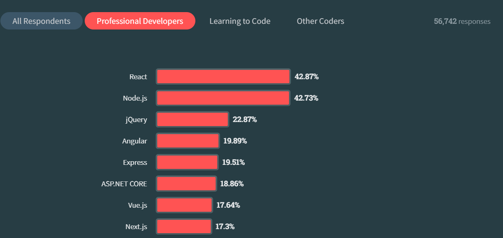
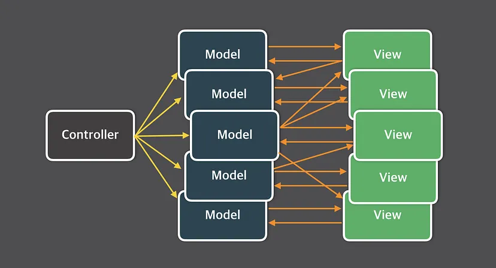
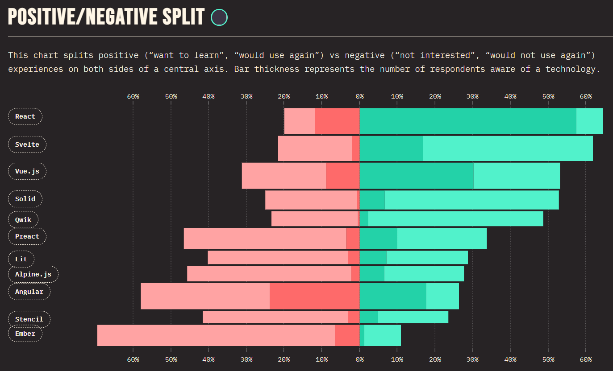
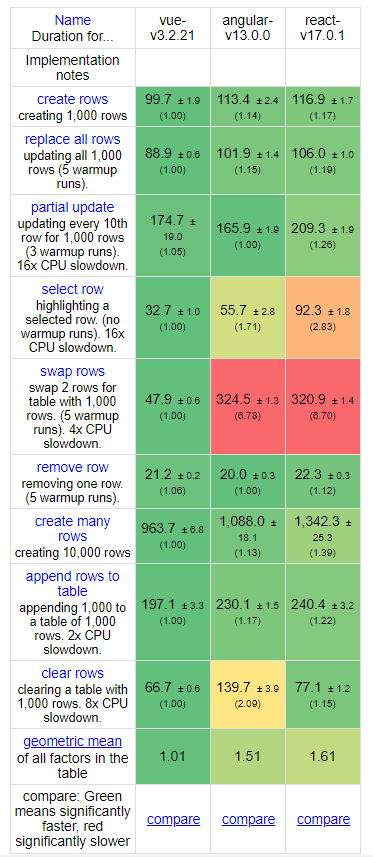

## 🤔프론트엔드 라이브러리가 왜 필요할까??

사실 사용자와의 인터렉션이 많이 없는 프로젝트라면, 굳이 필요하지 않다.
직접 js로 구현하는 것도 가능하다.

=> 하지만 프로젝트의 규모가 커지고, 다양한 UI와 인터렉션을 제공한다면 수많은 DOM요소들을 직접 관리하는 것은 너무 힘든일이다.

=> ★즉 이러한 DOM관리, 상태값 업데이트 관리를 최소화하고, 오직 기능 개발 그리고 UI 구현에 집중할 수 있도록 해주게 하기 위해 나오게 된것이다.

## 🆚라이브러리 vs 프레임워크

|             | 라이브러리                                                                 | 프레임워크                                                                  |
| ----------- | -------------------------------------------------------------------------- | --------------------------------------------------------------------------- |
| 정의        | 재사용 가능한 코드의 집합                                                  | 개발시 필요한 필수코드, 알고리즘, DB커넥션 등 기능을 위한 뼈대              |
| 목적        | 재사용 가능한 기능들을 미리 구현해두고 필요시 호출하여 사용하도록 만들어짐 | 개발자가 원하는 기능 구현에 집중할 수 있도록 규칙과 패턴을 정의한 구조 제공 |
| 제어의 흐름 | 주도권이 사용자에게 있다.                                                  | 전체 흐름을 자체적으로 가짐                                                 |
| 예시        | React, jQuery                                                              | Vue.js, Angular, Next.js, Svelte                                            |

<br>

### 🙃**제어의 역전(Inversion Of Control)**

애플리케이션의 흐름을 누가 쥐고 있는가??
<br>

📝 라이브러리는 주도권이 사용자에게 있어 전체적인 흐름을 사용자가 직접 만들고 필요시 가져다 쓰는 것이지만,

📖 프레임워크는 제어의 권한이 프레임워크에 있어, 애플리케이션의 흐름이 수동적으로 결정된다. 사용자가 특정 함수를 제공하고, 프레임워크가 알맞는 시점에 호출하는 셈이다.

일반적으로 개발자가 가지고 있어야할 제어의 권한을 프레임워크에 넘겼기 때문에 이를 제어의 역전이라고 부른다.

⇒ 앱/서버 등의 구동, 메모리관리, 이벤트 루프 등 공통된 부분은 프레임워크가 관리, 사용자는 틀 안에서 구체적인 기능 구현에 집중할 수 있다.

프레임워크는 라이브러리를 포함한다.

## 리액트의 멈출줄 모르는 인기의 근간은??

출처: https://survey.stackoverflow.co/2023

### React의 장점

리액트란 ①"Javascript"를 사용해서,
사용자가 컴포넌트에 ②"선언"한 데이터를,
③UI로 렌더링 해주는 라이브러리

#### 1. JSX

```jsx
const element = <h1>Hello, world!</h1>;
```

- Angular나 Vue.js 같은 경우 자신들의 문법을 가지나, 리액트는 Javascript 기반의 문법인 JSX를 사용한다.

#### 2. 선언형

JSX 자체는 선언형이 아니지만, JSX의 캡슐화를 통해 리액트는 선언형 코드 작성이 가능하다.

```js
// 명령형 Vanllia JS
let target = document.getElementById("target");
let wrapper = document.createElement("div");
let headline = document.createElement("h1");

wrapper.id = "welcome";
headline.innerText = "Hello World";

wrapper.appendChild(headline);
target.appendChild(wrapper);
```

```jsx
// 선언형 React
const App = () => {
  <Welcome />;
};
```

```jsx
const Welcome = () => {
  <div id="welcome">
    <h1>Hello World</h1>
  </div>;
};
```

- 명령형에 비해 가독성면에서 좋으며, 예측이 비교적 쉬워 디버깅에 유리하다.
- How보단 What(결과물)에 집중한다. 복잡한 과정은 추상화를 통해 신경쓰지 않는다.

#### 3. UI 렌더링에 집중한다.

=> 리액트는 Vue나 Angular와는 달리 프레임워크가 아닌 라이브러리이다.

리액트가 제공하지 않는 기술은 무엇이 있을까??

- 단일페이지에서 URL변경으로 UI전환을 수행하는 routing 기술
- 지역데이터 외에도 애플리케이션 전역적으로 쓰이는 데이터에 대한 전역적인 상태관리 기술
- Ajax 기술
  등등 하나의 애플리케이션으로 동작하기 위해서는 많은 기술들이 수반되어야 하는데...
  리액트 자체는 이런것들보다는 오직 "UI 렌더링"에 집중한다.

#### 4. 페이스북

메타(페이스북)에 의해 유지,관리되고 사용자가 많기 때문에 생태계가 활발하다.
=> 문제 해결방법에 대한 소스들이 많이 있다.

#### 5. 범용성 (모바일 개발도 가능)

리액트 자체는 UI만을 만들기 때문에 굉장히 가볍다. -> 이는 굉장히 유연하면서 확장가능해서
React Native를 이용해 모바일 개발 또한 가능하다.

#### 6. 단방향 바인딩

기존에는 양방향 바인딩 방법(MVC 패턴)을 사용했으나, 프로젝트 규모가 커지면 아래 그림처럼 굉장히 복잡해진다.



=> 페이스북이 Flux 패턴(단방향 바인딩)을 도입하게 됨.


부모 컴포넌트에서 자식으로 바인딩 함으로써 데이터 추적에 유리하고 가독성 또한 좋다.

cf. 데이터 바인딩이란?
데이터와 화면(뷰)을 연결하여 동기화 상태를 유지하는 것.
JS 데이터가 변경되면 View도 업데이트

#### 7. CSR, SSR 둘다 지원

**CSR**<br>
Client Side Rendering으로, 뜻 그대로 클라이언트 측에서 렌더링이 일어나는 방식이다.

1. 유저가 웹사이트를 방문하여 브라우저가 서버로 요청을 보낸다.
2. 서버는 클라이언트로 HTML 파일 (뼈대)와 js링크를 보낸다.
3. 브라우저가 bundle.js파일을 다운 받음
4. 데이터를 추가적으로 동적으로 받아와서 렌더링

모바일 친화적으로 사용할 수 있는 서비스가 필요해서라고 한다.
그때마다 렌더링 할 경우 모바일에서 성능 부담이 갔기 때문에

장점

- 화면 전체를 새로고침 하지않고 일부만 동적으로 변경하므로 로드된 뒤에는 빠른 속도를 보장한다.
- 서버에 부담이 적다 (data 요청이 있을때만 요청하므로)

단점

- 초기 로딩 시간이 길다. (bundle.js를 다운받아야 실행이 되므로 무거운 프로젝트에서는 오래걸림)
- SEO 문제
  검색엔진은 크롤러를 사용해서 사이트 정보를 읽는데, 이 크롤러는 JS를 실행하지 않는다고 한다. => SEO 대응이 안된다..

**SSR**<br>
서버측에서 렌더링하는 방식이다.

서버에서 HTML을 만드므로 데이터가 수시로 바뀌어 미리 만들기 어려운 상황의 프로젝트에 적절하다고 한다.

1. 웹사이트 방문하여 브라우저가 서버측에 요청
2. 서버는 데이터 및 CSS까지 적용해서 렌더링 준비가 된 HTML과 JS코드를 클라이언트에 넘긴다.
3. 브라우저는 HTML을 렌더링하고 JS코드를 다운받아서 연결

장점

- 초기 로딩 시간이 적다
- SEO에 유리하다.

단점

- 페이지 요청시마다 새로고침이 된다. => UX에 지장
- 요청이 많을시 서버에 부담이 간다.

#### 💡cf. SPA와 CSR

둘을 같은 의미로 보면 안된다!

SPA(Single Page Application)
서버로부터 첫페이지만 받아오고 이후에는 동적으로 페이지를 구성하는 웹 애플리케이션.

SPA, MPA는 페이지를 하나를 쓰는지 여러개 쓰는지 차이.
<br>
CSR, SSR은 렌더링을 어디에서 하는지 차이

<br>

SPA에서 첫페이지만 SSR을 하고 그 이후에 CSR을 하면 SPA가 유지된다.
=> SSR을 하니 SEO에도 유리해서 좋다고한다.

#### 8. 컴포넌트 기반

#### 9. Virtual DOM 활용



|                 | React      | Vue        | Angular    |
| --------------- | ---------- | ---------- | ---------- |
| 구분            | 라이브러리 | 프레임워크 | 프레임워크 |
| 개발자          | Facebook   | Evan You   | Google     |
| DOM             | Virtual    | Virtual    | Real DOM   |
| 데이터 바인딩   | 단방향     | 양방향     | 양방향     |
| 플러그인        | 많음       | 적음       | 모름       |
| 플러그인 의존도 | 높음       | 낮음       | 모음       |
| 번들사이즈      | 43K        | 23K        | 143K       |
| 러닝커브        | 중         | 하         | 상         |
| 생태계          | 상         | 중         | 중         |

=> 생산성 면에서 React보다 Vue가 더 좋다.
아무래도 적은 학습시간에 비해 낼 수 있는 결과가 많을테니까



### 모듈

- 재사용 가능한 코드 조각
- 라이브러리와 비슷한 개념이다. 라이브러리는 자주 사용되는 로직을 잘 정리한 집합이다.
- 기능을 기준으로 파일 단위로 분리

> 💡 cf. SOLID의 SRP 원칙

원래는 하나의 모듈에 하나의 기능만을 넣어야 한다는 것이 SRP 원칙이라 생각을 했었다.

하지만 SRP원칙의 본질적인 의미는

> “하나의 모듈은 하나의 엑터에 대해서만 책임져야한다.” 라고 한다.

즉, 모듈이 변경되는 이유가 한가지여야 함을 의미한다. (== 하나의 이해관계자에 대해서만 책임져야한다.)
⇒ 여러가지 책임을 가지고 있으면 각기 다른 사유에 의해서 모듈이 계속해서 변경되어야 하기 때문에.

<br>

💥cf. JS에는 모듈 기능이 존재하지 않았다.

script태그를 사용하여 외부의 스크립트 파일을 가져올 수는 있지만, 파일마다 독립적인 파일 스코프를 갖는 것이 아닌, 하나의 전역 객체를 공유한다.

⇒ 여러개 파일로 분리해도 결국엔 로드시 하나의 JS파일에 있는 것처럼 하나의 전역을 갖게 된다

⇒ 전역변수 중복등 문제 발생할 수 있다.

Node.js(서버 사이드 환경)에서는 CommonJS를 채택하여 모듈이 지원된다. (모듈별로 독립적인 모듈 스코프를 갖는다.)

<br>

🎁배퀴즈🎁

Q ) SPA와 CSR은 같은 의미로 쓰인다. (😯 / ❌)<br>
Q ) 리액트는 단방향 바인딩을 사용하여 데이터 추적이 어렵다. (😯 / ❌)
Q ) 리액트 자체에서는 라우팅 기술을 제공하지 않는다. (😯 / ❌)
