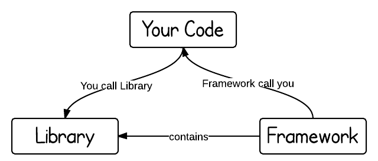
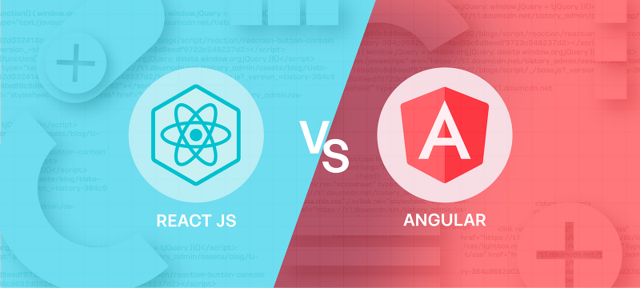

# 01.10 FE Study

# 주제

- 프레임워크와 라이브러리 차이는 무엇일까?
- React와 타 프레임워크(Vue.js, Angular 등)와 비교해보기 → 이왕이면 사용해본 경험과 연관지어볼 것)
- 그렇다면 React가 이 세상을 점령한 이유는 무엇일까? (장점 생각해보기)

---

## 프레임워크와 라이브러리의 차이는 무엇일까?

### 프레임워크란?

프레임워크는 복잡한 문제를 해결하거나 서술하는 데 사용되는 **기본 개념 구조**입니다.

프레임워크는 애플리케이션 개발 시 필수적인 코드, 알고리즘, DB 커넥션 등의 기능들을 위해 **뼈대**를 제공합니다.

개발자는 이러한 뼈대 위에서 코드를 작성해 원하는 애플리케이션을 개발할 수 있습니다.

**대표적으로 사용되는 프레임워크로는 백엔드 개발에 사용되는 Spring Framework나 Django, 안드로이드 앱개발에 사용되는 Android 등이 있습니다.**

### 라이브러리란?

라이브러리는 주로 소프트웨어를 개발할 때 컴퓨터 프로그램이 사용하는 비휘발성 자원의 모임입니다.

비휘발성 자원에는 구성 데이터, 문서, 도움말, 메시지 틀, 미리 작성된 코드, 함수, 클래스, 값, 자료형 사양 등을 포함할 수 있습니다.

라이브러리는 개발에 필요한 것들을 미리 구현해놓은 도구라고 할 수 있습니다. **재사용이 가능한 기능을 미리 구현**해놓고 필요한 곳에서 호출하여 사용 가능하도록 만들어진 집합입니다.

**대표적으로 사용되는 라이브러리는 프론트엔드 개발에 사용되는 React(리액트)나 Python(파이썬)의 Pip로 설치한 패키지/모듈(pandas, tensorflow등)이 있습니다.**

### 프레임워크는 라이브러리를 포함한다?

프레임워크가 라이브러리를 포함한다는 말은 일반적으로 맞습니다. 프레임워크는 보통 필요한 여러 라이브러리, 도구, 규약, 템플릿 등을 포함하고 있고 **상위 수준의 구조**를 의미합니다.

결국, 프레임워크는 어떤 작업을 수행하기 위한 ‘**기본 구조**’와 함께, 해당 작업을 위해 필요한 ‘**라이브러리**’를 미리 정의해놓은 것입니다.

### 프레임워크와 라이브러리

**정리하면, 프레임워크는 해당 분야의 범용적인 문제들에 대한 해결책이 이미 제공되어 있기 때문에, 개발자는 특정 기능을 구현하는 데에만 집중할 수 있습니다. 이 말은, 개발자는 프레임워크가 제시하는 규칙과 구조에 따라 코드를 작성하고, 프레임워크가 제공하는 라이브러리들이 적절한 시점에 호출되어 동작되며, 제어의 흐름은 프레임워크에 의해 주도됩니다.**

**반면에 라이브러리는 개발자가 필요할 때 필요한 기능을 직접 호출하여 사용하며, 제어의 흐름은 개발자가 가지고 있습니다.**

## 표로 정리해봤어요 ✌️

| 프레임워크                                            | 라이브러리                                                                         |
| ----------------------------------------------------- | ---------------------------------------------------------------------------------- |
| 제어의 역전 (Inversion of Control)                    | 개발자가 호출하는 코드를 제어하는 주체는 개발자                                    |
| 구조와 규칙에 따른 개발                               | 개발자가 자유롭게 코드를 작성하고 필요한 라이브러리 기능을 필요할 때 호출하여 사용 |
| 일반적으로 전체적인 애플리케이션의 구조화 흐름을 제공 | 개발자가 선택적으로 사용할 수 있으며, 필요한 부분에만 사용 가능                    |
| 주로 범용적인 기능 제공                               | 특정 기능이나 도구에 특화된 기능을 제공                                            |
| 개발자에게 규약과 규칙을 강제하는 경향                | 개발자는 라이브러리의 규약에 따르지 않고, 필요할 때 호출하여 사용함                |
| 높은 일관성과 통일된 개발 경험을 제공                 | 일관성은 프레임워크보다는 상대적으로 낮으며, 개발자가 선택할 수 있는 여지가 많음   |

### 근데 리액트는 왜 라이브러리?

“그렇다면 리액트는 왜 프레임워크가 아닌 라이브러리로 개발되었을까요?” 라는 생각을 할 수 있으실 거에요.

이에 대한 이유는 리액트의 ‘철학’과 ‘목표’에 기인합니다. 리액트는 사용자 인터페이스를 구축하기 위한 **선언적**이고 **효율적인** 방법을 제공하면서도, 다른 라이브러리나 프레임워크와 쉽게 통합될 수 있도록 설계되었기 때문입니다.

- **선언적 프로그래밍**: 리액트는 선언적 프로그래밍을 강조합니다.
  - 개발자는 원하는 UI 상태를 명시하고, 리액트는 해당 상태를 어떻게 렌더링할지 처리합니다.
  - 이로써 코드의 가독성과 유지보수성이 향상됩니다.
- **컴포넌트 기반 아키텍처**: 리액트는 컴포넌트 기반 아키텍처를 채택하여 재사용 가능하고 모듈화된 코드를 작성할 수 있도록 합니다.
  - 이는 라이브러리로서의 특징이며, 다른 라이브러리나 프레임워크와 조합하여 사용하기 용이하게끔 합니다.
- **상호운용성**: 리액트는 다른 라이브러리와 쉽게 통합될 수 있도록 설계되었습니다.
  - 예를 들어, 리액트는 Angular, Vue, jQuery 등과 함께 사용할 수 있습니다.
  - 이는 라이브러리로서의 특징이 강조된 결과입니다.
- **가볍고 유연한 설계**: 리액트는 필수적인 기능들을 제공하면서도, 다른 라이브러리나 프레임워크와 함께 사용될 수 있도록 가볍고 유연한 설계를 채택하였습니다.
  - 이는 필요한 부분만을 선택해서 사용할 수 있도록 하는 라이브러리로서의 특징을 반영하고 있습니다.

**요약하면, 리액트는 사용자 인터페이스를 구축하기 위한 라이브러리로 개발되었으며, 가볍고 유연한 설계와 상호운용성을 강조하여 다양한 환경에서 사용될 수 있도록 의도되었습니다.**

### 🤔 생각해보기

### **그럼 우리가 API라고 부르는 것과 라이브러리는 같은 걸까요?**

정답은 ‘아니다’입니다~ 이 둘은 서로 연관되어 있지만 API는 소프트웨어 컴포넌트들이 상호 작용하는 방법을 정의한 규약이나 명세를 의미하고 라이브러리는 미리 작성된 코드 조각들의 모음입니다. 예시로 보면 이해하기 쉽습니다.

날씨 정보를 제공하는 외부 서비스가 있다고 할 때 이 서비스는 API를 제공하며, 사용자는 날씨 데이터를 요청하고 받을 수 있게 됩니다. 이 경우, API는 사용자가 애플리케이션과 외부 날씨 서비스 간의 상호작용을 가능하게 하는 인터페이스입니다.

---

## React와 타 프레임워크(Vue.js, Angular 등)와 비교해봅시다.

### 리액트와 Vue 비교하기

리액트와 뷰는 문법 및 구문 혹은 상태 관리 차이로 비교할 수 있습니다.

|                   | React(리액트)                                              | 알러 Vue(뷰)                                                |
| ----------------- | ---------------------------------------------------------- | ------------------------------------------------------------ |
| **문법 및 구문**    | 리액트는 JSX를 사용해서 JavaScript와 XML/HTML을 조합한 문법을 제공하며, 이는 JavaScript 코드 내에서 UI 컴포넌트를 정의하는 데 사용됩니다. | Vue는 템플릿 기반의 문법을 사용하여 JavaScript와 HTML를 조합하여 UI를 정의합니다.               |
| **상태 관리**      | 리액트는 주로 상태 관리를 위해 컨텍스트 API와 Redux와 같은 상태 관리 라이브러리를 사용합니다. | Vue는 상태 관리를 위해 내장된 Vuex라는 상태 관리 라이브러리를 제공합니다.                 |
| **장점**            | - 가상 돔을 사용해서 갱신되는 싱글 페이지 애플리케이션의 리플로우와 리페인트를 최소화함으로써 성능을 최적화합니다. - 컴포넌트 기반의 아키텍처를 가지고 있어, 재사용 가능한 컴포넌트는 생산성과 유지 보수를 용이하게 합니다. - 단방향 데이터 바인딩으로 안전성이 보장됩니다. - React 공식 문서 가이드와 방대한 커뮤니티, 자료를 통해 쉽게 접하고 배울 수 있습니다. - 단방향 바인딩의 장점인데, 데이터 변화에 따른 성능 저하 없이 DOM 객체를 갱신할 수 있고 데이터 흐름이 단방향이라 코드를 이해하기 쉽습니다. | - 양방향 데이터 바인딩 방식을 이용해서 화면에 표시되는 값과 프레임워크 모델 데이터 값이 동기화되어 한쪽을 변경하면 다른 한 쪽도 자동으로 변경됩니다. - 컴포넌트 기반 프레임워크로 가상 돔 렌더링 방식을 사용합니다. 화면 전체를 다시 그리지 않고 프레임워크에서 정의한 방식에 따라 화면이 갱신되므로 유지보수와 재사용성이 높습니다. - HTML, CSS, JavaScript만 알고 있어도 사용이 가능하여 배우기 쉽습니다. - 양방향 바인딩의 장점인데, 코드의 사용면에서 코드양을 크게 줄여줍니다.                   |
| **단점**            | - 앱의 규모가 커지면 속도가 느려집니다. - View 이외의 데이터 모델링 등은 직접 구현하거나 라이브러리를 사용해야 하므로 JavaScript에 대한 지식이 필요합니다. - 데이터 모델링, 라이팅 Ajax 등 기능 지원이 되지 않습니다. - 단방향 바인딩의 단점인데, 변화를 감지하고 화면을 업데이트하는 코드를 매번 작성해야 합니다.     | - 테스트가 어렵고 재 구조화가 쉽지 않습니다. - 모바일 지원이 부족합니다. - 커뮤니티 등의 자료가 리액트에 비해 많지 않습니다. - 양방향 바인딩의 단점인데, 변화에 따라 DOM 객체 전체를 렌더링해주거나 데이터를 바꿔주므로, 성능이 감소되는 경우가 있습니다.                   |

### 정리

리액트는 확장성이 좋으나 자바스크립트 문법에 능숙해야 하며 커스터마이징 및 자유도가 높은 편입니다. 또한 커뮤니티 형성이 잘 되어있고 큰 규모의 프로젝트에 용이합니다.

뷰는 제공되는 HTML 기반의 템플릿이 있어 진입장벽이 낮고 프로젝트를 빠르게 만들 수 있습니다. 개발자간 코드가 일관성 있으며 소규모 프로젝트에 용이합니다.

### 리액트와 Angular 비교하기

리액트와 앵귤러는 언어, 양방향 데이터 바인딩, 모듈성으로 비교할 수 있습니다.

|                  | React(리액트)                                           | Angular(앵귤러)                                            |
| ---------------- | ------------------------------------------------------- | ----------------------------------------------------------- |
| **언어**            | 리액트는 JavaScript 또는 TypeScript를 사용하여 개발할 수 있습니다. | Angular는 TypeScript가 기본 언어이고 JavaScript도 지원합니다.                |
| **양방향 데이터 바인딩** | 리액트는 단방향 데이터 흐름을 가지고 있으며, 상태가 변경될 때만 뷰가 업데이트되기 때문에 안전성이 보장됩니다. | Angular는 양방향 데이터 바인딩을 제공하여 모델의 변경이 뷰에 즉시 반영됩니다.            |
| **모듈성**           | 리액트는 라이브러리이므로 다양한 라이브러리와 함께 사용할 수 있습니다. | Angular는 프레임워크 자체가 모듈 시스템을 제공하며, 종합적인 솔루션을 제공하는 경향이 있습니다.         |
| **장점**            | - 가상 돔을 사용해서 갱신되는 싱글 페이지 애플리케이션의 리플로우와 리페인트를 최소화함으로써 성능을 최적화합니다. - 컴포넌트 기반의 아키텍처를 가지고 있어, 재사용 가능한 컴포넌트는 생산성과 유지 보수를 용이하게 합니다. - 단방향 데이터 바인딩으로 안전성이 보장됩니다. - React 공식 문서 가이드와 방대한 커뮤니티, 자료를 통해 쉽게 접하고 배울 수 있습니다. - 단방향 바인딩의 장점인데, 데이터 변화에 따른 성능 저하 없이 DOM 객체를 갱신할 수 있고 데이터 흐름이 단방향이라 코드를 이해하기 쉽습니다. | - 프레임워크입니다. 필요한 모든 것의 거의 갖추어져 있습니다. 라우팅, HTTP 등 애플리케이션 개발에 필요한 대부분의 기능들이 내부적으로 포함되어 있습니다. 심지어 UI를 위한 컴포넌트 라이브러리도 공식적으로 제공하고 있습니다. - 코드 유지 관리성 측면에서 TypeScript를 사용하고, 또한 일단은 안정적으로 지속적인 기술 지원이 이루어지고 있기 때문에 유지 보수 측면에서 용이합니다. - 구글이 뒤를 받치고 있습니다. (일단은?) - 양방향 바인딩의 장점인데, 코드의 사용면에서 코드양을 크게 줄여줍니다.              |
| **단점**            | - 앱의 규모가 커지면 속도가 느려집니다. - View 이외의 데이터 모델링 등은 직접 구현하거나 라이브러리를 사용해야 하므로 JavaScript에 대한 지식이 필요합니다. - 데이터 모델링, 라이팅 Ajax 등 기능 지원이 되지 않습니다. - 단방향 바인딩의 단점인데, 변화를 감지하고 화면을 업데이트하는 코드를 매번 작성해야 합니다. | - 프레임워크입니다. 일반적인 앵귤러만의 패턴이 있습니다. 앵귤러 스타일을 다소 강요하는 측면이 있습니다. - 학습 곡선이 높습니다. (처음 시작을 위한 학습 사항이 다양하다고 합니다.) - 양방향 바인딩의 단점인데, 변화에 따라 DOM 객체 전체를 렌더링해주거나 데이터를 바꿔주므로, 성능이 감소되는 경우가 있습니다. |

### 리액트와 Svelte 비교하기

**리액트와 스벨트는 컴파일 방식과 바인딩 방식으로 비교할 수 있습니다.**

|                  | React(리액트)                                           | Svelte(스벨트)                                            |
| ---------------- | ------------------------------------------------------- | ----------------------------------------------------------- |
| **컴파일 방식**     | 리액트는 브라우저에서 동작하는 런타임 라이브러리이며, 컴포넌트가 브라우저에서 동적으로 생성됩니다. | Svelte는 컴파일 타임에 코드를 생성하여 런타임 라이브러리의 크기를 줄이고 성능을 향상시킵니다.            |
| **바인딩 방식**     | 리액트는 가상 돔(Virtual DOM)을 사용하여 변화를 추적하고 업데이트 합니다. | Svelte는 컴파일 타임에 변경 사항을 감지하고 DOM 업데이트를 생성하므로 런타임에 더 효율적으로 동작할 수 있습니다.       |
| **장점**            | - 가상 돔을 사용해서 갱신되는 싱글 페이지 애플리케이션의 리플로우와 리페인트를 최소화함으로써 성능을 최적화합니다. - 컴포넌트 기반의 아키텍처를 가지고 있어, 재사용 가능한 컴포넌트는 생산성과 유지 보수를 용이하게 합니다. - 단방향 데이터 바인딩으로 안전성이 보장됩니다. - React 공식 문서 가이드와 방대한 커뮤니티, 자료를 통해 쉽게 접하고 배울 수 있습니다. - 단방향 바인딩의 장점인데, 데이터 변화에 따른 성능 저하 없이 DOM 객체를 갱신할 수 있고 데이터 흐름이 단방향이라 코드를 이해하기 쉽습니다. | - 적은 코드로 높은 가독성을 유지하고, 개발 시간을 단축시켜 줍니다. 가독성이 좋기 때문에 리팩토링이 보다 쉬우며, 쉬운 디버깅, SPA에 최적화된 더 작은 번들 사용, 낮은 러닝 커브가 장점입니다. - Virtual DOM을 사용하지 않고도 DOM을 가볍게 제어할 수 있습니다. - 양방향 바인딩의 장점인데, 코드의 사용면에서 코드양을 크게 줄여줍니다.                     |
| **단점**            | - 앱의 규모가 커지면 속도가 느려집니다. - View 이외의 데이터 모델링 등은 직접 구현하거나 라이브러리를 사용해야 하므로 JavaScript에 대한 지식이 필요합니다. - 데이터 모델링, 라이팅 Ajax 등 기능 지원이 되지 않습니다. - 단방향 바인딩의 단점인데, 변화를 감지하고 화면을 업데이트하는 코드를 매번 작성해야 합니다.    | - 대중적이지 않기 때문에 낮은 성숙도, 다양한 소스 코드나 플러그인들이 많지 않은 작은 생태계라는 점이 단점입니다. - Svelte는 IE를 지원하지 않습니다. (이 부분은 제거하셔도 됩니다.) - 양방향 바인딩의 단점인데, 변화에 따라 DOM 객체 전체를 렌더링해주거나 데이터를 바꿔주므로, 성능이 감소되는 경우가 있습니다.|

**결론: 기술의 선택은 프로젝트 요구사항, 개발자의 선호도, 팀의 경험 등을 고려하여 이루어져야 합니다.**

---

## 리액트가 세상을 점령한 이유가 뭘까요?

리액트는 기존의 정적인 웹 사이트인 사용자가 브라우저를 통해서 도메인에 접속하면 서버에 이미 배포되어있는 HTML 문서들을 가져와서 보여주는 형식인 **SSR(Server Side Rendering)**을 사용했습니다. 브라우저는 서버가 응답한 HTML을 응답받아 렌더링 하는데 이 때 전체 페이지를 다시 렌더링 하게 되어서 새로고침이 일어납니다.

리액트는 웹 페이지 내에서 부분적인 업데이트가 가능한, HTML이 아니라 필요한 데이터를 자바스크립트를 이용해 동적으로 HTML을 생성해 페이지를 업데이트 하는 방식인 **SPA(Single Page Application)**

### 리액트의 등장

페이스북 팀은 기존에 MVC 모델을 적용해 SPA 개발을 하고 있었습니다. 애플리케이션 규모가 작을 땐 괜찮았지만, 새로운 기능이 추가될수록 구조는 너무 복잡해져갔고 디버깅이 쉽지 않았습니다. 이를 해결하기 위해 더 많은 엔지니어들이 투입되었지만 점점 예측 불가능해져 갔습니다.

페이스북 팀의 일원인 엔지니어 Jordan Walker는 이를 해결하기 위해 뭔가를 해야겠다고 생각했고, 개발에 착수했습니다. 그리고 2013년, React는 **재사용 가능한 컴포넌트 구현을 장려하고, JSX 문법을 사용했으며, 단방향 데이터 바인딩 방식을 사용하며, 가상 돔 (Virtual DOM)을 사용**하는 오픈소스 라이브러리로 세상에 공개되었습니다.

## 다시 돌아가서, 급변하는 프론트엔드 트렌드 속에서 어떻게 그 꾸준한 인기를 유지할 수 있었을까요?

### 리액트는 배우기 쉽고 사용이 간편합니다.

앵귤러와 같은 프레임워크와 비교하면, 리액트는 러닝 커브가 훨씬 낮습니다. 더 배우기 쉽기 때문에 자연스럽게 사용자는 늘어나게 됩니다.

### 리액트는 강력한 커뮤니티를 갖고 있습니다.

페이스북 팀이 개발한 오픈 소스이며 대규모 커뮤니티에 의해서 유지되고 있기 때문입니다. 특히 주니어 개발자들이 배우기 좋은 환경을 제공해줍니다. 정기적인 버전 업데이트 또한 끊임없이 발전하고 변화하는 프론트엔드 트렌드에서 살아남기 위한 필수 요소입니다. 이 때문에 코드의 안정성 또한 높다고 합니다.

### 리액트는 커스터마이징을 권장합니다.

재사용 가능한 컴포넌트 개발은 개발자들이 자신만의 컴포넌트 개발과 재사용을 가능하게 하며 규모가 큰 애플리케이션을 구축하기에 용이합니다. 이로 인해 높은 수준의 UI를 구현하는 데 큰 도움을 주고 프로젝트를 구축하는 데 드는 시간도 단축시킵니다.

### 높은 유연성과 효과적인 비용 절감

높은 유연성은 개발자에게 높은 자율성을 부여한다고 합니다. 상대적으로 자유도가 떨어지는 다른 프레임워크들과 달리 리액트로 구축한 프로젝트는 필요로 하는 기능을 구현하기 위해서 원하는 라이브러리만을 선택할 수 있어 기업들은 많은 비용 절감을 할 수 있습니다.

### 많은 리액트 관련 extension들을 제공합니다.

리액트는 많은 extension들이 존재합니다. 이것들은 개발자가 편하게 코딩할 수 있도록 도와주며 코드를 더욱 읽기 쉽게 만들어 줍니다. VSCode 뿐 아니라 브라우저또한 다양한 extension들을 지원하고 있습니다.

이와같이 다양한 장점들과 개발자 친화적인 특징들 때문에 많은 사람들이 리액트를 훌륭한 도구하고 생각하고, 각자 최적의 환경에서 최고의 가치를 창출해 낼 수 있다고 느꼈기 때문에 리액트가 세상을 점령했다는 말이 나올 정도로 인기를 끈 것이 아닌가 생각합니다. ☁️☁️☁️

— 멋진 결말 —

---

## 🎉 퀴즈! 🎉

### 🤩 뷰와 앵귤러, 스벨트는 리액트와 달리 양방향 바인딩 방식을 채택하고 있다. (🅾️, ❎)

### 🤩 리액트의 JSX 문법은 JavaScript + XML이다. (🅾️, ❎)

### 🤩 뷰는 JavaScript 기반의 템플릿을 제공해서 HTML과 간단한 JavaScript만으로 UI를 쉽게 정의할 수 있는 프레임워크다. (🅾️, ❎)

---

- 참고 블로그s
  [https://code-lab1.tistory.com/284](https://code-lab1.tistory.com/284)
  [https://velog.io/@tjdud0123/API-vs-라이브러리-vs-프레임워크](https://velog.io/@tjdud0123/API-vs-%EB%9D%BC%EC%9D%B4%EB%B8%8C%EB%9F%AC%EB%A6%AC-vs-%ED%94%84%EB%A0%88%EC%9E%84%EC%9B%8C%ED%81%AC)
  [https://velog.io/@leehaeun0/React-vs-Vue-장단점-비교](https://velog.io/@leehaeun0/React-vs-Vue-%EC%9E%A5%EB%8B%A8%EC%A0%90-%EB%B9%84%EA%B5%90)
  [https://tech.kakaoenterprise.com/109](https://tech.kakaoenterprise.com/109)
  [https://pagepro.co/blog/react-vs-svelte/](https://pagepro.co/blog/react-vs-svelte/)
  [https://www.simform.com/blog/react-vs-svelte/](https://www.simform.com/blog/react-vs-svelte/)
  [https://tech.osci.kr/react-깊이-파고들기/](https://tech.osci.kr/react-%ea%b9%8a%ec%9d%b4-%ed%8c%8c%ea%b3%a0%eb%93%a4%ea%b8%b0/)
