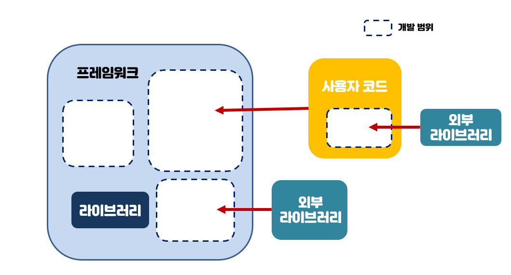

Q1. 프레임워크는 이미 일정한 형태와 필요한 기능을 모두 갖추고 있지만, 사용자가 필요로 한다면 외부 라이브러리를 추가 설치해 사용할 수 있다.

> 🙆‍♀️ / 🙅‍♀️

정답

🙆‍♀️

 

Q2. 프레임워크는 라이브러리의 상위 그룹으로, 개발하는데 필요한 각 기능을 보유한 라이브러리를 한 데 묶어 담은 것을 말한다.

> 🙆‍♀️ / 🙅‍♀️

정답

⭕️

- **프레임워크** : 컴포넌트s + 라이브러리s
- **라이브러리** : 모듈들의 집합
- **모듈** : 특정 기능을 수행하는 코드 집합

 

Q3. 다음 중 Virtual DOM을 사용하고, Virtual DOM의 구현이 빠르며 오버 헤드가 적게 발생하는 것은?  
※ 오버 헤드(overhead) : 어떤 처리를 하기 위해 들어가는 간접적인 처리 시간 · 메모리 등

> ❶ React  
> ❷ Vue.js  
> ❸ Angular.js

정답

❷ Vue.js

