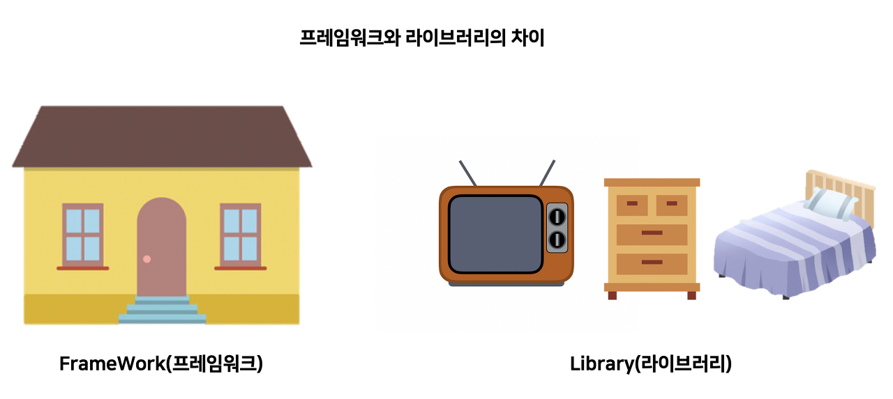
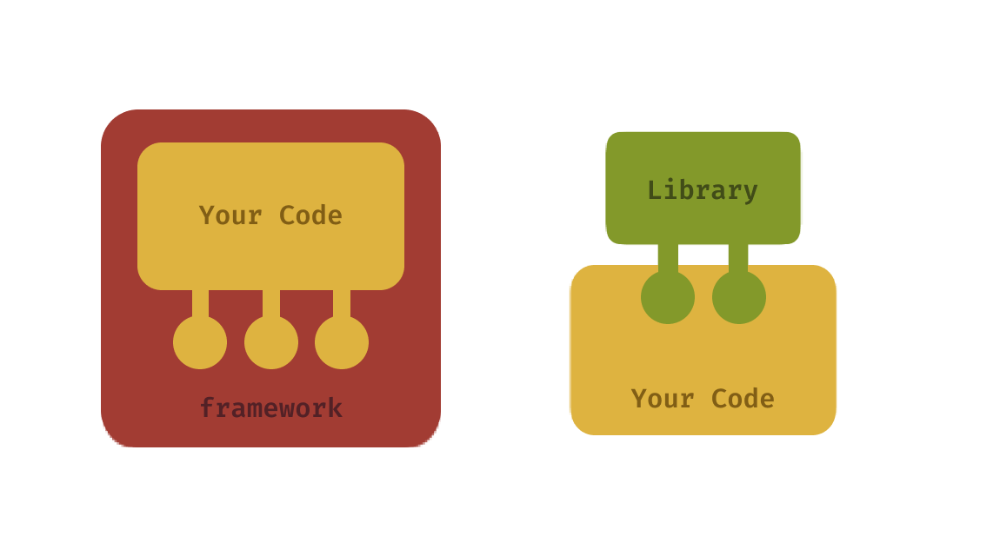
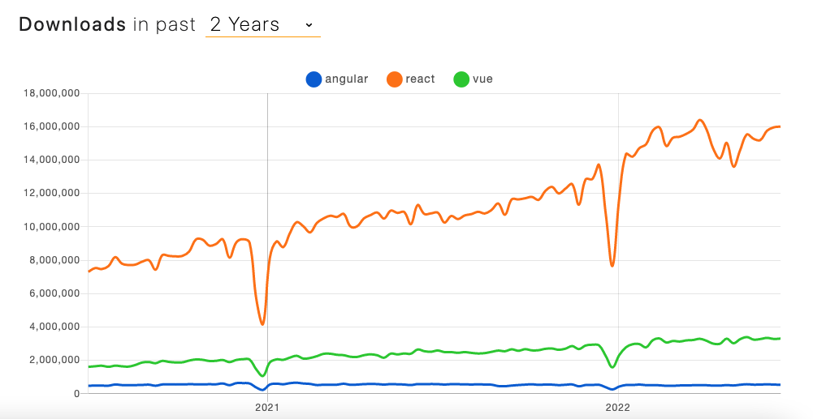
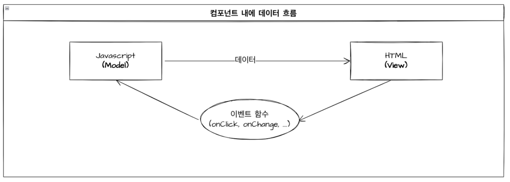
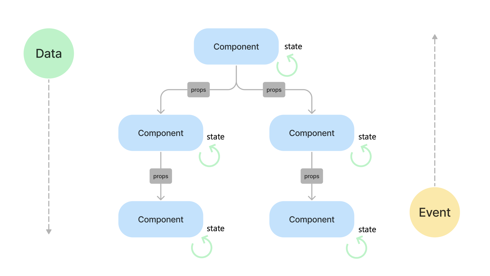
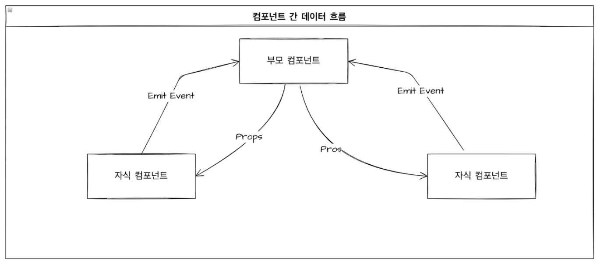

# 01. 프레임워크와 라이브러리의 차이

프레임워크와 라이브러리의 "사전적 정의"는 다음과 같다.

> 컴퓨터 프로그래밍에서, 소프트웨어 프레임워크(software framework)는 복잡한 문제를 해결하거나 서술하는 데 사용되는 기본 개념 구조이다. 간단히 뼈대, 골조(骨組), 프레임워크(framework)라고도 한다. -위키백과

> 라이브러리는 주로 소프트웨어를 개발할 때 컴퓨터 프로그램이 사용하는 비휘발성 자원의 모임이다. 여기에는 구성 데이터, 문서, 도움말 자료, 메시지 틀, 미리 작성된 코드, 서브루틴, 클래스, 값, 자료형 사양을 포함할 수 있다 - 위키백과

쉽게 설명하기 위해 집을 꾸미는 과정을 라이브러리와 프레임워크에 비유한다면,  
**프레임워크**는 `이미 꾸며진 모델하우스`를 구매하는 것, **라이브러리**는 `내가 원하는 가구들을 직접 사거나 조립`하는 것에 비유할 수 있다.

 

### ✔️ 프레임워크(Framework)

모델하우스는 소파의 위치나, 방의 용도 등 우리가 수정할 수 있는 범위가 제한되어 있고 거실, 주방, 화장실의 위치나 방의 개수 등 집을 이루는 큰 뼈대는 수정할 수 없다.

이처럼 개발자도 프레임워크가 제공하는 틀 안에서 코드를 작성해야 한다. 이를 두고 **`통제권을 프레임이 쥐고 있다`** 라고 한다.

### ✔️ 라이브러리(Library)

반대로 라이브러리는 빈 집에 내가 원하는 가구를 구매하여 배치하거나 또는 DIY 재료를 통해 사용자 맘대로 조립하고 배치할 수 있다. 즉 개발자는 라이브러리 안에서 원하는 다른 프로그램을 가져와 사용할 수 있다.

즉 **`통제권을 사용자가 쥐고 있다`**.

### 👀 제어의 역전 (Inversion Of Controll, IoC)

: '통제권'은 `제어`라는 의미로 사용되기도 하는데, 그 뜻은 **애플리케이션의 Flow(흐름)을 누가 쥐고 있느냐**를 뜻한다.

컴퓨터에게 명령을 내리는 주체는 "사람"이기 때문에 라이브러리의 경우 이 제어에 대한 주도권이 사람, 즉 `개발자`에게 있다.
하지만 **프레임워크**의 경우, 개발자가 아닌 `프레임워크`가 소프트웨어의 흐름을 제어한다.

👉 이를 두고 소프트웨어에 대한 제어권이 개발자에서 프레임워크로 역전(제어 역전)되었다고 한다.

 

# 02. React vs Vue vs Angular

 

## 🗣️ 특징

### ① React (Library)

> 2013년 **Facebook**에서 개발한 Javascript 라이브러리로, 컴포넌트를 기반으로 사용자 인터페이스(UI)를 구축하기 위해 설계되었다.  
> Virtural DOM을 활용해 빠른 렌더링 성능을 제공한다.

1. **컴포넌트 기반 구조** : React는 UI를 재사용 가능한 컴포넌트로 분리하는 것을 중점으로 둔다.  
   각 컴포넌트는 독립적으로 동작하며, 필요에 따라 다른 컴포넌트 내에서 사용할 수 있다.
2. **Virtual DOM** : Virtual DOM을 사용해 브라우저의 실제 DOM 업데이트를 최적화하고 이를 통해 렌더링 성능을 향상한다.
3. **JSX(JavaScirpt XML)** : XML과 유사한 JSX문법을 통해 UI 구조를 직관적으로 표현할 수 있다.
4. **단반향 데이터 바인딩** : React는 데이터가 단반향으로 흐르게 설계되어 데이터 흐름 추적이 쉽고, 버그 발생 가능성을 줄여준다.
5. **HOOKS** : React Hook을 사용하면 함수형 컴포넌트 내에서도 클래스형 컴포넌트에서 사용할 수 있는 상태와 생명주기 기능을 활용할 수 있다.
   대표적으로 useState, useEffect 등이 있다.
6. **풍부한 생태계** : 넓은 커뮤니티와 광범위한 서브파티 라이브러리, 그리고 툴셋을 활용할 수 있다.

### ② Vue.js (Framework)

> 2014년 **Evan You**에 의해 만들어진 프로그레시브 프레임워크로, 웹 인터페이스를 구축하는데 사용된다.  
> Vue.js는 사용자 인터페이스를 구축하기 위한 직관적이고 빠르게 반응하는 **프레임워크**로, 간결한 API와 강력한 플러그인 시스템을 제공한다.

1. **양방향 데이터 바인딩** : UI와 데이터 모델 간에 자동 동기화를 제공한다.
2. **컴포넌트 기반** : 재사용 가능한 UI 컴포넌트를 쉽게 만들 수 있다.
3. **템플릿 문법** : HTML 기반의 템플릿을 사용해 선언적으로 렌더링 할 수 있다.
4. **light & fast** : 코드 기반이 작고, 빠른 시작 및 렌더링 속도를 제공한다.
5. **Vue CLI** : 프로젝트 초기 설정과 프로토타이핑을 빠르게 도와주는 명령 도구를 제공한다.

### ③ Angular.js (Framework)

> 2010년 **Google**에서 개발한 웹 애플리케이션과 동적 웹 페이지를 위한 `TypeScript`기반 오픈 소스 프레임워크

1. **컴포넌트 기반 아키텍처** : UI를 재사용 가능한 컴포넌트로 나누어 구축한다.
2. **양방향 데이터 바인딩** : UI와 데이터 모델 간에 자동 동기화를 제공한다.
3. **TypeScript 기반** : 강력한 타입 검사와 최신 ECMAScript 기능을 제공한다.
4. **의존성 주입** : 모듈과 컴포넌트 사이의 의존성을 관리하고 조절할 수 있게 해준다.
5. **통합된 개발 도구** : Angular CLI는 프로젝트 생성, 개발, 테스팅 및 배포를 쉽게 만들어준다.

 

## 🗣️ 언제 사용할까?

|    Features     | Technology |
| :-------------: | :--------: |
|   Flexibility   |   React    |
| With JavaScript |   React    |
|   Clean Code    |   Vue.js   |
|  Easy To Learn  |   Vue.js   |
|       OOP       | Angular.js |
|  Small Project  |   Vue.js   |
|  Large Project  | Angular.js |

 

> - **React** :기존 앱에서 보수 및 확장이 필요하거나, 빠르게 크로스플랫폼 앱 개발까지 필요할 때
> - **Angular.js** : 규모가 큰 기업에서 많은 기능 구현이 필요하고 확장성 높은 어플리케이션을 개발할 때
> - **Vue.js** : 가벼운 서비스를 개발하거나, 개발에 대한 지식이 적어도 빠르게 성과를 내야할 때

 

# 02. Date Binding

|                  React                  |                   Vue.js                   |                 Angular.js                 |
| :-------------------------------------: | :----------------------------------------: | :----------------------------------------: |
| 단반향 데이터 바인딩(One-way Data Flow) | 양방향 데이터 바인딩(Two-way Data Binding) | 양방향 데이터 바인딩(Two-way Data Binding) |

## ❓ Date Binding이란

> 데이터 바인딩(Data Binding)은 **브라우저 에 보여지는 데이터(View)** 와 **브라우저 메모리에 있는 데이터(Model)** 를 묶어(Binding) 서로 간의 데이터를 동기화하도록 하는 기법을 말한다.

## ① 단반향 데이터 바인딩(One-way Data Binding)

### ❶ 컴포넌트 내에 데이터 흐름

JavaScript(Model)에서 HTML(View)로, **한 방향**으로만 데이터가 동기화되는 것을 의미한다.

예를 들어 자바스크립트 상에서 데이터가 생성, 변경된 경우 HTML 상에도 동일하게 변경된 데이터를 보여주는 것을 의미한다.

### ❷ 컴포넌트 간 데이터 흐름

리액트에서 컴포넌트 간 데이터 흐름은 **하향식**으로, 오직 부모 컴포넌트에서 자식 컴포넌트로만 데이터를 전달할 수 있다.

> ❗️ **이벤트와 데이터의 흐름은 반대이다**.
>
> 위 그림과 같이 **데이터는 상위 컴포넌트에서 하위 컴포넌트로 하향식으로 이동(props)** 하고, **이벤트는 아래에서 위로 올라가는 상향식 흐름(DOM의 이벤트 버블링)** 이다.

 

리액트는 양방향 바인딩을 지원하지 않기 때문에 HTML(View)에서 JS(Model)로 **직접적인 데이터 갱신은 불가하다.**

하지만 **State 끌어올리기 (lighting state up)**를 통해 양방향 바인딩처럼 동작할 수 있게 구현할 수 있다.

👉 자식 컴포넌트에서 `이벤트 함수(onClick, onChange..)`가 발생할 때, 부모 컴포넌트에서 전달한 **event handler**를 통해 state를 바꾸는 등 **State 끌어올리기 (lighting state up)** 로
양방향 바인딩처럼 동작하게 할 수 있다.

 

## ② 양방향 데이터 바인딩(Two-way Data Binding)

### ❶ 컴포넌트 내에 데이터 흐름 (MVVM 패턴)

JavaScript(Model)에서 HTML(View) 사이에 위치한 **ViewModel**이 Model과 View의 데이터 변화를 감지해 화면이나 데이터를 갱신하여 서로 간의 데이터가 동기화되도록 한다.

프레임워크의 **ViewModel**은 데이터 변경을 감지하고 있다가 데이터가 변경되는 시점에 DOM 객체를 렌더링 해주거나, 페이지 내 모델의 변경을 감지해 JS 실행부로 변경한다.

덕분에 입력된 값이나 변경된 값에 따라 데이터가 자동 동기화되므로 개발자의 수고도 덜고, 간결한 코드 작성이 가능하다.

> **👀 Vue.js의 v-model과 v-on**
>
> - **v-model** : Model 상에서 업데이트가 될 때 ViewModel을 거쳐 View와 데이터를 일치시키는 방식
> - **v-on** : View 상에서 업데이트가 될 때 ViewModel을 거쳐 Model과 데이터를 일치시킨다.

> ⛔️ **일반 통행보단 양측 통행이 좋지 않아?**
>
> 단방향 바인딩으로 표현 가능한 요소를 양방향으로 표현 시 불필요한 리소스 사용으로 성능 저하 이슈가 발생할 수 있다.
>
> 따라서 상황에 따라 알맞는 방법을 사용해야 한다.

### ❷ 컴포넌트 간 데이터 흐름

부모 컴포넌트에서 자식 컴포넌트로는 `props`을 통해 데이터를 전달하고, 자식 컴포넌트에서 부모 컴포넌트로는 `Emit Event`를 통해 데이터를 전달하는 구조이다.

 

## 03. React는 어떻게 개발자들의 선택을 받게 되었을까?

👀

