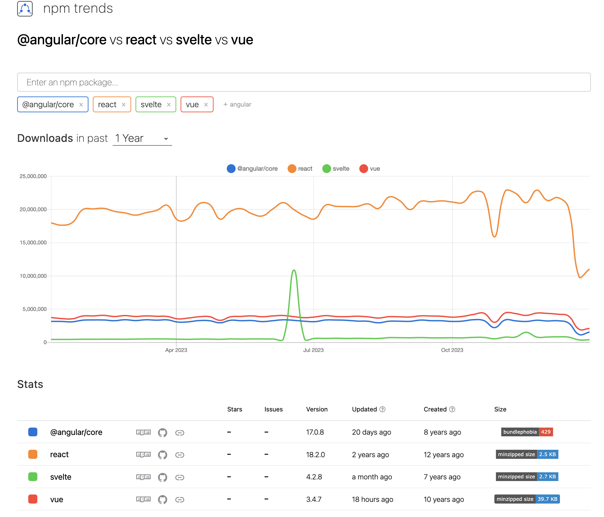
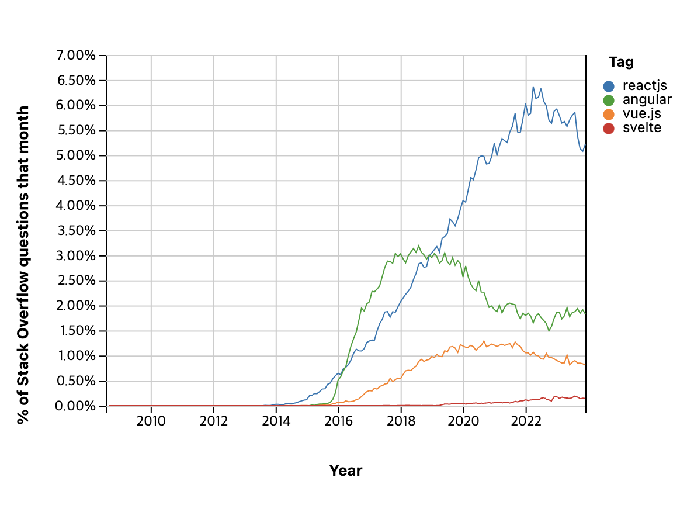
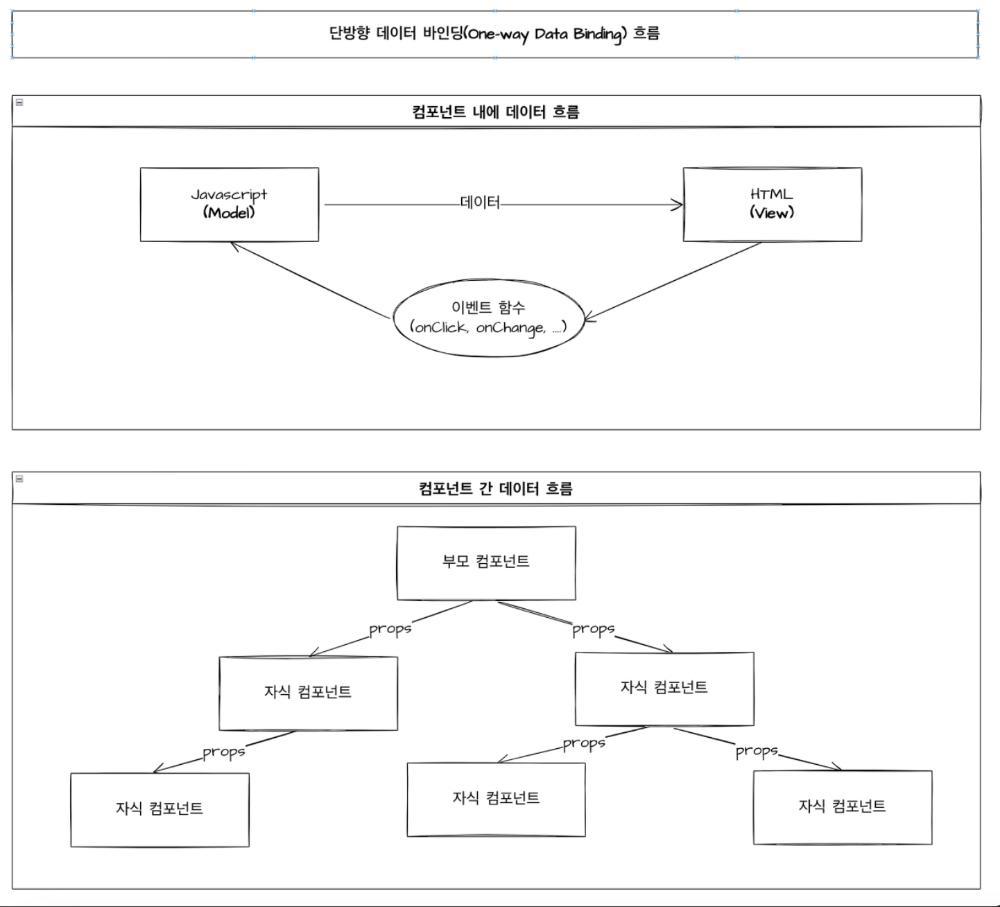
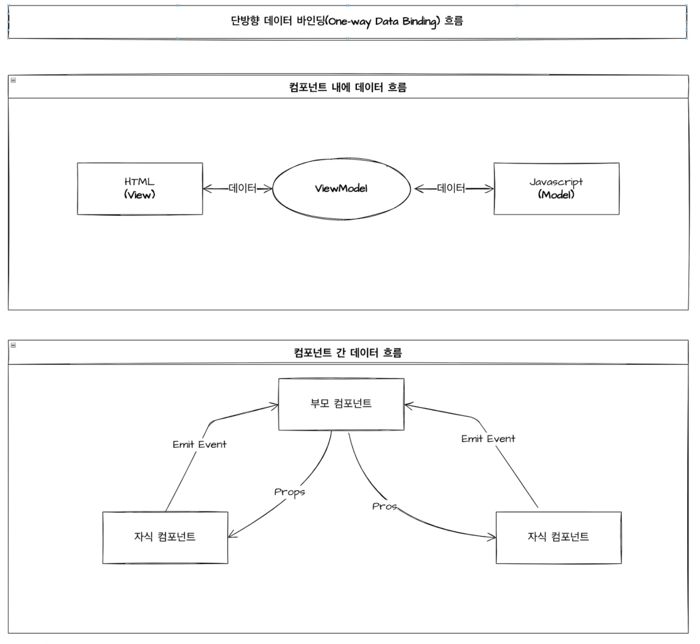

# 📖 프레임워크와 라이브러리 비교

https://www.devkuma.com/docs/framework-and-library/

## 🚗 프레임워크

>  *Vue.js*와 *Angular*, *Next.js*, *Svelte*

Frame(틀, 뼈대) + Work(일)

**응용 프로그램이나 소프트웨어의 솔루션 개발을 수월하게 하기 위해 제공된 소프트웨어 환경**

- 프레임워크는 애플리케이션의 구조를 정의하고, 개발자가 그 안에서 자신의 코드를 작성하도록 하는 틀을 제공함

- 프레임워크는 애플리케이션의 흐름과 제어를 개발자 대신 관리하고, 전반적인 실행은 프레임워크 내부 플로우를 따라 진행되기 때문에 이 틀 안에서 원하는 기능 구현에만 집중해 빠르게 개발이 가능하게 됨

- 개발자는 프레임워크가 제공되는 규칙과 패턴을 따라 코드를 작성해야 함

- **제어의 역전 (Inversion of Control)** 개념을 따르고 있음 (내가 호출당하는 입장이 되는 것을 제어의 역전이라고 함)

  즉, 프레임워크가 개발자의 코드를 호출하여 필요한 기능을 수행함

<br />

#### Framework의 특징

1. 상호협력하는 클래스와 인터페이스의 집합

2. 응용 프로그램이 **수동적으로( = 규칙을 지켜가며)** 프레임워크에 의해 사용됨

   라이브러리와는 다르게 Framework는 내가 작성한 코드를 호출하기 때문에, Framework만으로는 실행되지 않으며 기능들을 추가해야 하고, Framework가 정의한 규칙을 준수하며 개발해야 함

<br />

*마이크로소프트웨어 2006/8월호 130쪽 “프레임워크 활용전략"에서*

> GoF의 디자인 패턴으로 유명한 랄프 존슨(Ralph Johnson) 교수는 프레임워크를 “소프트웨어의 구체적인 부분에 해당하는 설계와 구현을 재사용이 가능하게끔 일련의 협업화된 형태로 클래스들을 제공하는 것"이라고 정의하였다. 프레임워크는 라이브러리와 달리 애플리케이션의 틀과 구조를 결정할 뿐 아니라, 그 위에 개발된 개발자의 코드를 제어한다. 프레임워크는 구체적이며 확장 가능한 기반 코드를 가지고 있으며, 설계자가 의도하는 여러 디자인 패턴의 집합으로 구성되어 있다.

<br />

## ⚙️ 라이브러리

> *React*

 **응용 프로그램 개발을 위해 필요한 기능들을 모아 놓은 소프트웨어**

- 라이브러리는 자주 사용되는 로직들의 모음 혹은 묶음으로 자주 쓰는 클래스, 메소드 및 함수들을 미리 구현해 놓고, 필요에 따라 프로그램에 추가해서 사용하는 형태가 됨 

- 라이브러리는 보통 특정 기능을 수행하기 위한 코드의 집합이며, 개발자가 직접 호출하여 사용하게 되고 개발자가 코드의 특정 부분을 라이브러리로 대체하거나 추가할 수 있음

- 라이브러리는 **제어의 역전 (Inversion of Control) 개념을 따르지 않음** 

  즉, 개발자가 라이브러리를 호출하여 사용하는 것이지, 라이브러리가 개발자의 코드를 호출하는 것은 아님

  (언제 질문을 할 것인지, 언제 응답을 받을 것인지, 언제 결과를 처리할 것인지 내 코드에서 결정함)


<br />

#### Library의 특징

1. **독립성**을 가짐 

   해당 Library는 다른 Library에 의존하지 않음

2. 응용 프로그램이 **능동적으로( = 필요할 때)** Library를 사용함

<br />

## ✏️ 프레임워크와 라이브러리 개념 요약

라이브러리는 개발자가 필요한 기능을 직접 호출하여 사용하는 도구이고, 프레임워크는 개발자가 프레임워크가 정의한 규칙과 패턴에 따라 코드를 작성하고, 프레임워크가 코드를 호출하여 필요한 기능을 수행하도록 하는 구조를 제공하는 틀

<br />

## ✨ 프레임워크와 라이브러리 차이

> **제어 흐름의 주도권이 어디에 있는가 **(누가 누구를 컨트롤하는가)

\- **Framework**: Framework가 개발자를 호출 = 정해진 프로그램의 틀에 맞게 개발자가 필요한 기능을 입력 (프레임워크가 전체적인 흐름을 제어하고, 개발자는 그 안에서 필요한 코드를 넣음)

\- **Library**: 개발자가 필요한 기능을 원할 때 호출 (개발자가 전체적인 흐름을 만들며 라이브러리를 사용)


프레임워크가 라이브러리보다 일반적으로 큰 단위라고 볼 수 있고, 프레임워크 내에 라이브러리가 존재할 수 있기 때문에 사실상 라이브러리와 프레임워크를 100% 분리할 수 있는 것은 아님

<br />

*토비의 스프링3. 1장 오브젝트와 의존관계 p.95*에서

> 프레임워크도 제어의 역전 개념이 적용된 대표적인 기술이다. 프레임워크는 라이브러리의 다른 이름이 아니다. 프레임워크는 단지 미리 만들어 둔 반제품이나, 확장해서 사용할 수 있도록 준비된 추상 라이브러리의 집합이 아니다. 프레임워크가 어떤 것인지 이해하려면 라이브러리와 프레임워크가 어떻게 다른지 알아야 한다. 라이브러리를 사용하는 애플리케이션 코드는 애플리케이션 흐름을 직접 제어한다. 단지 동작하는 중에 필요한 기능이 있을 때 능동적으로 라이브러리를 사용할 뿐이다. 반면에 프레임워크는 거꾸로 애플리케이션 코드가 프레임워크에 의해 사용된다. 보통 프레임워크 위에 개발한 클래스를 등록해두고, 프레임워크가 흐름을 주도하는 중에 개발자가 만든 애플리케이션 코드를 사용하도록 만드는 방식이다. 최근에는 툴킨, 엔진, 라이브러리 등도 유행을 따라서 무작정 프레임워크라고 부르기도 하는데 이는 잘못된 것이다. 프레임워크에는 분명한 제어의 역전 개념이 적용되어 있어야 한다. 애플리케이션 코드는 프레임워크가 짜놓은 틀에서 수동적으로 동작해야 한다.

<br />

## 그렇다면, React는 왜 라이브러리일까?

>  https://ko.legacy.reactjs.org/ (사용자 인터페이스를 만들기 위한 JavaScript 라이브러리)

1. 프로그램 흐름에 작업을 추가하거나 그렇게 하지 않음으로서 프로그램의 흐름을 바꾸는 것이 가능하기 때문

   <br />

   **React 라이프사이클을 생각해보자**

   ```
   1) componentWillMount()
   2) render()
   3) componentDidMount()
   ```

   → 프로그램 흐름의 기본적인 틀은 정해져 있지만, 개발자가 API를 호출하거나 다른 작업을 수행하기를 원할 때 componentDidMount()를 통해 프로그램을 추가적인 동작을 정의할 수 있음

   <br />

2.  다른 프레임워크와 다르게 **개발에 필요한 전체적인 구조와 규칙을 제공**하기보다는 **사용자 인터페이스의 개발을 돕는 도구와 기능만을 제공**하기 때문 

   리액트는 애플리케이션의 전체 구조나 아키텍처를 결정하지 않으며, 개발자는 필요한 부분에 리액트를 적용하여 UI를 구성하고 관리할 수 있음 (리액트는 컴포넌트 기반 아키텍처를 기반으로 하여 재사용성과 유지보수성을 높일 수 있도록 도와줌)

3. 다른 프레임워크와 다르게 개발에 필요한 모듈을 기본적으로 제공하지 않고, **서드파티 (Third Party) 라이브러리에 의존**하기 때문 (높은 자유도를 지녔지만, 학습에 대한 부담이 기본적으로 있긴 함 → 이러한 단점을 극복하고자 리액트가 개발환경을 구축하는 CRA 툴을 제공하는 것)

리액트는 프레임워크의 엄격함보다는 라이브러리의 유연함을 가지고 있으며 개발자가 원하는 기능만을 선택적으로 사용할 수 있음

<br />

# ⚖️ Frontend 프레임워크와 라이브러리 비교

## 프론트엔드 프레임워크 혹은 라이브러리 등장 이유

프론트엔드 프레임워크나 라이브러리는 **정적인 웹 페이지에서 동적으로 유저 인터랙션을 처리하는 웹 애플리케이션으로 규모가 커짐에 따라 개발을 용이하게 하기 위해** 등장하게 되었음

<br />



▲ 지난 1년간 Angular vs React vs Vue.js vs Svelte NPM 다운로드 수 비교




▲ Stackoverflow Angular vs React vs Vue.js vs Svelte Trend 비교

<br />

## 데이터 바인딩

**💡** **화면상에 보여지는 데이터(View)**와 **브라우저 메모리에 있는 데이터(Model)**를 묶어서(Binding) 서로 간의 데이터를 동기화하는 것을 의미

💡 예를 들어서 HTML에서 서버 혹은 스크립트상에서 받아온 데이터를 화면상에 그려주고 있다고 가정을 했을 때, **해당 값이 변경이 될 경우** 다시 HTML 상에 데이터(값)를 **변경된 값에 따라서 맞추어 주는 동작을 '데이터 바인딩'이라고 함**

<br />

### 단방향 데이터 바인딩



- 컴포넌트 내에서 '**단방향 데이터 바인딩**'은 **Javascript(Model)에서 HTML(View)로 한 방향으로만 데이터를 동기화하는 것을 의미** [JS(Model) -> HTML(View)]

- 단방향 데이터 바인딩이기에 역으로 HTML(View)에서 JS(Model)로의 직접적인 데이터 갱신은 불가능함

  **'이벤트 함수(onClick, onChange,...)'를 주고 함수를 호출한 뒤 Javascript에서 HTML로 데이터를 변경해야 함** [HTML(View) -> JS(Model)]

- 컴포넌트 간에서 단방향 데이터 바인딩은 **부모 컴포넌트에서 자식 컴포넌트로만 데이터가 전달되는 구조**

<br />

### 양방향 데이터 바인딩



- 컴포넌트 내에서 **'양방향 데이터 바인딩'**은 Javascript(Model)와 HTML(View) 사이에 ViewModel이 존재하여 하나로 묶여서(Binding) 되어서 **둘 중 하나만 변경되어도 함께 변경되는 것을 의미** [HTML(View)<-> ViewModel <-> Javascript(Model)]
-  컴포넌트 간에서는 부모 컴포넌트에서 자식 컴포넌트로는 Props를 통해 데이터를 전달하고, 자식 컴포넌트에서 부모 컴포넌트로는 Emit Event를 통해서 데이터를 전달하는 구조

<br />

## React

- Facebook에서 개발된 자바스크립트 라이브러리로, 컴포넌트 기반 웹 애플리케이션의 사용자 인터페이스(UI)를 구축하기 위해 필요한 도구를 제공함

- 컴포넌트 기반 아키텍처를 사용하여 UI를 작성하고 이를 재사용할 수 있도록 도와줌

- 가상 DOM(Virtual DOM)을 활용하여 효율적으로 UI 업데이트를 처리하여 성능을 최적화함

  - 렌더링 성능의 핵심은 **DOM 조작 관련 작업을 최소화**하는 것 

    이는 DOM 조작 수 자체를 최소화하거나, DOM 조작을 할 때 최소한의 오버헤드만 가하는 것

- **단방향 데이터 바인딩 모델** (데이터 변경이 UI로 전달되어 화면을 업데이트함)

<br />

## Vue.js

   - 대규모 커뮤니티와 개발자들의 도움을 받아 완성된 자바스크립트 기반 프레임워크

   - Vue.js는 컴포넌트 기반 개발을 지원함 (하지만, 작은 컴포넌트를 정의하는데 React의 문법이 더 직관적이고, 간결하고, 일관적)

     **SFC(Single File Component)**는 Vue가 권장하는 Vue 컴포넌트 전용 파일 포맷

     한 파일 안에 템플릿과 자바스크립트 그리고 CSS까지 정의하며, Vue는 개발자가 컴포넌트를 개발할 때 클래스를 정의하기보다는 클래스를 만들 수 있는 옵션을 정의하는 형태로 개발함

     ```jsx
     <template>
       <div>
         <input type="text" v-model="newTodo" @keyup.enter="onEnter">
         <ul>
           <li v-for="todo in todos" :key="todo">{{todo}}</li>
         </ul>
       </div>
     </template>
     <script>
     export default {
       data() {
         return {
           todos: ['TASK1'],
           newTodo: ''
         };
       },
       methods: {
         onEnter(ev) {
           this.addTodo(this.newTodo);
         },
         addTodo(title) {
           this.todos.push(title);
         }
       }
     };
     </script>
     ```

   - 가상 DOM(Virtual DOM)을 사용하여 성능을 최적화함

     - DOM 조작 수 최소화는 둘 다 가상돔을 사용하기에 큰 차이가 없지만, 같은 조건의 **DOM 조작시 최소한의 오버헤드** 측면에서 Vue의 가상돔이 훨씬 가벼움

   - **양방향 데이터 바인딩 모델** (데이터의 변경과 UI 요소의 상태 변경이 서로 영향을 주어 동시에 업데이트)
     `v-model`이 DOM 연관된 내용을 잡아내며 vue가 바라보는 대상의 속성과 연결되고, `v-on`은 이벤트를 잡아내는 데 사용함

   - 체감은 안되지만, React보다 렌더링 시간이 빠르다고 알려져 있음 (비트코인 거래 사이트에서 이용하는 것을 볼 수 있음)

   - 상태 갱신 성능

     React는 상태가 변경되면 해당 컴포넌트부터 이하 자식 컴포넌트를 포함하는 트리를 다시 렌더링하는데, 이는 개발자가 직접 최적화할 수는 있지만, 기본적으로는 성능면에서 좋지 않음

     Vue는 렌더링 중 컴포넌트의 종속성이 자동 추적되기 때문에 **시스템은 실제로 다시 렌더링해야하는 컴포넌트를 정확히 알고있기 때문에** 최적화 되지 않은 조건에서도 Vue가 더 빠르고, 심지어 최적화된 React보다 기본 Vue가 더 빠름

   - 쉽고, 더 HTML스러워서 구조 파악이 조금 더 용이함 (JSX, functional component 같은 리액트스러운 자유로운 웹앱 프로그래밍도 지원하긴 함)

     react는 javascript 언어(map, forEach, for in, for of 등)를 적극 활용하여 개발하지만, vue는 for 반복문이면 v-for가 모두 대체함 (코드의 통일성이 통일되어서 수정과 관리가 편해짐)

     

     

     

<br />

## Angular

   - Google에서 개발한 자바스크립트 기반 프레임워크 (필요한 기능을 모두 내장함)

   - MVC (Model-View-Controller) 아키텍처를 기반으로 하며, 의존성 주입 등의 기능을 제공함

     - Component 와 Service 단의 분리 

       Angular 에서 Component 는 View 를 처리하는 로직만을 다루며 Service 를 다루는 로직은 분리하여 작성함여기서 사용되는 Service 는 기존의 MVC 패턴에서 사용되는 Service 의 개념과 비슷한데, Component 에서 Service 단 코드를 분리함으로서 코드의 중복성을 줄여주며 유지보수에 용이하게 해줌

   - Angular는 기본적으로 TypeScript를 사용하여 개발되며, 강력한 기능과 확장성을 제공함

   - 실제 DOM을 직접 조작하고, 이로 인해 애플리케이션의 크기와 복잡성에 따라 렌더링 속도가 저하될 수 있음 (Incremental DOM 방식을 채택하여 DOM 을 조작)

     React 에서는 재조정 과정을 위해서는 메모리에 가상 DOM 을 두 개를 올려야 하는데, Incremental DOM 방식은 랜더링 과정에서 변화를 감지하고 이를 DOM 트리에 반영하는 과정에 있어서 추가적인 메모리 공간을 요구하지 않음

     

     랜더링 과정에서 변화를 감지하기 위해 실제 DOM 을 이용하며 변경 사항이 있을 시 이를 즉시 반영하기 때문에, Virtual DOM 을 활용할 때 보다 훨씬 메모리 관리에 있어서 효율적

   - **양방향 데이터 바인딩 모델** (데이터의 변경과 UI 요소의 상태 변경이 서로 영향을 주어 동시에 업데이트)


**[추가]**

- **왜 Google 의 Angular 팀은 Incremental DOM 을 채택했을까?** 

  Angular 팀은 모바일의 발전에 따라서 저용량의 메모리에서도 Application 의 퍼포먼스가 저하되지 않아야 한다고 생각했고, 이를 해결하기 위해서 두 가지 옵션을 최적화 했어야 했는데 한 가지는 번들링 된 사이즈 이며 다른 한 가지는 메모리 관리

  번들링된 사이즈는 Tree Shaking 을 통해서 해결할 수 있는 이슈 → Tree-shaking 을 통해서 실제로 DOM 에 반영되지 않을 Component 들은 번들링에서 제외시키는데, 메모리 관리에 있어서는 Incremental DOM 은 추가적인 메모리 공간을 요구하지 않기 때문에 최적화가 가능한 부분이였음

- ***Angular 는 무겁다?***
  아래 포스팅을 살펴보면 앵귤러의 버전이 높아질 수록 번들링 되는 결과물의 사이즈가 작아지고 있다는 것을 확인할 수 있음
  [포스팅 보기](https://tsh.io/blog/angular-size-comparison/)

- **Angular 의 퍼포먼스는 다른 Library or Framework 에 비해서 느리다?**
  프레임워크 및 아키텍처의 랜더링 퍼포먼스를 수치상으로 비교하면

  

  앵귤러는 82 point 를 지니고 있다. 그에 비해서 React + Redux 는 67 point 를 지니고 있음

  결론적으로 가장 많이 사용되는 아키텍처인 React + Redux 보다 수치상으로 15 Point 를 앞선다고 볼 수 있다. (물론 환경이나 여러가지 변수를 고려하지 않은 수치 데이터임을 확인해야 하긴 함)

<br />

## Svelte

 - **컴파일러를 사용**하여 런타임이 아닌 빌드 시점에 가벼운 바닐라 자바스크립트로 변환되는 프론트엔드 프레임워크 

   런타임에 프레임워크의 코드가 포함되지 않기 때문에 결과물의 크기가 작고 빠름 (가능한 한 적은 양의 자바스크립트 코드 생성함으로써 앱 동작에 필요한 코드 부하를 크게 줄이는 데 성공함)

   **압축된 리액트 파일 : 42.2KB / 압축된 스벨트 : 1.6KB** → 더 빨리 로드되고, 더 높은 응답성과 낮은 대역폭을 요구하게 됨

 - 다른 프레임워크는 프레임워크 코드 자체를 브라우저로 전달되게 되지만, HTML, CSS, JS가 최적화된 작은 번들로 컴파일되기 때문에 비즈니스 로직 처리에만 집중할 수 있음 

   (타 프레임워크는 브라우저 스스로가 무거운 작업을 처리해야 하기 때문에 느려짐)

 - React와 비슷한 컴포넌트 기반 개발 방식을 제공함 (컴포넌트 프레임워크라고 소개)

   컴포넌트를 export 할 때 수동으로 해야하는 리액트와 다르게 svelte가 자동으로 처리해주고, 스타일 태그에서 컴포넌트 범위를 지정해서 유연하게 스타일 지정이 가능함 (고유한 클래스 생성할 필요가 없음)

 - 외부 라이브러리가 필요 없음

   리액트는 뷰 영역에 초점을 맞춘 라이브러리고, 상태 관리나 화려한 애니메이션 구현 시 외부 라이브러리를 사용해야 하지만, 스벨트는 용량을 늘리지 않으면서도 시각 효과, 애니메이션 등을 내장하고 있음 (코드 컴파일이 가진 장점이며, 필요한 부분만 불러올 수 있음)

 - 가상 DOM(Virtual DOM)의 비교 처리가 없음 (조정과 비교 과정을 포함하는 가상 DOM의 사용을 과감하게 제거)

 - 반응성이 뛰어남

   리액트는 **선언적 언어**로 특정 결과를 얻기 위해 각 단계를 모두 정의하는 대신, **원하는 결과**만 지정하여 리액트가 알아서 처리하지만, 변경된 값은 DOM에 자동적으로 반영되지 않고 정해진 일정에 따라 컴포넌트를 업데이트함

   스벨트는 컴포넌트 단계가 업데이트 되면 DOM을 업데이트 하는데, **업데이트 명령을 받았을 때 동작**하며 그전까지 발생한 변경사항은 한 번에 처리함

   - **반응형 선언문** - 업데이트가 발생하는 동안 **자동으로 로직 재계산**
   - **반응형 변수** - 변경 발생할 때마다 연관된 다른 변수도 함께 업데이트


<br />

**단점**

- **커뮤니티 규모가 작음** → 플러그인, IDE에 대한 부족한 자원, 문제 해결 시 스스로 해결해야 할 가능성이 높음
- **운영 주체가 기업이 아님** → 계속 유지하고 발전시켜 나갈 자금이 불안정하고, 커뮤니티 핵심 개발자들의 열정에 따라 미래가 불투명함
- **대규모 웹에 적합하지 않음** → 외부의 다양한 유스케이스를 지원하려면 아직 시간이 조금 더 필요함

<br />

# 🧸 리액트의 사용 이유

> https://modulabs.co.kr/blog/react-library/

- **단방향 바인딩**으로 명시적인 상태 변경

  

  **단방향 바인딩**

  - 상태가 변화했다면 그 상태 변화를 명시적으로 일으키는 함수만 찾으면 됨 (데이터 흐름이 단순하기 때문에 코드를 읽기 쉽고 버그 야기할 가능성이 비교적 적음) → 명시적인 상태 업데이트는 많은 개발자들에게 간단함과 유연함 제공함
  - 단점은 변화를 감지하고 업데이트하는 코드 매번 작성해야 하고, 코드 규모가 증가할 수 있음

  - 성능 저하가 거의 없이 DOM을 렌더링

  ```jsx
  // 리액트
  // 리액트의 경우 name이 변경되는 경우는 setName이 호출될 때 뿐임
  // name이 변경된 이유를 찾고 싶다면 setNmae을 호출하는 곳을 찾으면 됨
  function App {
      const [name, setName] = useState('')
      
      function onChange(e) {
          setName(e.target.value)
      }
      
      return <input type="text" value={name} />
  }
  ```

  ↔ **Angular**

  - 양방향 바인딩은 뷰 변화가 컴포넌트에 영향을 미칠 수도, 반대로 컴포넌트 상태가 변경되면 뷰 상태도 변할 수 있음
  - 단방향이 제공할 수 없는 편리함을 제공하지만 코드 규모가 커질수록 상태 변화가 무엇으로 일어났는지 파악하기 어려워짐
  -   변화에 따라 DOM 객체 전체를 렌더링해주거나 데이터를 바꿔주므로, 성능이 감소되는 경우가 있음
  
  ```jsx
  // Angular
  import { Component } from '@anglular/core'
  
  // input 입력으로 name이 변경되거나 AppComponent 클래스 내부에서 직접 name 변경 가능
  // name 변경된 이유를 알고 싶다면 template이나 클래스 내부에서 name 변경하는 곳 다 찾아야 함
  @Component({
      selector: 'app-root',
      template: `<input type="text" [(ngModel)]="name" />`,
  })
  
  export class AppComponent {
      name = ""
  }
  ```
  
- **JSX (JavaScript XML)**

  앵귤러와 뷰는 자신들만의 문법을 갖고 있지만 (문자열 템플릿이나 Angular 디렉티브 등 전용 문법을 익혀야 함) **리액트는 자바스크립트 기반의 문법(JSX)을 사용하기 때문에 자바스크립트에 익숙하다면 보다 쉽게 사용이 가능**함

  타 프레임워크는 HTML 마크업 위에 템플릿 문법을 추가하여 컴포넌트 구조와 구성 요소를 적용함

  ```jsx
  // Angular
  // 추가적인 *ngIf 존재 알고 있어야 함
  <div *ngIf="condition">true일 때 렌더되는 content</div>
  
  // React
  // 자바스크립트 문법 친화적이며, null이 아무것도 렌더링하지 않는다는 점,
  // 자바스크립트 문법을 {}로 감싸야 한다는 사실만 알면 됨
  // JSX는 리액트 외에서도 사용 가능
  {condition ? <div>true일 때 렌더되는 content</div> : null}
  ```

- **가볍고 유연한 라이브러리**

  **필요한 부분에만 적용할 수 있기 때문에** 기존 프로젝트에 리액트를 통합하기 쉽게 만들어주고, 다른 프레임워크나 라이브러리와의 혼용도 가능하므로 기존 코드를 변경하지 않고도 리액트를 도입할 수 있음

  (리액트는 Angular와 다르게 단순 UI를 위한 라이브러리로만 작동함으로써 그 역할에 제한을 두고 그 외의 모든 것에 자유도를 둠)

- 리액트는 **페이스북(메타)**에서 개발한 오픈 소스 프로젝트로, **활발하고 다양한 커뮤니티와 생태계를 가지고 있음**

  이를 통해 문제 해결을 위한 자료와 지원을 쉽게 얻을 수 있으며, 다양한 라이브러리와 도구를 활용하여 개발 생산성을 높일 수 있음 (바벨 (Babel)과 같은 초대형 오픈소스 프로젝트도 재정난을 겪는데, 오픈소스가 빠르고 안정적으로 성장할 수 있기 위해서는 중심이 되는 메인 스폰서의 역할도 중요함)

- 리액트의 UI를 만드는 기능을 확장하여 웹이 아닌 플랫폼에서 활용할 수 있도록 기술을 확장하여 React Native를 활용하면 모바일 앱도 쉽게 제작이 가능함 (하나의 코드 베이스로 여러 플랫폼의 애플리케이션을 개발할 수 있어 개발 생산성이 높아짐)
