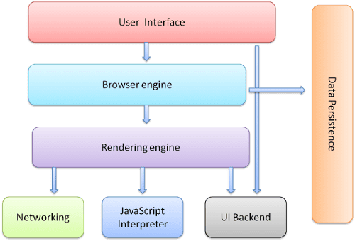
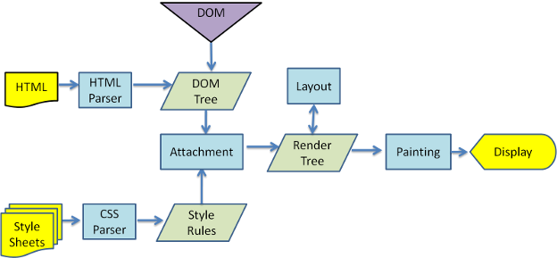
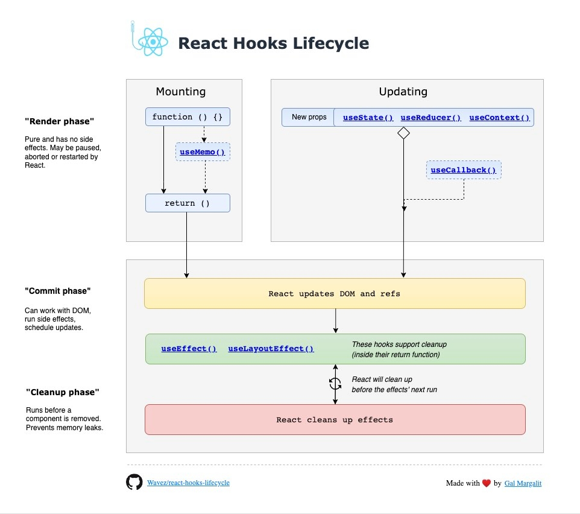

## DOM과 Virtual DOM

### 🐟DOM

웹문서(텍스트파일로 만들어진)를 브라우저에 렌더링하려면??
=> 웹 문서를 브라우저가 이해할 수 있는 구조로 메모리에 적재해야 한다.

=> 따라서 브라우저 렌더링 엔진은 웹문서(HTML, XML, SVG)를 로드한 후, 파싱하여 DOM이라는 문서객체모델을 생성한다!

=> 이때의 구조가 트리형태로 객체가 구조화 되어있어서 DOM Tree라고 불린다.

브라우저의 렌더링 엔진에서 발생하는 일련의 과정을 잠깐 짚고 넘어가보자.

우선, **렌더링 엔진**은 브라우저의 구성요소중 하나이다.

클라이언트가 브라우저에 요청한 타입의 문서를 화면에 나타내는 기능을 수행하는데, 세부적인 동작은 다음과 같다.

다음은 오픈소스 웹 브라우저 엔진인 "WebKit"의 동작과정을 나타낸 그림이다.


1. HTML파서에 의해 HTML문서를 DOM으로 파싱
2. CSS파서에 의해 CSS파일을 CSSOM으로 파싱(1번과 독립적으로)
3. DOM 트리를 구축하는 동안 스타일 속성을 계산하여 노드의 위치 및 크기 결정(Layout) => 렌더트리 생성
4. 렌더트리 시각화(Paint)

### 😕DOM 조작의 비효율성

웹에서 DOM 조작

SPA를 사용하기 시작하면서, 사용자와의 잦은 인터렉션으로 인해 DOM트리를 즉각적으로 변경할 일이 많아졌는데 그때그때 DOM이 수정되어 (리플로우, 리페인트) 렌더링을 진행하는것은 성능저하의 원인이 된다.

=> 최소화가 필요하다.

=> Virtual DOM을 사용.

### ✌️VDOM이란?

[공식문서 정의]
**"UI의 이상적인 또는 “가상”적인 표현을 메모리에 저장하고 ReactDOM과 같은 라이브러리에 의해 실제 DOM과 동기화하는 프로그래밍 개념"**

Virtual DOM은 DOM과 HTML 문서 사이에 존재하는 버퍼와 유사한 것으로 생각할 수 있다
(=> HTML DOM의 추상화 버전이라고 생각해도 될것같다.)

실제 DOM의 전체를 변경하지 않더라도 필요한 부분의 UI만 업데이트가 가능하다.

리액트의 경우에는 DOM의 복제본과도 같은 Virtual DOM을 메모리에 보관한다.

> **과정** (밑에서 phase에 맞게 다시 다룰것)<br>
> **1. Virtual DOM을 수정**
> => 유저 인터렉션에 의해 상태가 변경되면 즉, DOM의 변경이 필요한 상황이 오면 Virtual DOM 트리를 수정한다.<br>
> **2. Compute Diff**
> => 그리고, Diff 알고리즘을 통해 Real DOM과의 차이를 계산하여 변경사항을 배치로 만든다. (Reconciliation)<br>
> **3. 리렌더링**
> 실제 DOM에 적용한다.

```html
<ul id="today-list">
  <li>item 1</li>
  <li>item 2</li>
</ul>
```

```js
let domNode = {
  tagName: "ul",
  attributes: { id: "today-list" },
  children: [
    {
      tagName: "li",
      textContent: "item 1",
    },
    {
      tagName: "li",
      textContent: "item 2",
    },
  ],
};
```

Virtual DOM

1. JS 객체를 활용한다.
2. 메모리상에서 동작 (실제 DOM X) => 빠르다
3. 실제 렌더링X => 연산비용 최소화

Element가 여러개 바껴도 그때그때 리플로우, 리페인팅이 되는 것이 아닌 모든 변경을 딱 한번 실행

virtualDOM은 dom fragment의 변화 를묶어서 적용시켜 기존 DOM에 던짐?
virtual dom은 이 과정을 자동화, 추상화해놓은 것이다.
무슨말인가 했더니...

### 💫Virtual DOM 없이 DOM 변경을 효율적으로 관리할 수 있는 방법이 있다?

_**배치 프로세스**_
한번에 여러 DOM 변경사항을 적용함으로써 직접적인 DOM 조작을 최소화한다. => 리플로우, 리페인트 최소화

1. 일반적인 DOM 업데이트

```js
const list = document.getElementById("myList");

for (let i = 0; i < 100; i++) {
  const listItem = document.createElement("li");
  listItem.textContent = `Item ${i}`;
  list.appendChild(listItem); // 각 항목을 추가할 때마다 DOM 업데이트
}
```

2. 배치처리를 사용한 DOM 업데이트

```js
const list = document.getElementById("myList");
const fragment = document.createDocumentFragment(); // 문서 조각 생성

for (let i = 0; i < 100; i++) {
  const listItem = document.createElement("li");
  listItem.textContent = `Item ${i}`;
  fragment.appendChild(listItem); // 문서 조각에 항목 추가
}

list.appendChild(fragment); // 문서 조각을 일괄적으로 DOM에 추가
```

#### 💡그럼에도 Virtual DOM은 단순히 DOM 변경 작업보다 빠르다는 이유로 만들어진 것이 아니다.

그럼에도 Virtual DOM만의 이점

- 유지보수성 및 선언적 관리 가능
- 호환성. => 많은 현대의 프론트엔드 프레임워크가 virtual dom을 사용
- 코드 재사용성

<br>

### 💥리액트 파이버 아키텍처(React Fiber)

"Fiber는 React16의 새로운 재조정 엔진이다."
리액트에서 관리하는 평범한 JS 객체로서, 가상 DOM 관리를 위한 아키텍처이다.

리액트 파이버는 가상DOM과 실제DOM을 비교해 변경사항을 수집하는 역할을 수행하며, 두개의 DOM에 차이가 발생하면 이 파이버를 기준으로 화면에 렌더링을 요청하게 된다.

> 💡 파이버는 리액트 아키텍처 내에서 **비동기**적으로 수행된다.

탄생배경

과거 리액트의 조정 알고리즘은 스택 알고리즘으로 이루어져 있었다.
하나의 스택에 렌더링에 필요한 작업이 쌓이고 이들은 동기적으로 이루어졌는데,
자바스크립트 특징인 싱글스레드라는 점으로 인해 동기적인 작업이 중단되어서는 안되었고, 리액트의 비효율성으로 이어졌었다. => 이를 타파하기 위해 만들어짐

기능

- 증분 렌더링 : 렌더링 작업을 여러 단위로 분할하여 여러 프레임에 분산시키는 기능.
- 업데이트에 우선순위 할당
- 새 업데이트가 들어올 때 작업을 일시중지, 중단
- 이전 작업을 재사용 할 수 있고 폐기할 수 있다.

> 파이버는 컴포넌트가 최초로 마운트되는 시점에 생성되어 이후에 가급적 재사용됨
> <-> 리액트 요소는 렌더링 발생할때마다 새롭게 생성.

실행시점
state가 변경되거나 생명주기 메서드가 실행되거나 DOM의 변경이 필요한 시점 등에 실행.
=>

## 🚀리액트 렌더링 프로세스

우선 리액트에서의 렌더링은 실질적인 화면 업데이트가 아니다는 것이다. (실질적 DOM 업데이트 X)
React에서의 렌더링이란 컴포넌트가 Props 및 State를 통해 UI를 어떻게 구성할지 컴포넌트에게 요청하는 작업을 말한다.

[공식문서](https://react-ko.dev/learn/render-and-commit)에서는 이러한 프로세스를 3단계로 나눈다.

> 1. Trigger - state 변경 및 렌더링 촉발
> 2. Rendering - 컴포넌트 렌더링
> 3. Commit - DOM에 커밋

### 2. Render 단계

컴포넌트를 렌더링하고 변경사항을 계산하는 모든 작업을 수행하는 단계.

컴포넌트를 실행한 결과와 이전 가상DOM을 비교하는 과정을 통해 변경이 필요한 컴포넌트를 체킹한다.
이것을 Reconciliation이라고도 하며 비교하는 알고리즘으로 Diff 알고리즘이 사용된다.

### 🕷️Reconciliation 및 Diff 알고리즘

Virtual DOM이 업데이트 되면, React는 업데이트 이전의 virtual DOM 스냅샷과 비교하여 어떤 Virtual DOM이 바뀌었는지 검사한다.
=> Reconciliation

컴포넌트의 type, props, key 를 비교한다!

- element 속성값만 변경된 경우 => 속성값만 업데이트
- 태그나 컴포넌트가 변경된 경우 => 해당 노드 및 하위 모든 노드를 unmount 한 후 새로운 virtual DOM으로 대체

만약 Virtual DOM트리와 실제 DOM 트리를 비교하는 Diff 연산이,
DOM트리를 새롭게 구축하고 렌더링하는 것보다 오히려 시간이 더 많이 소요된다면 => 메모리와 시간 측면에서 모두 낭비하는 셈이다.

### 3. Commit 단계

Render 단계에서 재조정된 가상 DOM을 실제 DOM에 적용하고 라이프사이클을 실행하는 단계

=> DOM에 마운트가 될뿐 paint를 하는 단계는 또 아니다.
=> commit 단계가 끝나면, 브라우저에서 실제로 paint를 한다.

### Browser paint

DOM을 업데이트 한 후 브라우저는 화면을 다시 paint한다.
본래는 해당 단계를 '렌더링'이라고 칭하지만, 전체 렌더링 과정과의 혼동을 피하기 위해 페인팅이라는 용어를 사용하자.

#### cf. 렌더링 결과(Render단계에서의 결과를 말하는 듯)가 이전과 같으면 React는 DOM을 건드리지 않는다.

<br>

### ♻️라이프 사이클 실행 과정

함수형 컴포넌트 hooks의 라이프사이클을 phase에 맞게 그려놓은 그림이다.


[출처](https://github.com/Wavez/react-hooks-lifecycle)

### 🦋리액트의 렌더링이 일어나는 시나리오

1. 최초 렌더링
2. 리렌더링
   (1) 함수형 컴포넌트의 useState()의 두번째 배열 요소인 setter가 실행될때
   => state를 업데이트하는 함수 setState()로 생각하면된다.
   (2) useReducer()의 두번째 배열 요소인 dispatch가 실행될때
   => 마찬가지로 상태를 업데이트 하는 함수를 배열로 제공한다.
   (3) key props가 변경될때

> Mobx, Redux는 각자의 방법으로 상태를 관리해주지만, 리액트의 리렌더링으로 이어지지는 않는다.
> => mobx-react, react-redux와 같은 리액트 패키지를 설치해야하는 이유이다.

> cf. Recoil은 별도의 리액트 패키지 없이도 내부에서 useState()등을 통해 리렌더링을 발생시킨다.

### Virtual DOM과 리액트의 핵심

<br>

---

**🎁배퀴즈🎁**

> Q) 파이버와 virtual DOM은 동일한 개념이다. (⭕/❌)

<details>
<summary>정답</summary>
<div markdown="1">
	❌이오<br>
  설명) 가상DOM이라는 표현은 웹 애플리케이션에서만 통용되는 개념. 리액트파이버는 리액트 네이티브와 같은 브라우저가 아닌 환경에서도 사용할 수 있다!
</div>
</details>

> Q) React의 reconciliation이 일어나는 경우 중, 태그나 컴포넌트가 변경된 경우에는 해당 노드 및 하위 모든 노드를 unmount 한 후 새로운 virtual DOM으로 대체한다. (⭕/❌)

<details>
<summary>정답</summary>
<div markdown="1">
	⭕이오<br>
</div>
</details>

> Q) Virtual DOM과 리액트의 핵심은 브라우저의 DOM을 더욱 빠르게 반영하는 것이다. (⭕/❌)

<details>
<summary>정답</summary>
<div markdown="1">
	❌이오<br>
  설명) 핵심은 바로 값으로 UI를 표현하는것이다. 화면에 표시되는 UI를 JS의 문자열, 배열 등과 마찬가지로 값으로 관리하고 이러한 흐름을 효율적으로 관리하기 위한 메커니즘이 핵심이다. 
</div>
</details>
