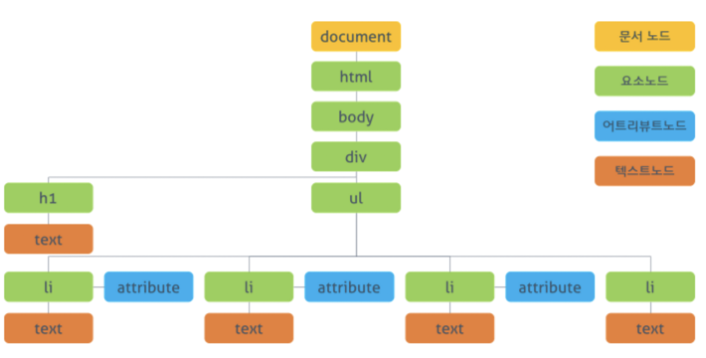
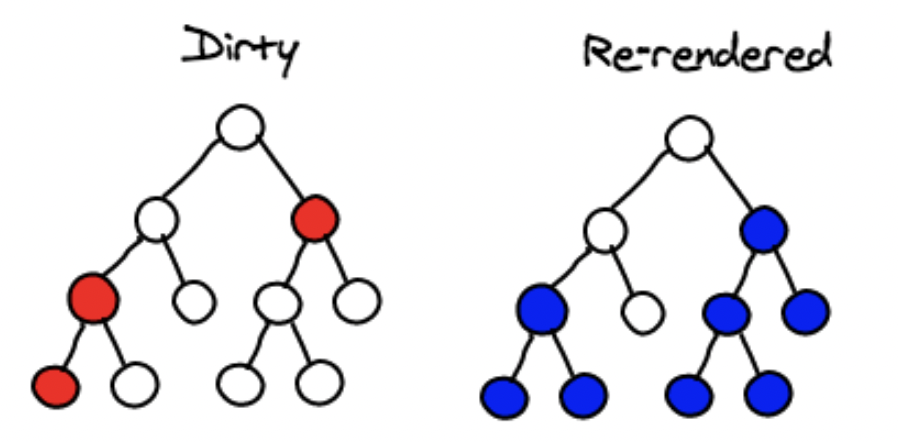

# DOM과 Virtual DOM

## DOM

DOM(Document Object Model, 문서 객체 모델) : HTML, XML 문서의 Programminginterface로 HTML과 Javascript가 상호작용 할 수 있도록 하는 도구이다.

- DOM API(ex.querySelector, innerText, nodeList, classList, addEventListener)를 이용해 DOM구조에 접근 할 수 있다. 다시말해, API를 이용해 DOM에 접근하여 문서 구조, 스타일, 내용 등을 변경할 수 있다!

### DOM tree




#### 자식 노드 탐색

- 자식노드 : 일반적으로 중첩 관계에 있는 본인 바로 아래 노드
- 후손노드 : 일반적으로 중첩 관계에 있는 본인 아래의 모든 노드
  

#### 부모 노드 탐색

- 부모노드 : 일반적으로 바로 위에서 특정 노드를 감싸고 있는 노드
- 조상노드 : 일반적으로 특정 노드를 감싸고 있는 모든 노드
- 형제노드 : 일반적으로 특정 노드와 동등한 레벨에 있는 노드
  

#### DOM 객체 탐색


<hr>
<br>

### DOM의 문제점

👉🏻 DOM 조작의 비효율성
<br>

- 노드의 수가 많아질 수록 속도가 느려지고, DOM 업데이트에 잦은 오류를 발생시킬 수 있다.
- 유저가 어떤 포스트에 좋아요를 누르거나 담아둔 장바구니 목록에서 상품을 하나 삭제하거나 어딘가에 댓글을 남기면 전체 노드들이 `처음부터 다시 그려지게 된다!`

<Br>

```
document.getElementById('some-id').innerValue = 'updated value';
```

1️⃣ 브라우저는 HTML을 구문 분석하여 이 ID를 가진 노드를 찾는다.<br>
2️⃣ 이 특정 요소의 자식 요소를 제거한다.<br>
3️⃣ 'updated value'으로 요소(DOM)을 업데이트한다.<br>
4️⃣ 부모 및 자식 노드에 대한 CSS를 다시 계산한다.<br>
5️⃣ 브라우저 디스플레이에 페인팅된다.

→ DOM 트리가 수정될 때마다 렌더 트리가 계속해서 실시간으로 갱신되어 DOM을 조작 비용이 증가하게 된다

> SPA(Single Page Application)을 많이 사용하면서 DOM tree를 즉각적으로 변경할 일이 생겼다. 전체 페이지를 서버에서 매번 보내주는 것이 아니라, 브라우저 단에서 자바스크립트가 관리하기 때문에, DOM조작을 더욱 더 효율적으로 할 수 있게 최적화가 필요하게 되었다.

<br>

## Virtual DOM

**Virtual** DOM은 실제 DOM을 모방하는 형태로 메모리 상에서만 존재하는 가상의 DOM을 의미한다.

- Virtual DOM은 DOM을 가볍게 만든 JavaScript 표현이며, 실제로 스크린에 랜더링하는 것이 아니기 때문에 DOM을 직접 업데이트하는 것보다 상대적으로 빠르다.

- 데이터가 변경이 되면 전체 UI는 Virtual DOM에 렌더링 되어져 `이전 virtual DOM에 있던 내용과 업데이트 후에 내용을 비교하여 바뀐 부분만 실제 DOM에 적용`시킨다.

<br>


### Virtual DOM 특징


- JavaScript 객체를 활용한다.
- 메모리 상에서 동작하기에 훨씬 더 빠르게 동작한다.
- 실제 렌더링이 되지 않기 때문에 연산 비용이 적다.

<br>
❗️ 요소가 30개가 바뀌었다고 레이아웃을 30개씩 새로 하는 것이 아니라 모든 변화를 하나로 묶어서 딱 한번만 실행시킨다. 이렇게 연산 횟수를 줄일 수 있기 때문에 실제 DOM 리렌더링에 비해서 효율적이다.

### Virtual DOM의 과정


1️⃣ 데이터가 업데이트 되었을 때, 전체 UI가 Virtual DOM에서 리랜더링 된다.
<br>


2️⃣ 이전 DOM과 새로운 Virtual DOM의 차이가 계산된다.
<br>


3️⃣ 계산이 끝난 후, DOM은 변경된 부분만을 변화시킨다.
<Br>

### DOM과 Virtual DOM의 비교

|                                  |                       DOM                        |                                                Virtual DOM                                                 |
| :------------------------------: | :----------------------------------------------: | :--------------------------------------------------------------------------------------------------------: |
|           **업데이트**           |                      느리다                      |                                                   빠르다                                                   |
|      **HTML 업데이트 방식**      |            HTML을 직접적으로 업데이트            |                                    HTML을 직접적으로 업데이트하지 않음                                     |
| **새로운 element 업데이트 방식** | 새로운 element가 업데이트된 경우 새로운 DOM 생성 | 새로운 element가 업데이트된 경우 새로운 가상 DOM 생성 후 이전 DOM과 비교 후 차이점만을 실제 DOM에 업데이트 |
|            **메모리**            |                메모리 낭비가 심함                |                                             메모리 낭비가 덜함                                             |

### Diff 알고리즘

Virtual DOM이 업데이트되면, React는 Virtual DOM을 업데이트 이전의 Virtual DOM 스냅샷과 비교하여 정확히 어떤 Virtual DOM이 바뀌었는지 검사한다.
<br>



- 속성 값만 변한 경우 → 속성 값만 업데이트
- 태그나 컴포넌트가 변경된 경우 → 해당 노드를 포함한 하위의 모든 노드들이 `언마운트` (제거한 뒤에 새로운 Virtual DOM으로 대체) <br>
  👉🏻 변경이나 업데이트가 모두 마무리된 이후에 딱 한번은 실제 DOM에 이 결과를 업데이트합니다. 이렇게 비교를 통해서 섞인 부분들을 찾아낸다.

### Virtual DOM이 DOM보다 `무조건` 빠를까?

👉🏻 아니다!
<br>interaction이 발생하지 않는 페이지 (정보제공)라면, DOM tree의 변화가 발생하지 않아서 일반 DOM의 성능이 더 좋을 수 있다!

<br>
<br>

# 타 프레임워크는 어떻게 운영할까?

## Angular의 incremental DOM

Incremental DOM은 코드 변경점을 찾을 때 실제 DOM을 사용하여 Virtual DOM보다 더 간단한 접근 방식을 제공한다.
<br>
→ 차이를 계산할 때 메모리상에 실제 DOM에 대한 가상 표현이 없으며, 새로운 렌더 트리와 차이를 비교하는 데 실제 DOM이 사용된다.

- 명령(Instruction) 묶음을 통해 모든 컴포넌트를 컴파일한다. 이 명령들은 DOM 트리를 생성하고 변경점을 찾아낸다.

- 메모리를 효율적으로 사용하여, 휴대전화와 같이 메모리가 적은 장치에서 사용될 때 굉장히 좋다.
  <br>
  <br>
  
  추가 및 변경되는 부분만 메모리 할당한다.

❗️ Virtual DOM과 다르게, Incremental DOM은 애플리케이션 UI를 다시 렌더링할 때 실제 DOM을 복사해서 생성하지 않는다. 게다가 애플리케이션 UI에 변경이 없다면 메모리를 할당하지도 않는다. 대부분의 경우, 중요한 수정 사항 없이 애플리케이션을 다시 렌더링한다. 그래서 Incremental DOM의 접근 방식은 메모리 사용을 크게 줄여준다.


```
💡 Incremental DOM은 메모리의 효율성에서 훨씬 뛰어나지만, 속도면에서는 Virtual DOM 방식이 더 빠르다.
```

### Incremental DOM을 선택한 이유?

어플리케이션은 반드시 모바일 기기에서 문제 없이 작동해야 한다. 즉 , 어플리케이션 번들의 용량(Tree shaking)과 `메모리 점유율에 대한 최적화`를 위한 선택이다.

<br>

## Svelte의 DOM

Svelte는 컴파일러에 차이가 있다.
Svelte는 그 과정을 사이트가 배포되기 전에 미리 다 해두도록 한 것이다. Svelte 형식에 맞게 코드를 작성하고 빌드하면 Svelte는 사이트에서 실제로 일어날 일들, 어떤 이벤트가 들어오면 어떤 변화가 일어날지들을 컴팩한 자바스크립트 파일로 컴파일해서 내놓기 때문에 용량 면에서도 더 가볍고 DOM의 조작도 더 빠르다고 한다.

❗️ 코드를 미리 컴파일해서 내보내야 하기 때문에 특정 형태의 사이트에서는 한계가 될 수 있다.

<br>

## 결론

사실상 체감 속도는 거의 차이 나지 않는다고 한다.
메모리도 기기 성능의 향상으로, 속도나 메모리에 민감한 서비스가 아닌 이상 취향에 맞는 것을 권장한다고 한다!
