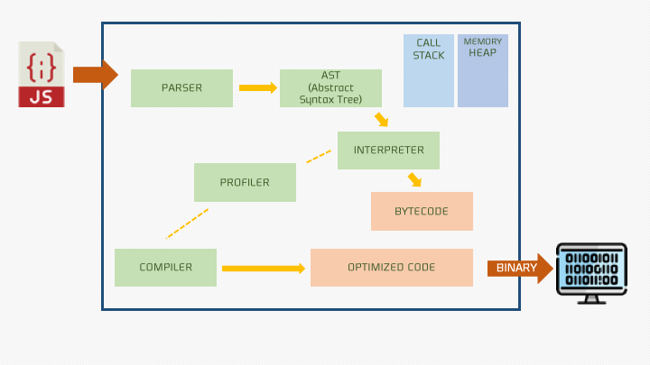

# 💡 V8 엔진은 어떻게 내 코드를 실행하는 걸까?


<br />

## 01. V8 엔진이란?

V8 엔진은 구글에서 만든 `자바스크립트 런타임 엔진`으로, 현재 Google Chrome과 NodeJS에서 사용되고 있다.


>

<br />

## 02. V8 엔진의 구조와 동작 원리



### ❶ 파서(Parser) -- 파싱(Parsing) -> AST Tree

V8 엔진은 `JavaScript Source Code`를 가져와 가장 먼저 `Parser(파서)`에게 전달한다.  
`Parser`는 파싱 과정을 통해 JavaScript 코드를 분석하여 토큰으로 분해한다.

```js
const a = 5;
["const", "a", "=", "5"];
```

그리고 분해된 토큰을 바탕으로 **추상 구문 트리(AST, Abstract Syntax Tree)** 를 생성한다.

```js
function hello (name) {
  return 'Hello,' + name;
}

// 위 코드를 파싱하면 대략 이런 추상 구문 트리가 된다.

{
  type: 'FunctionDeclaration',
  name: 'hello'
  arguments: [
    {
      type: 'Variable',
      name: 'name'
    }
  ]
  // ...
}
```

> - parsing(구문 분석) : compiler의 일부로, 프로그래밍 언어로 작성된 문장의 구성 성분을 분해하여 문법적 관계를 분석하는 행위를 말한다.
> - Token(토큰) : 소스 코드를 자바스크립트 문법 규칙에 따라 구문(어휘) 분석하여 나온 문자열 조각들

### ❷ Ignition으로 바이트 코드(Bytecode) 변환하기

**Ignition**는 `JavaScript code`를 `Byte code(바이트 코드)`로 변환하는 인터프리터이다.

> **🧩 P1. 바이트 코드(Bytecode)란?**
>
> `바이트 코드(Bytecode)`는 고급 언어로 작성된 소스 코드를 VM(Virtual Machine, 가상머신)이 해석하기 쉬운 중간 코드로 한번 컴파일한 것을 의미한다.  
> V8 엔진에서 이 역할을 수행하는 것이 바로, 인터프리터인 `Ignition`이다.

**Ignition**를 통해 `JavaScript code`를 `Byte code(바이트 코드)`로 변환하며 다음 3가지 이점이 생긴다.

**1. 메모리 사용량 감소** : 자바스크립트 코드를 바이트 코드로 컴파일하면 이를 기계어로 컴파일 했을 때 보다 코드 실행 시 차지하는 메모리 공간이 적다.  
**2. 파싱 시 오버헤드 감소** : 바이트 코드는 간결하기 때문에, 다시 원본 코드로 파싱이 필요한 경우에도 복잡도가 덜하다.  
**3. 컴파일 파이프 라인의 복잡성 감소** : 바이트 코드로 인해 `Optimizing(최적화)`과 `Deoptimizing(최적화 해제)` 모두 간편하다.

이렇게 변환된 바이트 코드는 실제 컴퓨터에서 실행되어 동작하게 되고,

그 중 자주 사용되는 코드는 컴파일러인 **TurboFan**으로 보내지게 된다.

### ❸ Bytecode -- TurboFan --> Optimized

**TurboFan**은 V8엔진에서 최적화를 담당하는 컴파일러로, 최적화 조건에 부합하는 바이트 코드에 대해 기계어로 변환하여 최적화를 진행한다.

이렇게 최적화가 진행된 코드를 Optimized Machine Code(최적화된 코드)라고 하며, 0과 1로 이뤄진 이진 코드이다.

이때, 최적화되는 조건은 다음과 같다.
**1. Hot & Stable** : 자주 호출되고(hot), 변하지 않는 코드를 말한다. 예로 매번 같은 행동을 수행하는 순수함수가 있다.  
**2. short** : 인터프리팅된 바이트 코드 길이가 특정 임계점을 넘기지 않는다면, 작은 함수라고 판단하여 최적화를 진행한다. 작고 단순한 함수는 크고 복잡한 함수보다 동작이 매우 추상적이거나 제한적인 확률이 더 높기 때문에 안정적이라고 판단한다.

> **🧩P3. 한번 Optimized code는 불변할까?**
>
> 답은 ❌이다.  
> 최적화된 코드라고 하더라도 해당 함수의 사용 빈도가 줄거나, 변수의 타입 혹은 동적 환경의 변수 등으로 안정적이지 않다고 판단되면 다시 해당 코드를 바이트 코드로 Deoptimizing(최적화 해제)한다.
>
> 마찬가지로 eoptimizing된 코드도 상황에 따라서 얼마든지 다시 Optimized(최적화)된다.

> **🧩P2. 인터프리터 vs 컴파일러**

> **👀 Behind Story**
>
> 여기서 사용되는 용어들이 굉장히 재미있는데, V8은 원래 8기통 엔진의 종류를 의미하는 단어다.(제네시스 G90이나 기아 K9같은 차에 들어간다고 한다.)
>
> 그리고 Ignition는 엔진에 시동걸 때 사용하는 "점화기"라는 뜻이다.
>
> 👉 이를 결합해보면, `V8`엔진 속 `Ignition`라는 점화기로 불을 붙여 코드가 실행되고, 엔진이 과열되지 않고 잘 작동될 수 있도록 `TurboFan`으로 최적화 작업을 통해 식혀준다!

<br />

※ 참고자료

- []()
